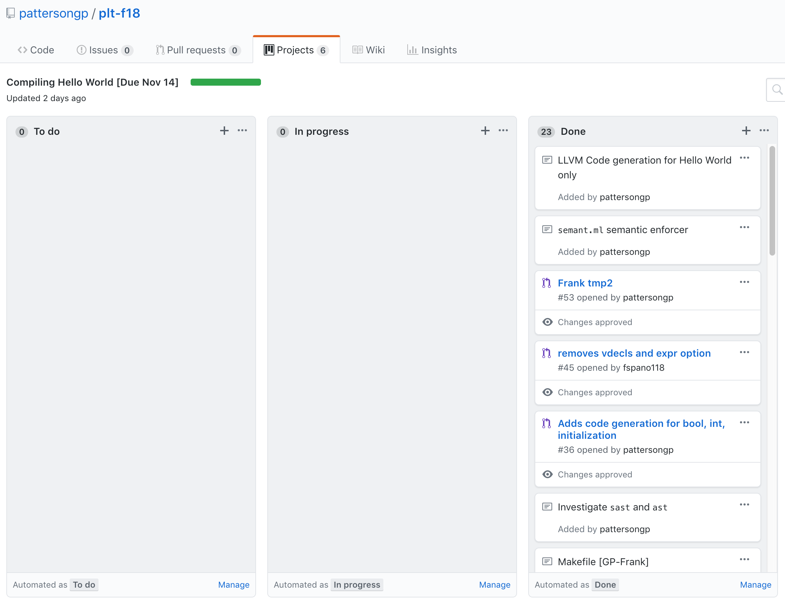

#F.I.R.E Final Report

Graham Patterson (gpp2109)  
Frank Spano (fas2154)  
Ayer Chan (oc2237)  
Christopher Thomas (cpt2132)   
Jason Konikow (jk4057)  

*The limits of my language are the limits of my world.* - Ludwig Wittgenstein, Tractatus Logico-Philosophicus 


## Table of contents

1. Introduction
2. Tutorial
3. Language Reference Manual 
4. Project Plan
5. Architectural Design 
6. Testing Plan
7. Lessons Learned
8. Appendix

I. Appendix A - Codebase

## 1. Introduction 
- *Include your language white paper.*

F.I.R.E (File Input Reinterpretation Engine) is a programming language inspired by AWK, Bash & C. It seeks to provide some of the robust pattern matching and script-manipulation functionality of these languages with a more palatable syntax.

### 1.1 Motivation

AWK & Bash remain essential weapons in the arsenal of any programmer seeking to manipulate text files in a Unix-like environment. They are robust and integrate well with other Unix tools, but they are also artifacts of a time before the total dominance of C in the landscape of programming language design. As a result, both languages feature syntax that is alien to generations of programmers reared on C and C-like languages like Java, C++, Python and et al. Bash, for all its utility, has gained a reputation for fiddly and non-intuitive syntax rules (ever leave an extraneous space in a `makefile` or `.bashrc`? You know what I'm talking about). 

Since C is so well regarded and so well-know, we have made it the inspiration for much of our syntax. If you code in C or a language inspired by C, much of FIRE will feel as comfortable as a cardigan.

### 1.2 Target Audience

The kind of programmer that will find FIRE useful spends many hours in the terminal. He or she or they will likely have to manipulate dozens if not hundreds of text files. They may be a systems administrator, sifting through system logs, or a scientist working through huge data sets. F.I.R.E empowers this target user with tools to expedite tasks like pattern matching (via our robust regex library, built into the language), the opening and creation of files, and more. 

## 2. Tutorial
- *A short explanation telling a novice how to use your language.*

This tutorial assumes a certain degree of familiarity with programming languages, compilation and the command-line. We recommend brushing up on basic git commands like `git pull` and with docker as well. Use git clone to download a local copy of our repository, named `plt-f18`:

`git clone ....`

### 2.1 Environment Setup

It is highly recommended that you use the Docker container utilized by our development team when compiling FIRE programs. Based on a Docker container built by Programming Languages & Translators TA John Hui, the Dockerfile for the container lies in the root directory of our repository, with corresponding directions provided by the `Readme.md` file. Those directions are reiterated here:

### 2.1.1 Docker Configuration

For help with installing Docker on your machine, please consult [Docker's documentation](https://docs.docker.com/)

1. Ensure that you are in the root of the repository: `cd plt-f18`
2. Build a docker image via the following command: `docker build -t fire .` Note that a `.` is required at the end of the command.
3. To execute the container, use the following command: ```docker run --rm -it -v `pwd`:/home/fire -w=/home/fire fire```

Please note that these commands may vary slightly depending on the shell you are using. Also note that in the third command, a bash variable `pwd` is employed - this prints your local directory. It can be substituted with the absolute or relative path of the root directory of the repository. 

### 2.1.2 Dependencies 

If you elect not to utilize a Docker container, please ensure you have the following packages installed on your machine:

    ocaml
    menhir 
    llvm-6.0 
    llvm-6.0-dev 
    m4 
    git 
    aspcud 
    ca-certificates 
    python2.7 
    pkg-config 
    cmake
    opam
    
Utilize an appropriate package manager for your machine to install the above, e.g. `homebrew` on a mac or `apt-get` on a Debian-based Linux distribution.

### 2.2 Building the compiler

**For all subsequent sections of our tutorial, if you are intending to use our docker container, ensure you are inside the container by running the 3rd command listed in Section 2.1.1 - otherwise you will run into compilation error messages constantly.**

Navigate to the source folder of the repository, via `cd src`. Then run `make` to build the compiler of our language, `fire.native`. Note that `make` runs an automated test suite, compiling valid and invalid FIRE programs and outputting whether or not they have succeeded or failed. This is a highly useful tool for anyone working on extending or testing the language, but if your goal is only to write FIRE programs, you can safely terminate the automated test suite with `CMD + D`.

### 2.3 Compiling a FIRE Program

Consider this very basic FIRE program, `hello.fire`:

```
func int main = () => {
	
	str s = "Hello World";
	sprint(s);

}
```

As you may have gathered, this program outputs "Hello World" to `stdout`. To compile it, ensure you are in the `/src` directory of your copy of the FIRE repository, and run:

`./fire.native hello.fire`

(Please ensure you have hello.fire located in your source directory, or that you reflect its current path accurately when supplying it as an argument).

The compiler will now generate an executable, `hello.flames`, as well as several intermediate files used in compilation, usually with the extension `.ll` and or `.s`. These artifact files can be deleted without repercussion as they are only useful in the process of building an executable. 

As the above example illustrates, compiling a file is much the same as it is with other languages - supply a source file to the compiler as an argument, and the compiler will generate an executable binary. Running the above will output `Hello World!`, as expected.

### 2.4 Clean Up

If you would like to clean up binaries or recompile the FIRE compiler, run `make clean` while inside the `src` folder. Make clean not only removes the existing binary for the FIRE compiler, it removes all the artifacts of compilation (like `.ll` files) and will clean up artifacts generated the the test suite as well.


## 3. Language Reference Manual 
 - *Include your language reference manual.*

## 4. Project Plan
 - *Identify process used for planning, specification, development and testing*
- *Include a one-page programming style guide used by the team*
- *Show your project timeline*
- *Identify roles and responsibilities of each team member*
- *Describe the software development environment used (tools and languages)
Include your project log*

### 4.1 Our Process

### 4.1.1 Weekly Meetings

Our team conferred in twice-weekly sprints throughout the semester, with one meeting on Tuesday afternoons and the other on Thursday afternoons. The Tuesday meetings took place between 2 and 3 pm, and were often our weekly opportunity to sort out logistics, assign tasks for the week, and engage in high-level planning about the direction our language would take during development. Our Tuesday meetings were followed by a half-hour to hour meeting with our TA and mentor John Hui. The timing of our Tuesday meetings proved to be hugely helpful, as we were able to formulate questions and concerns that we could almost immediately field to John for input.

Our Thursday meetings were comprised of long coding sprints, from 4 to 6 pm, though in practice we often began work earlier than the specified time. Though we frequently did work outside of the sprints, sometimes remotely and separated from one another, these Thursday sprints gave us a chance to confer and collaborate in person, keeping us on the same page.

Numerous times in the semester we broke the cadence of twice weekly meetings to meet every day of the week, most notably around the development of the `Semant.ml`.

### 4.1.2 Team Communication

Our team utilize a slack channel to manage communications between our five-member group. This proved indispensable, primarily because Slack was a familiar technology for almost all of us, and had useful features like support for Code Blocks and a mobile app. Helpfully, all of our members were responsive to messages and replied promptly, which enabled us to quickly pivot or assign tasks to one another. Also of note is the fact that our TA John Hui joined our Slack, which enabled us to quickly ping him with questions (and enable him to respond, almost as quickly).

### 4.1.3 Git

Our Project utilized git & Github for version control and project management. We made liberal use of branches, but mandated that pull requests into master required approval from at least one other team member. That team member was responsible for a) vetting the changes made and for b) providing a rationale for their approval of the pull request. Branches were made not only for major features like the semant or the test-suite, but also for LRM and final project, and also for subsets of a feature divided among multiple teammates. This project proved to be a great excuse to develop a familiarity with Git and its unbelievably robust feature set. 

### 4.1.4 Github Projects

Beyond availing ourselves of Github's free hosting, our project also leveraged several of Github's project management tools. Github Projects is a kanban board built into every Github repository. It allowed for our team Manager, Graham Patterson, to break down our project into tasks and subtasks, with major milestones separated into individual projects and subtasks into 'notes' that existed within those projects. These notes would progress from a section titled `To do` to one titled `In Progress` as we began implementation. As we finalized the task, it would be promoted to the `Done` section of the Project. 

When all of the notes reached this final section, the project would be deemed complete and work would begin on the next Project. 

Below are screenshots of our Github Projects page and some notes from an individual project, titled `Compiling Hello World`:




Github Projects is surprisingly robust. It allowed us to link notes to individual git commits, combining task management with git's version history tools to allow us to more granularly and effectively track progress. It was an essential part of our workflow.

### 4.2 Style Guide

We followed the below style guide when writing code in FIRE. Our goal was primarily readability, though some of our test suite programs broke the these rules to properly vet features.

* Individual lines of code cannot exceed 80 characters. 
* Employ `camelCase` when naming variables and functions.
* Blocks of non-trivial code should have terse but useful comments.
* Git commit messages should be substantive; e.g. "Fixed map bug in semant.ml" instead of "fixed bug".

Many of these style principles come from our experience coding in other languages, and proved to be useful in the context of coding in FIRE as well.

### 4.3 Project Timeline


| Milestone            	| Date     	|
|----------------------	|----------	|
| Proposal             	| Sep 19th 	|
| Reference Manual     	| Oct 15th 	|
| Parser               	|          	|
| Semant               	| Nov 15th 	|
| Hello World          	| Nov 15th 	|
| Generate LLVM        	|          	|
| Project Report       	| Dec 14th 	|
| Project Presentation 	| Dec 19th 	|


## 5. Architectural Design 
- *Give block diagram showing the major components of your translator*
- *Describe the interfaces between the components*
- *State who implemented each component*

## 6. Testing Plan
- *Show two or three representative source language programs along with the target language program generated for each*
- *Show the test suites used to test your translator*
- *Explain why and how these test cases were chosen*
- *What kind of automation was used in testing*
- *State who did what*

## 7. Lessons Learned
- *Each team member should explain his or her most important learning
Include any advice the team has for future teams*

## 8. Appendix
- *Attach a complete code listing of your translator with each module signed by its author*


