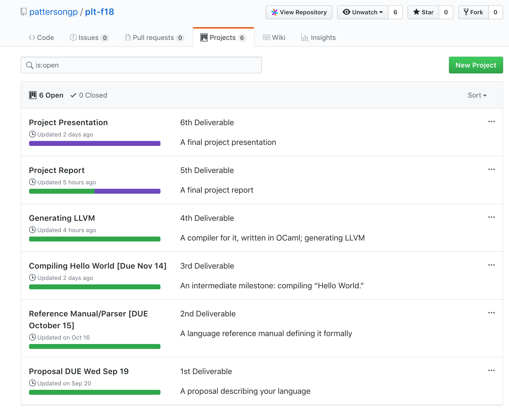

#F.I.R.E Final Report

Graham Patterson (gpp2109)  
Frank Spano (fas2154)  
Ayer Chan (oc2237)  
Christopher Thomas (cpt2132)   
Jason Konikow (jk4057)  

*The limits of my language are the limits of my world.* - Ludwig Wittgenstein, Tractatus Logico-Philosophicus 


## Table of contents

1. Introduction
2. Tutorial
3. Language Reference Manual 
4. Project Plan
5. Architectural Design 
6. Testing Plan
7. Lessons Learned
8. Appendix

I. Appendix A - Codebase

## 1. Introduction 

F.I.R.E (File Input Reinterpretation Engine) is a programming language inspired by AWK, Bash & C. It seeks to provide some of the robust pattern matching and script-manipulation functionality of these languages with a more palatable syntax.

### 1.1 Motivation

AWK & Bash remain essential weapons in the arsenal of any programmer seeking to manipulate text files in a Unix-like environment. They are robust and integrate well with other Unix tools, but they are also artifacts of a time before the total dominance of C in the landscape of programming language design. As a result, both languages feature syntax that is alien to generations of programmers reared on C and C-like languages like Java, C++, Python and et al. Bash, for all its utility, has gained a reputation for fiddly and non-intuitive syntax rules (ever leave an extraneous space in a `makefile` or `.bashrc`? You know what I'm talking about). 

Since C is so well regarded and so well-known, we have made it the inspiration for much of our syntax. If you code in C or a language inspired by C, much of FIRE will feel as comfortable as a cardigan.

### 1.2 Target Audience

The kind of programmer that will find FIRE useful spends many hours in the terminal. He or she or they will likely have to manipulate dozens if not hundreds of text files. They may be a systems administrator, sifting through system logs, or a scientist working through huge data sets. F.I.R.E empowers this target user with tools to expedite tasks like pattern matching (via our robust regex library, built into the language), the opening and creation of files, and more. 

## 2. Tutorial

This tutorial assumes a certain degree of familiarity with programming languages, compilation and the command-line. We recommend brushing up on basic git commands like `git pull` and with docker as well. Use git clone to download a local copy of our repository, named `plt-f18`:

`git clone https://github.com/pattersongp/plt-f18.git`

### 2.1 Environment Setup

It is highly recommended that you use the Docker container utilized by our development team when compiling FIRE programs. Based on a Docker container built by Programming Languages & Translators TA John Hui, the Dockerfile for the container lies in the root directory of our repository, with corresponding directions provided by the `Readme.md` file. Those directions are reiterated here:

### 2.1.1 Docker Configuration

For help with installing Docker on your machine, please consult [Docker's documentation](https://docs.docker.com/)

1. Ensure that you are in the root of the repository: `cd plt-f18`
2. Build a docker image via the following command: `docker build -t fire .` Note that a `.` is required at the end of the command.
3. To execute the container, use the following command: ```docker run --rm -it -v `pwd`:/home/fire -w=/home/fire fire```

Please note that these commands may vary slightly depending on the shell you are using. Also note that in the third command, a bash variable `pwd` is employed - this prints your local directory. It can be substituted with the absolute or relative path of the root directory of the repository. 

### 2.1.2 Dependencies 

If you elect not to utilize a Docker container, please ensure you have the following packages installed on your machine:

    ocaml
    menhir 
    llvm-6.0 
    llvm-6.0-dev 
    m4 
    git 
    aspcud 
    ca-certificates 
    python2.7 
    pkg-config 
    cmake
    opam
    
Utilize an appropriate package manager for your machine to install the above, e.g. `homebrew` on a mac or `apt-get` on a Debian-based Linux distribution.

### 2.2 Building the compiler

**For all subsequent sections of our tutorial, if you are intending to use our docker container, ensure you are inside the container by running the 3rd command listed in Section 2.1.1 - otherwise you will run into compilation error messages constantly.**

Navigate to the source folder of the repository, via `cd src`. Then run `make` to build the compiler of our language, `fire.native`. Note that `make` runs an automated test suite, compiling valid and invalid FIRE programs and outputting whether or not they have succeeded or failed. This is a highly useful tool for anyone working on extending or testing the language, but if your goal is only to write FIRE programs, you can safely terminate the automated test suite with `CMD + D`.

### 2.3 Compiling a FIRE Program

Consider this very basic FIRE program, `hello.fire`:

```
func int main = () => {
	
	str s = "Hello World";
	sprint(s);

}
```

As you may have gathered, this program outputs "Hello World" to `stdout`. To compile it, ensure you are in the `/src` directory of your copy of the FIRE repository, and run:

`./fire.native hello.fire`

(Please ensure you have hello.fire located in your source directory, or that you reflect its current path accurately when supplying it as an argument).

The compiler will now generate an executable, `hello.flames`, as well as several intermediate files used in compilation, usually with the extension `.ll` and or `.s`. These artifact files can be deleted without repercussion as they are only useful in the process of building an executable. 

As the above example illustrates, compiling a file is much the same as it is with other languages - supply a source file to the compiler as an argument, and the compiler will generate an executable binary. Running the above will output `Hello World!`, as expected.

### 2.4 Clean Up

If you would like to clean up binaries or recompile the FIRE compiler, run `make clean` while inside the `src` folder. Make clean not only removes the existing binary for the FIRE compiler, it removes all the artifacts of compilation (like `.ll` files) and will clean up artifacts generated the the test suite as well.


## 3. Language Reference Manual 

## 3.0 Reference Manual Table of contents

1. Introduction
2. Lexical Conventions
3. Syntax
4. Statements


## 3.1 LRM Introduction

File Input Reinterpretation Engine (FIRE) is a scripting language inspired by AWK, bash, and other syntactically light languages. These languages are renowned for their ability to robustly extract, pattern-match, and manipulate text files. FIRE seeks to emulate this functionality with a more attractive, C-Family inspired syntax and intuitive semantics.

FIRE is intended to be utilized with large sets of delimited data, like `.csv` files. FIRE is also animated by the premise that files are first class citizens. 

FIRE is written in OCaml , utilizing libraries built in `C`, and leveraging the `LLVM` compiler back-end.

This manual describes in detail the lexical conventions, types, scoping rules, built-in functions, and grammar of the FIRE language.

## 3.2: Lexical Conventions 

### 3.2.1 Identifiers

An identifier is a token correlate to a single variable, a function, an array, or a file. Identifiers are a sequence of characters consisting of uppercase or lowercase letters, digits, underscores or dashes. They must starts with a character or an underscore, and is optionally followed by characters, numbers and underscores. The scope of an identifier can only be local and limited inside the braces `{ ... }` in which they are declared. The regular expression for identifiers is:

['a'-'z' 'A'-'Z']['a'-'z' 'A'-'Z' '0'-'9' '_']


### 3.2.2 Keywords

FIRE has a set of identifiers that are restricted from use.

### 3.2.2.1 Basic Types
FIRE was designed for efficiency. Basic types, integer and string, are most efficient for scripting files. They ensure and eliminates certain runtime decisions. Void data type is used for functions that do not return a value. `true` and `false` are two predefined constants for `bool`. A function declaration begins with the `func` keyword.

* `int` 
* `str`
* `bool`
* `void`
* `func`


### 3.2.2.2 Control Flow 
The following keywords indicate keywords for control flow.

* `if` 
* `else`
* `while`
* `return`

### 3.2.2.2 Built-in Functions
The following keywords are reserved for built-in functions.

* `print`
* `sprint`
* `map`
* `filter`
* `strlen`
* `len`
* `keys`
* `atoi`

### 3.2.2.3 Advance Data Types
The following keywords are reserved for advance data types. 

* `array`
* `file`
* `regx`

### 3.2.3 Constants

FIRE supports integer, string and boolean literals, inside expressions. 


### 3.2.3.1 Integer
Identifiers of type `int` represent positive integers. An `int` is a 32-bit integer, and consists of at least one digit. The following defines the regular expression of a decimal digit for `int`.

`digit = ['0' - '9']`

#### Example

`int num = 32;`

#### Example
`int` type can also be assigned to the result of expressions. 

`int a = 34 * 2 + (2 / 1);`

### 3.2.3.2 String
Identifiers of type `str` are used to represent sequences of characters, strings. Strings can be declared in the following manner.

#### Example

`str myString = "Hello World";`

checkout the length of a string using: `strlen(<str>)`

Not all strings are in printable form. Some printable characters have conflicts with lexical conventions. They are
specially marked with a backslash. FIRE supports the following escape sequences.

`\n`
`\r`
`\t`
`\f`
`\b`
`\\`
`/`

To print out the raw forms of specially marked characters listed above, `\\` double backlash cancels escape sequences.

`\\\n`
`\\\r`
`\\\t`
`\\\f`
`\\\b`
`\\\\`
`\\/`

### 3.2.3.3 Boolean
Boolean objects contain a value of either `true` or `false`. They can be declared on their own and are used in conditional statements. The structure of a boolean declaration is as follow.
#### Example
```
bool switch = true; // or false
```

#### Example

```
func void main = () => {
	int x = 0;
	bool switch = true;


	// infinite loop
	while(switch) {
		x = x + 1;
	}
}
```

### 3.2.4 Punctuation
FIRE supports primary expressions using the previously-mentioned identifiers. Primary expressions also include expressions inside parentheses. In addition, parentheses can indicate a list of arguments in a function declaration or a function call:

`f()` 

Blocks are indicated by braces. Braces imply blocks that makeup function bodies:

`{  \* This is a block *\  }`

Brackets indicate array types and access to array elements:

```
array[int, int]		//this is a data type
a[0] 			//access to element 0 in array arr
```

Strings and Regular Expressions are sequences of characters surrounded by double quotes `"`,:

` "This is a string or regx expression" `

Semicolon is used to separate statement:

`str b = "bee"; int c = 3;`

### 3.2.5 Advance Data Type

### 3.2.5.1 File
Files are regarded as first-class citizens in FIRE. This is made apparent by the importance and centrality of files. A `file` type represents an existing file. This allows the programmer to more easily perform operations on the file. The syntax for instantiating a `file` object is as follows:

#### Syntax
```
file f = open("filename.csv", "<delimiter>");
```
#### Where
* two arguments are fed into `open(...)`
* `<filename>` for reading, writing or both on an existing file. 
* `<delimiter>` may be provided to the constructor specifying a delimiter for reading. The length of <delimiter> is expected to be exactly 1. An error will be thrown if a file does not exist.

#### Example
`file f; f.open("test.csv", ",");` will open the File named `test.csv` in the current directory for both reading and writing, and delimited by the `,` string.

### Reading and Writing
`read()` function returns the whole text of a delimited file. `write()` function takes in a string and does not return anything. 

#### Syntax
The syntax for reading and writing a `file` is as follows
```
<file name>.read();
<file name>.write(<str>);
```

### 3.2.5.2 Array
Arrays are dynamic sequence containers: they hold any number of elements ordered in a linear sequence. Inspired by AWK's associative arrays, an `array` collection maps keys of one type to values of one type. Keys and values do not have to be the same type, but all keys must share the same type and all values must share the same type. The structure of `array` variable declarations is as follows.

#### Syntax
```
array[<key_type>, <value_type>] arr;
```

#### Where
* `arr` is initialized without pointing to a value.
* `<key_type>` do not have to be of the same type as the `<value_type>` they correspond with - but all keys in an array must have the same type, and all values must be of the same type. 
* There are strict restrictions on the types a key can be and a value can be. Please consult the table below:

| Legal Key Types | Legal Value Types |
|-----------------|-------------------|
| int             | int               |
| str             | str               |
|                 | array             |

#### Example 
`array[str, str] arr;`

### Assignment
The assignment of variables has the following syntax:

```
arr[<key_value>] = <element>;
```

#### Example

 `arr["myAge"] = "28";`
 
### Retrieve
Retrieving an element of an array has the following syntax:
 ```
 int element = arr[<key_value>];
 ```

#### Example
 
 `int age = arr["myAge"];`
 
A key error will be thrown if `"myAge"` does not exist.

### Arrays of Arrays
A multidimensional array in FIRE is an array of arrays, declared by using syntax like the following:
```
array[<key_type1>, array[<key_type2>, <value_type2>]] myArray;
```

#### Where
* `myArray` is initialized but not the anonymous `array[<type>, <type>]`. The anonymous array will not be initialized until assignment.
* arrays that assign to `myArray` must follow the type `array[<key_type2>, <value_type2>]`. 


#### Example
`array[str, array[int, str]] b;`
 
In this case, array b will be initialized but not array[int,str]. 
 
### 3.2.5.3 Regular Expression
Regular expressions are supported in FIRE. Via the `regx` type, which assigns an object to a regular expression. That object can then be passed as a parameter to functions that utilize regular expressions to a pattern match or extract data.

#### Syntax
`regx myPattern = "<pattern>"`

#### Example
```
str s = "token";
regx r = "ok";
str ret = s.grab(r);	/* ret is 'ok' */
```
#### Example
The syntax for the regex patterns are as follows:

* `\` escapes any of the operators for the literal character
* `^` matches only the beginning of the string
* `$` matches only the end of the string
* `.` matches any single character
* `[ ... ]` defines a character list, where the character list can also be character range. This matches any string containing these characters
* `[^ ... ]` defines a character list, but negates them. This matches any string *not* containing these characters
* `|` matches either expression `e1` or `e2`
* `( ... )` groups expressions together where `...` is some regular expression
* `*` matches the preceding character 0 or many times
* `+` matches the preceding character at least once


### 3.2.4 Comments
FIRE only supports the use the block comments. Comments are initiated with the `/*` symbol and terminated by the `*/` symbol. Everything in between the symbols will be ignored by FIRE during compilation. A nested comment gets a parsing error. Comments have the following syntax:

 `/* This is a comment. */`

### 3.2.5 Value Binding
A single equal sign indicates assignment in an assignment or declaration statement: 
 `=`
 
### 3.2.6 Operators
FIRE supports the following binary operators:
```
+ - * /
== != 
> >= < <= 
&& ||
^
```

FIRE also supports the follow unary negations:

`!`


## 3.3: Syntax

### 3.3.1 Program Structure
A FIRE program will mainly consist of functions. The main=() function is the starting point of a FIRE program. FIRE does not support global variables, all variables must be initialized inside function bodies:
```
program:
	function declaration
	main function declaration
	function declaration
```

### 3.3.2 Variable Declarations  
Objects are instantiated via declarations, which explicitly assign a data type to a variable. In FIRE, a variable is only allowed to be declared locally anywhere within a function. Types are explicit in FIRE. The format of declarations are as follows:
```
{type} {variable name};
{type} {variable name} = {value};
```

### 3.3.3 Expressions

### 3.3.3.1 Primary Expressions
The grammars of the two primitive literals are INT_LIT and STRING_LIT. 

### 3.3.3.2 Function Calls
Functions take in arguments by value except in the case of other functions which are passed by reference. Functions, other than build-in functions, need to be assigned before being called, but FIRE does not support prototyping. The scope of a function is the top level.

### 3.3.3.3 Logical Negation
FIRE provides `true` and `false` values. The logical negation operator `!` evaluates to the parity of the operand.

### 3.3.3.4 AND Operator
The logical AND `&&` is a short circuit operator, and returns `true` if and only if the expressions on its left and right both evaluate to `true`, otherwise `false`.

### 3.3.3.5 OR Operator
The logical OR `||` operator is a short circuit operator and returns `true` if either of the expressions on its left or right return `true`, otherwise `false`.

### 3.3.3.6 Relational Operators
The relational operators `<, >, <=, <=, ==` return `true` if the expression on the left side of the operator has the expected relation to the operator on the right-hand side, otherwise `false`.

These relationships amongst ints are determined by natural ordering. Strings can only be evaluated using the `==` operator.

### 3.3.3.7 String Concatenation Operator
The string concatenation `^` operator returns a new string that is the concatenation of the string on its left side and the string on its right side. `^` operator can concat multiple strings into a larger string. 

#### Example
```
str x = "hello";
str y = " world";
str z = x ^ y;
str a = x ^ y ^ y; // evaluates to 'hello world world'
```

### 3.3.3.8 Bracket Operator
The bracket operator `[]` are operators on `array`. When `[]` is used on an `array`, it is supplied with a key and returns the corresponding element. Indexing a key using the bracket operator assigns an element to the corresponding key.

#### Example
where `arr` is a type of `[int,str]` array, `arr` can only accept integer keys and elements.

```
arry [int,str] arr;
arr[0] = "cat";
arr[1] = "dog";
arr[2] = "dog";
str animal = arr[0];
```


## 3.4:Statements 

### 3.4.1 Assignments

The assignment operators `=` returns the value of the expression that is evaluated on its right-hand side and stores it in the identifier on the left-hand side. The scope of that identifier is described in [section 2](#Identifiers)

### 3.4.2 Function Declaration
`func` objects reference functions and are treated as first class citizens. The structure of `func` variable declarations is as follows.

#### Syntax
```
func <return type> <name> = (<parameters>) => { <function body> };
```

#### Where
 * `<return type>` is the type returned by the function (NOTE: A function that does not return anything has a return type of `void`.  The void return type allows for programmers to create functions that are useful for their side effects)
 * `<name>` is the variable name of the function
 * `<parameters>` are the expected parameters for the function
 * `<function body>` is the body of the function

 

#### Parameterization
We originally aimed to provide parameterization, so that named functions can be passed to other functions as a parameter. However, this functionality is not implemented in FIRE at this point. Inspired by JavaScript, we wanted to be able to pass anonymous functions and also use functions as first class citizens as follows.
 
#### Example
```
func void saySomething = () => { print("something"); };
func void doSomething = (func f) => { f(); };
doSomething(saySomething);
```

#### Caveats

* FIRE does not support function overloading
* FIRE does not support genericity in functions


### 3.4.3 Blocks and Control Flow 

### Block 
A block is defined inside curly braces, which can include a possibly-empty list of statements.

### Conditional Statement 
A conditional statement is an if or if-else statement that takes an expression and evaluates to a
bool value. It only executes `<code block>` based on a `true` value. 

#### Syntax
```
if (<expression>) {
	<code block>
}
```
#### Syntax
```
if (<expression>) {
	<code block>
}
else {
	<code block>
}
``` 
		
### Iteration Statement 
An iteration statement begins with the `while` keyword. The expressions must evaluate to a `bool` value. While statements execute a code block until its provided condition fails to be met:

#### Syntax
```
while(<condition>) {
	<code block>
}
```

### Jump Statements 
The return statement takes an expression at the end of a function and exits out of that function

#### Syntax
```
func <return type> main = () => {
	return <expression>
}
```

#### Where
* `<expression>` the type of expression needs to meet the return type in function declaration.


### 3.4.3 Built-in Functions
### 3.4.3.1 Map 
Strongly influenced by Python and OCaml, the map built-in function allows a programmer to apply a function to every element of an array and modifies values of that array.
 
#### Syntax
```
map(<array>,<function>);
```

#### Where
* `<function>` is the name of the function, no need to specify an argument. 
The return type of `<function>` must match the type of element in `<array>`. A function used in `map()` must take exactly 1 argument. 
* return type of `map` is `void` 

#### Example
```
func int f = (int i) => { return print(i); }
func void main = () => {
  array[str, int] arr;
  ...
  map(arr,f);		/* print all elements in array arr */
}
```

### 3.4.3.2 Filter 
The filter function creates an array with elements for which a function returns true. It takes any function that returns a boolean and applies the function to each element of the array. This allows the filter to quickly generate a new array that consists of elements that match whatever member criteria your function tests for.

#### Syntax
```
filter(<array>,<function>);
```

#### Where
* `<function>` is the name of the function, no need to specify an argument. The return type of `<function>` must be a boolean.  Additionally, the only argument of `<function>` must be the type of the value in the array. `<function>` must take exactly 1 argument.   
* return type of `filter` is `void` 
* `<array>` is pointed to a new array after it gets filtered


#### Example
```
func bool f = (int i) => { ... }
...
array[str, int] a;
...
filter(a,f);
```
```
func bool f = (int i) => { return false; }
func void main = () => {
  array[str, int] arr;
  ...
  filter(arr,f);		/* arr is now an empty array */
}
```

### 3.4.4 Print & SPrint Statement
The print statement prints integers. To give more explicit typing constraints, print() can only print integers and sprint() can only print strings. The syntax and semantics of the print function are inspired by C. In C, the printf() function requires a format specifier inside printf(). To make it more explicit, FIRE intended to call a different printing function to print strings. 

#### Syntax
```
print(<int>);
sprint(<str>);
```
 
#### Example
```
print(10);
sprint("i will be printed to stdout");
```

### 3.4.6 Strlen
Like C, the strlen() function calculates the length of a given string. The function takes a single argument, a string variable, whose length is to be found, and returns the length of the string passed.

#### Syntax
```
strlen(<str>);
```

#### Example
```
strlen("FIRE");		/* "FIRE" is length of 4 */
```

### 3.4.7 Split
Inspired by Javascript's str.split() method, FIRE also supports splitting a string. split() function is used to split the given string into an array of strings by separating it into substrings using a specified separator provided in the argument. The syntax of the function is as follows.

#### Syntax
```
split(<str>, <delimiter>);
```

#### Arguments and Return value
The first argument is the string to be split. The second argument is a string, the delimiter, which specifies the points where the split has to take place. The delimiter string is expected to be a length of 1 and less than 1024. This function returns an array of strings, `array[int,str]`, that is formed after splitting the given string at each point where the separator occurs.
 
#### Example 
```
array arr [int, str];
arr = split("Hello$World", "$");		/* arr[0]=Hello, arr[1]=World */`
```
### 3.4.8 Len
`len(<array>)` is a built-in function that returns the number of elements in a given array, which provides a more efficient way to check an arrary.
 
#### Syntax
```
len(<array>);
```

### 3.4.9 Keys
Inspired by PHP's associative array function array_keys($arr), FIRE designs `keys()` function to get all the keys out of an array. The `keys()` function takes in an array as an argument and returns a new array containing the keys.

#### Syntax
```
keys(<array>);
```
### 3.4.10 Atoi
FIRE is a strongly typed language; therefore it performs no implicit type conversion. It is the responsibility of
programmers to convert operands to the correct type. Inspired by C, `atoi()` parses a string `str` interpreting its content as an integral number, which is returned as a value of type `int`. We also believe that this approach is less error prone than implicit conversion. 

#### Syntax
```
atoi(<str>);
```
#### Example
`int x = atoi("3") + 3;		/* x = 6 */`


## 4. Project Plan

### 4.1 Our Process

### 4.1.1 Weekly Meetings

Our team conferred in twice-weekly sprints throughout the semester, with one meeting on Tuesday afternoons and the other on Thursday afternoons. The Tuesday meetings took place between 2 and 3 pm, and were often our weekly opportunity to sort out logistics, assign tasks for the week, and engage in high-level planning about the direction our language would take during development. Our Tuesday meetings were followed by a half-hour to hour meeting with our TA and mentor John Hui. The timing of our Tuesday meetings proved to be hugely helpful, as we were able to formulate questions and concerns that we could almost immediately field to John for input.

Our Thursday meetings were comprised of long coding sprints, from 4 to 6 pm, though in practice we often began work earlier than the specified time. Though we frequently did work outside of the sprints, sometimes remotely and separated from one another, these Thursday sprints gave us a chance to confer and collaborate in person, keeping us on the same page.

Numerous times in the semester we broke the cadence of twice weekly meetings to meet every day of the week, most notably around the development of the `Semant.ml`.

### 4.1.2 Team Communication

Our team utilize a slack channel to manage communications between our five-member group. This proved indispensable, primarily because Slack was a familiar technology for almost all of us, and had useful features like support for Code Blocks and a mobile app. Helpfully, all of our members were responsive to messages and replied promptly, which enabled us to quickly pivot or assign tasks to one another. Also of note is the fact that our TA John Hui joined our Slack, which enabled us to quickly ping him with questions (and enable him to respond, almost as quickly).

### 4.1.3 Git

Our Project utilized git & Github for version control and project management. We made liberal use of branches, but mandated that pull requests into master required approval from at least one other team member. That team member was responsible for a) vetting the changes made and for b) providing a rationale for their approval of the pull request. Branches were made not only for major features like the semant or the test-suite, but also for LRM and final project, and also for subsets of a feature divided among multiple teammates. This project proved to be a great excuse to develop a familiarity with Git and its unbelievably robust feature set. 

### 4.1.4 Github Projects

Beyond availing ourselves of Github's free hosting, our project also leveraged several of Github's project management tools. Github Projects is a kanban board built into every Github repository. It allowed for our team Manager, Graham Patterson, to break down our project into tasks and subtasks, with major milestones separated into individual projects and subtasks into 'notes' that existed within those projects. These notes would progress from a section titled `To do` to one titled `In Progress` as we began implementation. As we finalized the task, it would be promoted to the `Done` section of the Project. 

When all of the notes reached this final section, the project would be deemed complete and work would begin on the next Project. 

Below are screenshots of our Github Projects page and some notes from an individual project, titled `Compiling Hello World`:




Github Projects is surprisingly robust. It allowed us to link notes to individual git commits, combining task management with git's version history tools to allow us to more granularly and effectively track progress. It was an essential part of our workflow.

### 4.2 Style Guide

We followed the below style guide when writing code in FIRE. Our goal was primarily readability, though some of our test suite programs broke the these rules to properly vet features.

* Individual lines of code cannot exceed 80 characters. 
* Employ `camelCase` when naming variables and functions.
* Blocks of non-trivial code should have terse but useful comments.
* Git commit messages should be substantive; e.g. "Fixed map bug in semant.ml" instead of "fixed bug".

Many of these style principles come from our experience coding in other languages, and proved to be useful in the context of coding in FIRE as well.

### 4.3 Project Timeline


| Milestone            	| Date     	|
|----------------------	|----------	|
| Proposal             	| Sep 19th 	|
| Reference Manual     	| Oct 15th 	|
| Parser               	| Oct 10th      | 
| Semant               	| Nov 15th 	|
| Hello World          	| Nov 15th 	|
| Generate LLVM        	| Nov 18th      | 
| Project Report       	| Dec 14th 	|
| Project Presentation 	| Dec 19th 	|

### 4.4 Team Roles

The below are the roles assigned to us at the inception of the project. As is natural with a project of this complexity, and with a team of this size, people came to take on other roles beyond their prescribed ambit as need required:


| Role             | Team Member        | UNI     |
|------------------|--------------------|---------|
| Manager          | Graham Patterson   | gpp2109 |
| System Architect | Jason Konikow      | jk4057  |
| System Architect | Frank Spano        | fas2154 |
| Tester           | Ayer Chan          | oc2237  |
| Language Guru    | Christopher Thomas | cpt2132 |

### 4.5 Tooling

Languages: OCaml, C, Bash

Version Control: Git

Repository Management: Github

Testing: Bash, FIRE

Editors: Vim, VS Code, Sublime Text, Xcode 

Platforms: MacOS 10.14 Mohave, Ubuntu (via Docker, VirtualBox & Parallels Desktop)

Documentation: Markdown, Macdown Editor

Communication: Slack


### 4.6 Project Log

GITHUB COMMITS HERE - REPLACE DAY OF DEMO. Current Commits are from 12/14, pulled from master.

commit 6410255c4bdc50c0e249ecac7301a1f8b65cc3bc
Merge: 411cf3e 52b8098
Author: Lord-Left <sethosayher@gmail.com>
Date:   Fri Dec 14 23:49:23 2018 -0500

    Merge branch 'master' of https://github.com/pattersongp/plt-f18

commit 52b8098f4a1a081a57777d017ab7c81a6c4cc739
Merge: f6b1069 4c39595
Author: Graham Patterson <pattersongp.usmc@gmail.com>
Date:   Fri Dec 14 11:57:58 2018 -0500

    Merge pull request #84 from pattersongp/file-delim
    
    Adds atoi

commit f6b10699f17e8564f3fcc457b90a41825b9a526c
Author: Graham Patterson <pattersongp.usmc@gmail.com>
Date:   Fri Dec 14 11:22:36 2018 -0500

    Deletes for loop tests (#85)

commit 4c39595d39dd603515a0d23fd354ab656d34db75
Author: Graham Patterson <gpp2109@columbia.edu>
Date:   Fri Dec 14 10:38:21 2018 -0500

    Adds atoi

commit f97851a0a12fcdcfcabe156ca539d489d87e5a57
Merge: d13ec4e d6244fa
Author: fspano118 <fas2154@columbia.edu>
Date:   Thu Dec 13 16:29:20 2018 -0500

    Merge pull request #83 from pattersongp/strcmp
    
    Strcmp

commit d6244fa23553b7b1284a696bd6957bdca60c5981
Merge: c121e53 d13ec4e
Author: Graham Patterson <pattersongp.usmc@gmail.com>
Date:   Thu Dec 13 16:28:41 2018 -0500

    Merge branch 'master' into strcmp

commit c121e53c19365c839c227a0233dc0426aecf015b
Author: Graham Patterson <pattersongp.usmc@gmail.com>
Date:   Thu Dec 13 16:27:23 2018 -0500

    Adds strcmp

commit d13ec4e649e72ecca3901a8b4a90349c90598ab0
Author: Jason Konikow <jkon1513@gmail.com>
Date:   Wed Dec 12 18:14:36 2018 -0500

    fixed unop tests (#82)

commit b9c5f66429903c2d594bf54ab396addf6b0d9449
Author: Graham Patterson <pattersongp.usmc@gmail.com>
Date:   Wed Dec 12 17:49:38 2018 -0500

    Adds support for keys() functionality (#81)

commit 8fb94dbea2bb5ff0939818ac9121e8989f20e769
Author: Graham Patterson <pattersongp.usmc@gmail.com>
Date:   Wed Dec 12 17:07:25 2018 -0500

    Adds support for keys() functionality

commit f173c17009379b79c246471bf62b5aa13b428981
Merge: 59a06db f404f9e
Author: fspano118 <fas2154@columbia.edu>
Date:   Wed Dec 12 14:23:24 2018 -0500

    Merge pull request #80 from pattersongp/2darr
    
    Adds support for multi-dimensional arrays and `split` functionality

commit f404f9ee28a7d8cea1d0f76cad03b2a1bd02e38b
Merge: d722d50 59a06db
Author: Graham Patterson <pattersongp.usmc@gmail.com>
Date:   Wed Dec 12 14:18:59 2018 -0500

    Merge branch 'master' into 2darr

commit d722d504f3b156660f5e2094b4719e7635a25534
Author: Graham Patterson <pattersongp.usmc@gmail.com>
Date:   Wed Dec 12 14:16:32 2018 -0500

    Adds support for multi dimension arrays

commit 74969330f010abf346502ace6c09479cfd04339c
Author: Graham Patterson <pattersongp.usmc@gmail.com>
Date:   Wed Dec 12 13:56:51 2018 -0500

    Adds split() function to fire interface

commit 6e7c6b034085617a71fdebb8ad8283962aa7b8d4
Author: Graham Patterson <pattersongp.usmc@gmail.com>
Date:   Wed Dec 12 13:34:39 2018 -0500

    Adds C lib functionality for split() function

commit 3fbd6ec44e171051335707e46eed69a949798b1f
Author: Graham Patterson <pattersongp.usmc@gmail.com>
Date:   Wed Dec 12 11:08:48 2018 -0500

    Adds Add/Get for IntArray() functions

commit 59a06db13326332cf77ddb840f57207bcff41e35
Author: Graham Patterson <pattersongp.usmc@gmail.com>
Date:   Tue Dec 11 09:28:31 2018 -0500

    Adds len() function for array length (#79)

commit e63622877a5715cbe134d47a28f0e4807940d255
Author: Graham Patterson <pattersongp.usmc@gmail.com>
Date:   Tue Dec 11 08:45:44 2018 -0500

    Fixes bug for issue 72 (#78)

commit e77fb5a8944fa9162638e389894eb6bd1c88fc99
Author: Graham Patterson <pattersongp.usmc@gmail.com>
Date:   Tue Dec 11 08:07:48 2018 -0500

    Testfixes (#77)
    
    * Fixes fail-assign2 testcase
    
    * Fixes fail-binop5
    
    * Fixes fail-formals3
    
    * Fixes fail-identifier3 test
    
    * Fixes fail-if{1,4,5}
    
    * Fixes fail-func3
    
    * Fixes fail-if6

commit bccbfdd2ace92e8234a57c2538eda15461d025d4
Merge: fbf58ff 1197ed2
Author: Graham Patterson <pattersongp.usmc@gmail.com>
Date:   Tue Dec 11 06:54:37 2018 -0500

    Merge pull request #75 from pattersongp/filter
    
    Filter implemented in arrlib.c and codegen.ml

commit fbf58ff94420dd8639a83af56c64f3bb74296f83
Author: Christopher Thomas <sethosayher@gmail.com>
Date:   Tue Dec 11 06:53:16 2018 -0500

    Valid Test Cases added to Test Suite (#76)
    
    * started testall.sh, removed outdated array tests
    
    * Starts refactoring test suite
    
    * partially modified testall.sh for FIRE, need to add lib checks
    
    * created checklist for test modifications
    
    * wrote 3 new assignment tests and ref output files
    
    * update testall.sh to check for required libs
    
    * testall.sh succesfully runs tests
    
    * added assign and binop fail cases to tests
    
    * add fail cases for relational binops in tests
    
    * added clean function with -c option to testall
    
    * corrected typo in expected error mssgs
    
    *  add fail cases tests for identifiers
    
    * add fail case tests for formals into test suite
    
    * added fail case tests for unop into test suite
    
    *  added fail test cases for if stmt, for stmt, and while stmt. created test.md to track unchecked errors
    
    * added fail cases for func, no main, print, and sprint into test suite
    
    * corrected typos, completed fail cases
    
    * fixed typo
    
    * removed old test files
    
    * Made slight change to testall.sh to pipe contents of test script provided as argument into the fire.native executable. This seems to fix an earlier issue where the fire.native executable would hang when the testall.sh script would be run with a fire test file as an argument.
    
    * Editing testall to reflect FIRE compilation process.
    
    * Working fix for valid test cases for testall.sh script. More test cases with outputs needed.
    
    * Fixed typos caused by merge conflict.
    
    * Added valid tests for addition.
    
    * Added valid tests for various arithmetic operations.
    
    * Added Graham's recursive fib program to test suite; fixed base case bug.
    
    * Added first batch of valid programs that utilize functions. Checks for scoping issues, etc.
    
    * Added next batch of valid programs testing functions. Tested nested functions.
    
    * Removed debug statements from testall.sh.
    
    * Added final batch of simple function tests.
    
    * Wrote tests using recursive gcd algorithim. Based off tests by Graham Patterson.
    
    * Added first batch of array tests.
    
    * Wrote some additional tests for arrays that retrieve values from one type of array from another type of array; e.g. from str-int to int-str.
    
    * Wrote a test that tests nested retrieval of values.
    
    * Added output file for Graham's general array test (test-arr-all.fire)

commit 411cf3e1283ef65d4eecef6d8035aa17c16c48c3
Author: Lord-Left <sethosayher@gmail.com>
Date:   Mon Dec 10 21:59:15 2018 -0500

    Wrote Scaffolding of Final Report.

commit 1197ed2eec7557c39e98957178e39f0b974c5fa4
Author: frank spano <fspano@tripcents.co>
Date:   Mon Dec 10 21:34:40 2018 -0500

    Filter implemented in arrlib.c and codegen.ml

commit 6255565448e3f95f2242da760247dcb3891686bc
Author: Graham Patterson <pattersongp.usmc@gmail.com>
Date:   Fri Dec 7 15:42:30 2018 -0500

    Handles all compiler warnings for clean compilation (#74)

commit a8ddebfffdc334ef4484be0b9c7db739ad337153
Author: Graham Patterson <pattersongp.usmc@gmail.com>
Date:   Tue Dec 4 16:51:02 2018 -0500

    Adds support for map() [tested] (#71)

commit 74a610b5e06befb4514a8a74d35ba4662fdacd63
Author: Graham Patterson <pattersongp.usmc@gmail.com>
Date:   Tue Dec 4 08:12:06 2018 -0500

    Adds top level Makefile for automatic testing (#70)
    
    At the top directory, run `make all` which will run the Makefile in the
    `src/`, then run the `testall.sh` script.

commit 289e6380c16f9a043b2db796eb4fe1ce7b68a5cf
Author: Ayer Chan <oc2237@columbia.edu>
Date:   Tue Dec 4 07:18:18 2018 -0500

    Arrlib.c (#66)
    
    * get rid of strcmp, add type flg,keep track of  array in array size
    
    * get rid of strcmp, add type flag, keep track of array in array size
    
    * solve merge conflit
    
    * comment ifdef
    
    * Adds function calls to InitArray() at array vdecl
    
    * Adds code generation for array assign [not finished]
    
    * Adds specialized implementation of the array library
    
    * Adds support for Arrays using int and string
    
    Currently only support:
            Array[int, int]
            Array[int, string]
            Array[string, string]
            Array[string, int]
    
    * Adds changes per PR feedback

commit 986b06e24dbd3de0b9fad5810945f792b0dad4e8
Author: Graham Patterson <gpp2109@columbia.edu>
Date:   Sun Dec 2 08:03:31 2018 -0500

    Update gitignore

commit 5124fee1250055de0d9d44ac8a86819708360e20
Author: Graham Patterson <gpp2109@columbia.edu>
Date:   Sun Dec 2 08:02:25 2018 -0500

    remove .o

commit c70025d9d2adf1c85399c772dadf258b9e2a4c45
Merge: 369507f a658f55
Author: Graham Patterson <gpp2109@columbia.edu>
Date:   Sun Dec 2 08:01:06 2018 -0500

    Merge branch 'master' of github.com:pattersongp/plt-f18

commit 369507f7696bb1fa684e205cc79f8f323cc6e6b5
Author: Graham Patterson <pattersongp.usmc@gmail.com>
Date:   Sat Dec 1 16:43:48 2018 -0500

    regular expression fix and example (#68)
    
    * Adds debug message
    
    * adds code example for lexer

commit a658f55a55810cb8c2d1da40a43354e2817aa8cc
Author: Graham Patterson <pattersongp.usmc@gmail.com>
Date:   Sat Dec 1 16:43:48 2018 -0500

    regular expression fix and example (#68)
    
    * Adds debug message
    
    * adds code example for lexer

commit d1dffa71b619cb2414684ce4483833d07329884a
Author: Christopher Thomas <sethosayher@gmail.com>
Date:   Sat Dec 1 16:43:11 2018 -0500

    Partial LRM Update (#67)
    
    * Fixed minor typos in opening paragraphs, added mention of  keyword re: array initalizing.
    
    * Added table of permissible types for Array Keys & Values.
    
    * Added Other Code Requirements Section.
    
    * Added documentation for string concat

commit 8c7ccd8e51eb5ce2effec8d77361e675d52bfa98
Author: Jason Konikow <jkon1513@gmail.com>
Date:   Sat Dec 1 15:04:37 2018 -0500

    Testall (#65)
    
    * started testall.sh, removed outdated array tests
    
    * Starts refactoring test suite
    
    * partially modified testall.sh for FIRE, need to add lib checks
    
    * created checklist for test modifications
    
    * wrote 3 new assignment tests and ref output files
    
    * update testall.sh to check for required libs
    
    * testall.sh succesfully runs tests
    
    * added assign and binop fail cases to tests
    
    * add fail cases for relational binops in tests
    
    * added clean function with -c option to testall
    
    * corrected typo in expected error mssgs
    
    *  add fail cases tests for identifiers
    
    * add fail case tests for formals into test suite
    
    * added fail case tests for unop into test suite
    
    *  added fail test cases for if stmt, for stmt, and while stmt. created test.md to track unchecked errors
    
    * added fail cases for func, no main, print, and sprint into test suite
    
    * corrected typos, completed fail cases
    
    * fixed typo
    
    * removed old test files

commit 9362fdb540b53f3f7e33774b40ae5c5ec1433ad4
Author: fspano118 <fas2154@columbia.edu>
Date:   Sat Dec 1 14:39:29 2018 -0500

    removed initarray from all places except Sast (#64)

commit 7bbc9225716ed090eea6b44a88efe636bc7312dc
Author: fspano118 <fas2154@columbia.edu>
Date:   Sat Dec 1 14:26:50 2018 -0500

    Semant array (#63)
    
    * fixes to printing in sast, arrays in semant
    
    * non-nested arrays semants working

commit 87df010c04019d56278e34a70bb5e7f6107aa361
Merge: d3ffad4 b9ee5f8
Author: fspano118 <fas2154@columbia.edu>
Date:   Sat Dec 1 14:06:48 2018 -0500

    Merge pull request #62 from pattersongp/utilfix
    
    Fixes bug with null terminated string in strcat

commit b9ee5f8a69af6728f3a74da60e31a10dfaa45bc2
Author: Graham Patterson <pattersongp.usmc@gmail.com>
Date:   Sat Dec 1 14:03:13 2018 -0500

    Fixes bug with null terminated string in strcat

commit d3ffad401c132a79a883aeb3a6ea88c21fb5bf22
Author: Graham Patterson <pattersongp.usmc@gmail.com>
Date:   Sat Dec 1 13:53:57 2018 -0500

    Adds list reverses to blocks in conditionals [bug fix] (#61)

commit 6a75892f0c1688fc1ad3bcfc5dff9804bea4480e
Author: Graham Patterson <pattersongp.usmc@gmail.com>
Date:   Fri Nov 30 14:24:03 2018 -0500

    Implements regex grab in fire (#60)
    
    Syntax for grabbing a slice of a string is:
            str s = "token";
            regx r = "ok";
            str ret = s.grab(r);
            /* ret is 'ok' */

commit d9a24fe6100595c6514e24a0ee82c4347e6c755d
Merge: 80867cd 3f79f1f
Author: Christopher Thomas <sethosayher@gmail.com>
Date:   Thu Nov 29 21:44:52 2018 -0500

    Merge pull request #59 from pattersongp/regex-grab
    
    Adds a library call to parse the matches string

commit 3f79f1f2d82332d6c1af45f1401742dc7b570827
Author: Graham Patterson <gpp2109@columbia.edu>
Date:   Thu Nov 29 21:42:17 2018 -0500

    Adds a library call to parse the matches string

commit 80867cd984ca85d9c9fb9643c7a36f9acd0c0e0c
Author: Graham Patterson <pattersongp.usmc@gmail.com>
Date:   Thu Nov 29 19:41:59 2018 -0500

    Adds support for writing files. (#58)

commit 9a94d131542c13310fde0f49177346c4c26b0ebe
Author: Graham Patterson <pattersongp.usmc@gmail.com>
Date:   Thu Nov 29 12:47:59 2018 -0500

    Passes all tests cases in tests-gp/ except for Arrays (#57)

commit e1c93188cd98e221ed6016f213f32cf79f9b2268
Merge: fec36b0 c03f375
Author: fspano118 <fas2154@columbia.edu>
Date:   Thu Nov 29 11:01:04 2018 -0500

    Merge pull request #56 from pattersongp/quick-fix
    
    Fixes some array typ issues in semantic and sast/ast.

commit c03f375b1b208cb42f183a0eb831f050ce0e9209
Author: Graham Patterson <pattersongp.usmc@gmail.com>
Date:   Thu Nov 29 10:53:55 2018 -0500

    Fixes some array typ issues in semantic and sast/ast.

commit fec36b0f904dbe9642f009787911323524af628d
Merge: e3185d7 27b0517
Author: Ayer Chan <oc2237@columbia.edu>
Date:   Thu Nov 29 10:06:29 2018 -0500

    Merge pull request #55 from pattersongp/arraylib-ayer
    
    Array Library additions

commit 27b0517a038092a33d903e475b80b19ab693929b
Merge: a794ba4 e3185d7
Author: Graham Patterson <pattersongp.usmc@gmail.com>
Date:   Thu Nov 29 09:47:28 2018 -0500

    Merge branch 'master' into arraylib-ayer

commit a794ba47c7c55539aa9a586cc183b2884f4df087
Author: Graham Patterson <pattersongp.usmc@gmail.com>
Date:   Thu Nov 29 09:45:08 2018 -0500

    Cleans up repository

commit ea9977384068746a9597d8f937f3dfaf32baf1ac
Author: Graham Patterson <pattersongp.usmc@gmail.com>
Date:   Wed Nov 28 13:40:22 2018 -0500

    Adds util

commit e3185d7f69d7835877265e38d22e88bfdbf3c395
Merge: 9ba50e7 239ce02
Author: fspano118 <fas2154@columbia.edu>
Date:   Thu Nov 29 09:35:36 2018 -0500

    Merge pull request #54 from pattersongp/integrate-semantic-1
    
    Integrate semantic 1

commit 239ce027269a4431296a8350af45883f3e9aebb4
Author: Graham Patterson <gpp2109@columbia.edu>
Date:   Wed Nov 28 21:54:08 2018 -0500

    fix check assign

commit e7b4ba39a0ed828e03f0bde05feaac43080b0736
Author: frank spano <fspano@tripcents.co>
Date:   Wed Nov 28 21:34:21 2018 -0500

    check assign

commit 51867e319017e8534f9a3848941ea51cd021f851
Author: frank spano <fspano@tripcents.co>
Date:   Wed Nov 28 21:08:12 2018 -0500

    fixed not finding formals

commit 87ce3e7635c0bfcf231056aa72757aa86c07e1c7
Author: frank spano <fspano@tripcents.co>
Date:   Wed Nov 28 20:57:30 2018 -0500

    strcat

commit 6e2b758b2d3c3676acf21340560572d7b4bcad18
Author: Graham Patterson <gpp2109@columbia.edu>
Date:   Wed Nov 28 17:14:28 2018 -0500

    Furthing semantic integration
    
    Currently supporting most features of the language.
    Still missing:
            + regex compare
            + strcat
            + sprint
    
    There is also a bug with the built in functions and arguments being
    decalred in the semantic instead of at runtime.

commit 10e57b59675fde6f5a66e1cfcbc5dcca94fcf240
Merge: 555df97 a777730
Author: Graham Patterson <gpp2109@columbia.edu>
Date:   Wed Nov 28 16:26:24 2018 -0500

    Merge branch 'integrate-semant' into integrate-semant-f

commit 555df97f1f8610f133531cd45fbedc8a88720f3c
Author: frank spano <fspano@tripcents.co>
Date:   Wed Nov 28 14:52:17 2018 -0500

    compiling semant with sast Vdecl change

commit a7777309f7782c24f569ba99b23511095b0bf116
Author: Graham Patterson <pattersongp.usmc@gmail.com>
Date:   Wed Nov 28 14:37:28 2018 -0500

    Fixes codegen for semant, untested

commit 457ee29a12e009271cd4dbb3b7f639c593f9c8ed
Author: Graham Patterson <pattersongp.usmc@gmail.com>
Date:   Wed Nov 28 13:40:22 2018 -0500

    Adds util

commit fb0f47d5f7021ce01af6033e747c33cfa34da361
Author: Graham Patterson <pattersongp.usmc@gmail.com>
Date:   Wed Nov 28 13:01:46 2018 -0500

    Starts integration of semant.ml into codebase

commit 9ba50e7206db42a26b0c413afdbf9a3a2683acd7
Author: Graham Patterson <pattersongp.usmc@gmail.com>
Date:   Tue Nov 27 21:49:38 2018 -0500

    Frank tmp2 (#53)
    
    * Added -s flag
    
    * Added detection of void functions and duplicate name functions to semant.ml
    
    * Added some comments re: void & dup detection in semant.ml
    
    * Added beginnings of symbol table function.
    
    * Revised declaration symbol table function; have to find way to express expr in order for function to work in semant.ml.
    
    * Revised semant.ml and built-in function code.
    
    * change arraydecl to array start semant changes
    
    * changed assign and array assign to stmnt in AST
    
    * added vdecl to AST under stmnt
    
    *  whelo
    
    * adds fix that requires Block body
    
    * added call scafolding to rec expr
    
    * sast v1
    
    * added sast
    
    * fixed compilation errors in sast, corrected several pretty printing errors in sast
    
    * modifed fire.ml to reflect new semant.check params
    
    * modified semant after refactors, compiles up to check_function
    
    * fixed incorrect param in symbols, semant compiling throught start of rec expr
    
    * corrected ast.op token names in semant, compiles through binop/unop
    
    * semant compiling through function call semantic check in expr
    
    * finished rec expr and check_bool, compiles up to check_stmt
    
    * added SStringLit to pretty printer
    
    * replaced arg in check_binds
    
    * partial merge
    
    * vdecl
    
    * compiling except for 1 line
    
    * semant compiling
    
    * changed sast and fire to build sast
    
    * semant compiles pre check_stmnt refactor
    
    * fucking around
    
    * attempts to pass enviroment through check_stmt calls
    
    * logically sound fixing syntax errors
    
    * semant compiled, needs testing

commit 0910015f9f4af7b573974d0c6f53cbc3e651c72d
Author: Graham Patterson <pattersongp.usmc@gmail.com>
Date:   Tue Nov 27 18:21:27 2018 -0500

    Adds function calls and modifies array lib.
    
    Compiles programs but with a type error:
    llc: arr.test.ll:33:19: error: '@add' defined with type 'i32 (i8*, i32*, i32*)*

commit 485f6e4aef9aceddb1f3d52068700ee234a2735c
Author: Graham Patterson <pattersongp.usmc@gmail.com>
Date:   Tue Nov 27 17:36:02 2018 -0500

    Removes warnings

commit d58af69da0ade4579b67211d1f7324188815df2f
Author: Graham Patterson <pattersongp.usmc@gmail.com>
Date:   Tue Nov 27 17:16:52 2018 -0500

    Adds some forgotten changes

commit e0662560196335aae4b6289b7c7028b151dabfe9
Author: Oi I Chan <oiichan@dyn-129-236-227-4.dyn.columbia.edu>
Date:   Tue Nov 27 16:33:28 2018 -0500

    arrlib.c compiles

commit 3f2dd86848568ae9607f711f7c81652757bb2a7d
Author: Graham Patterson <pattersongp.usmc@gmail.com>
Date:   Tue Nov 27 16:10:06 2018 -0500

    Adds init(typ, typ) for array library

commit e7810b17474d9485a3a883ea6ebe2be752bcf1c3
Author: Oi I Chan <oiichan@dyn-129-236-227-4.dyn.columbia.edu>
Date:   Tue Nov 27 15:58:31 2018 -0500

    change initarray

commit bee421244acd237a17c8c9c7efd2d686a7a40520
Author: Oi I Chan <oiichan@dyn-129-236-227-4.dyn.columbia.edu>
Date:   Tue Nov 27 15:54:05 2018 -0500

    update arrlib.c initArray and add

commit b7187aaf09c87a05dbbfe95ac3d1d39379902529
Merge: 8402df4 7449f48
Author: Graham Patterson <pattersongp.usmc@gmail.com>
Date:   Tue Nov 27 15:13:06 2018 -0500

    Merge branch 'arraylib-ayer' of github.com:pattersongp/plt-f18 into arraylib-ayer

commit 8402df4de9a6293029d62317c3552f37f8670e06
Author: Graham Patterson <pattersongp.usmc@gmail.com>
Date:   Tue Nov 27 15:11:00 2018 -0500

    Adds init() and compiles the array init in codegen

commit 7449f48fad7e4b3c9fc687b0eb379a2986a78d9d
Author: Oi I Chan <oiichan@dyn-129-236-227-4.dyn.columbia.edu>
Date:   Tue Nov 27 14:54:34 2018 -0500

    update arrlib.c changing set incorporating to add

commit 50636c6607eb5d266c6bb90c3338bb3f47b48255
Author: Oi I Chan <oiichan@dyn-129-236-227-4.dyn.columbia.edu>
Date:   Tue Nov 27 14:26:03 2018 -0500

    update codegen

commit 26ce632dbeb1f76d413ab5d1ccd2ba7c107a6be8
Merge: 1fbc485 6c7241b
Author: Oi I Chan <oiichan@dyn-129-236-227-4.dyn.columbia.edu>
Date:   Tue Nov 27 14:08:20 2018 -0500

    Merge branch 'arraylib-ayer' of https://github.com/pattersongp/plt-f18 into arraylib-ayer
    
    get updates

commit 2405568d4d8bd0ad9eea6a6030ad123fff3a3fc8
Merge: f3fd4af 6dc800c
Author: Christopher Thomas <sethosayher@gmail.com>
Date:   Sun Nov 25 16:06:32 2018 -0500

    Merge pull request #52 from pattersongp/strcat
    
    Adds string concatenation operator to codegen

commit 1fbc485322d1db8dc1b9a612e539198cdf9cde91
Author: Oi I Chan <oiichan@Ois-MacBook-Pro.local>
Date:   Sun Nov 25 12:02:33 2018 -0500

    delete some files

commit 65c7d9046bfc41fc6be8c88927faee9d33e8f021
Author: Oi I Chan <oiichan@Ois-MacBook-Pro.local>
Date:   Sun Nov 25 11:58:08 2018 -0500

    add get() and not to do remove element

commit e87c19f35434f8ffbad8476920f067eb7778d83e
Author: Oi I Chan <oiichan@Ois-MacBook-Pro.local>
Date:   Sun Nov 25 01:12:01 2018 -0500

    confirm using c instead of c++ and add get method

commit 5109dd98d35c2833b5d28e40d59ff869e603012b
Author: Oi I Chan <oiichan@Ois-MacBook-Pro.local>
Date:   Sat Nov 24 14:37:52 2018 -0500

    no error message, create a c++ base for array

commit 75f1ad4a418a0336bb3fb09ae7c27259074b0748
Author: Oi I Chan <oiichan@Ois-MacBook-Pro.local>
Date:   Fri Nov 23 15:45:25 2018 -0500

    trying c++

commit cf4fa62c1d12eaf12a5731d9c7f42b321b91e0fc
Author: Oi I Chan <oiichan@dyn-129-236-227-169.dyn.columbia.edu>
Date:   Tue Nov 20 20:27:14 2018 -0500

    array initialization and adding to array works

commit 30154fdd1298c92896cecd9a47b2a8af0951c154
Author: Oi I Chan <oiichan@dyn-129-236-227-169.dyn.columbia.edu>
Date:   Tue Nov 20 15:57:17 2018 -0500

    create cpp array template that do absolutely nothing and create c array template as well

commit 6c7241b9d791779028cb351122a0ad47912fe547
Author: Oi I Chan <oiichan@Ois-MacBook-Pro.local>
Date:   Sun Nov 25 11:58:08 2018 -0500

    add get() and not to do remove element

commit 12dd8b153e05ab016e8d90093ecabcaf0288adfa
Author: Oi I Chan <oiichan@Ois-MacBook-Pro.local>
Date:   Sun Nov 25 01:12:01 2018 -0500

    confirm using c instead of c++ and add get method

commit c5e79b6f0ee7c95742c95a29cc35278077c10a80
Author: Oi I Chan <oiichan@Ois-MacBook-Pro.local>
Date:   Sat Nov 24 14:37:52 2018 -0500

    no error message, create a c++ base for array

commit 32aa9ac81bb7c6b8d08e2119571ccc6e9660d78e
Author: Oi I Chan <oiichan@Ois-MacBook-Pro.local>
Date:   Fri Nov 23 15:45:25 2018 -0500

    trying c++

commit 6dc800c39f9927101649eaea9f48ce34e61b66b4
Author: Graham Patterson <gpp2109@columbia.edu>
Date:   Tue Nov 20 20:51:23 2018 -0500

    Adds string concatenation operator to codegen
    
    Sample Program:
            func int main = () => {
                    str s1 = "hello ";
                    str s2 = "world!";
                    str s3 = s1 ^ s2;
    
                    /* Single strcat */
                    sprint(s3);
    
                    /* grouped strcat */
                    sprint((s1 ^ s2) ^ s3);
    
                    return 0;
            }

commit aba6a0acc2bab902f1b4a94115f72303cada6ba3
Author: Oi I Chan <oiichan@dyn-129-236-227-169.dyn.columbia.edu>
Date:   Tue Nov 20 20:27:14 2018 -0500

    array initialization and adding to array works

commit f3fd4af3a9015b4360e629d41514a08872cc803d
Author: Graham Patterson <pattersongp.usmc@gmail.com>
Date:   Tue Nov 20 18:27:34 2018 -0500

    Adds file support (#51)
    
    * Starts working on the Open() and file interaction.
    
    Supports:
    func void main = () => {
            file[w] f;
            f = open("helloWorld.txt", ",");
    }
    
    * Adds working read() function in Fire and readFire() in lib.
    
    * Adds support for reading text files.
    
    Features:
            read() : Reads in a chunk of delimited by delim
            open() : Opens filename and sets delim

commit c41bd0cd27c9d6b829df3427d196db0bee161ad5
Author: Oi I Chan <oiichan@dyn-129-236-227-169.dyn.columbia.edu>
Date:   Tue Nov 20 15:57:17 2018 -0500

    create cpp array template that do absolutely nothing and create c array template as well

commit 24fb3d0d0466ea6b4ff94a30e1562f52f784db79
Author: Graham Patterson <pattersongp.usmc@gmail.com>
Date:   Mon Nov 19 17:35:44 2018 -0500

    Adds support for matching on regular expressions and strings (#50)

commit 3e5399b343d488bd587f40fbb3fcb27c30c42711
Merge: a61604a 656a699
Author: Christopher Thomas <sethosayher@gmail.com>
Date:   Mon Nov 19 11:13:02 2018 -0500

    Merge pull request #49 from pattersongp/codegen-regx
    
    Fixes bug with vdecls

commit 656a699e0340984c8453b1b0088c5c177012b2d0
Author: Graham Patterson <pattersongp.usmc@gmail.com>
Date:   Mon Nov 19 11:09:44 2018 -0500

    Fixes bug with vdecls

commit a61604aea3fa58a9ce40b308107c6d3f7549e0e2
Author: Ayer Chan <oc2237@columbia.edu>
Date:   Sun Nov 18 17:53:05 2018 -0500

    Lrmupdate (#48)
    
    * starts updating WRT john's comments
    
    * Made updates with John's comment
    
    * Add sprint()
    
    * Update LRM with John's comment

commit c6910ed9ed77c22b83cc35bdd9e2b565e7151ac2
Author: Graham Patterson <pattersongp.usmc@gmail.com>
Date:   Sun Nov 18 08:32:02 2018 -0500

    Adds support for printing and storing string (#47)

commit 322707490a1ca3efcc86e5bfd5eae6ee220bb333
Author: Graham Patterson <pattersongp.usmc@gmail.com>
Date:   Sat Nov 17 09:06:08 2018 -0500

    Refac codegen (#46)
    
    * progress on codegen-- currently compiling
    
    * Modifies codegen.ml to remove vdecls and support mixed decls

commit 33e0c20b4058c182c2898e8f9ce475011e718358
Author: fspano118 <fas2154@columbia.edu>
Date:   Thu Nov 15 16:33:19 2018 -0500

    removes vdecls and expr option (#45)
    
    Removed vdecl and expr from parser and ast. We decided it did not make
    sense to have global variable declarations, so now vdecls are part of
    stmt. Also, declarations with/without assignments will be distinguished
    at the parser level. We will not be assigning default values to
    variables.

commit 24aef33f3958d41dff634042d0abbf5dd10e496c
Author: Graham Patterson <pattersongp.usmc@gmail.com>
Date:   Wed Nov 14 14:17:54 2018 -0500

    Codegen111018 (#44)
    
    * Adds to ignore (#42)
    
    * Parses user functions without body
    
    * Adds batteries package to Dockerfile and linking in Makfile
    
    * Parsing return statements
    
    * Compiles helloworld.fire
    
    * Handles recursion, while, for, fib, gcd

commit 72ebec7c07dddd20668e811eb3db41afbb873508
Merge: 37096e3 38124e5
Author: Christopher Thomas <sethosayher@gmail.com>
Date:   Tue Nov 13 14:25:40 2018 -0500

    Merge pull request #43 from pattersongp/batteries-included
    
    Adds batteries package to Dockerfile and linking in Makfile

commit 37096e3b6227433d97c643162406c9d79b6b6fd4
Author: Ayer Chan <oc2237@columbia.edu>
Date:   Mon Nov 12 17:45:57 2018 -0500

    Update Test files to reflect current changes of our language (#40)
    
    * add file and print test
    
    * change function to without semis
    
    * change all func to main and add void as nothing to return
    
    * delete _build
    
    * puts arrlib.c back

commit 38124e58d0e57ff75d5e19e0455b743d815c9d46
Author: Graham Patterson <gpp2109@columbia.edu>
Date:   Sat Nov 10 15:20:16 2018 -0500

    Adds batteries package to Dockerfile and linking in Makfile

commit df62bc7cb375dcd8927a6e172f56fc02afb35d53
Author: Graham Patterson <pattersongp.usmc@gmail.com>
Date:   Sat Nov 10 12:14:20 2018 -0500

    Adds to ignore (#42)

commit b8f60dffd7585446d21d8843924c5da68f28e2ab
Merge: fd4dad0 2c832ca
Author: Christopher Thomas <sethosayher@gmail.com>
Date:   Thu Nov 8 17:53:29 2018 -0500

    Merge pull request #41 from pattersongp/pattersongp-patch-1
    
    Update .gitignore

commit 2c832ca76343773a04700db7e9b43d8da1c7d97c
Author: Graham Patterson <pattersongp.usmc@gmail.com>
Date:   Thu Nov 8 17:51:45 2018 -0500

    Update .gitignore

commit fd4dad00d6865126eeb1b6eef2d86d5cba596c9d
Merge: 5229286 d90ea0e
Author: fspano118 <fas2154@columbia.edu>
Date:   Thu Nov 8 15:30:28 2018 -0500

    Merge pull request #39 from pattersongp/revert-38-semi
    
    Revert "added semi colon to func assignment in parser"

commit d90ea0e6c6ba882787f284d1c3b656ac9cf184a9
Author: Graham Patterson <pattersongp.usmc@gmail.com>
Date:   Thu Nov 8 12:07:54 2018 -0500

    Revert "added semi colon to func assignment in parser"

commit 52292864658602340cf5683e4eb6bf76bd9265dd
Merge: 8a8e63b 14d2df9
Author: Christopher Thomas <sethosayher@gmail.com>
Date:   Wed Nov 7 17:18:25 2018 -0500

    Merge pull request #38 from pattersongp/semi
    
    added semi colon to func assignment in parser

commit 14d2df9502eef2f270a9f32c5e3524f39a8caa0b
Author: Jkon1513 <jkon1513@gmail.com>
Date:   Wed Nov 7 17:15:14 2018 -0500

    added semi colon to func assignment in parser

commit 8a8e63b969eeeff45b74c7945ffe7d7c8f87d11e
Merge: 3f73c97 8947b5d
Author: Christopher Thomas <sethosayher@gmail.com>
Date:   Wed Nov 7 17:10:47 2018 -0500

    Merge pull request #37 from pattersongp/ArrayFix
    
    Changed ArrayDecl to Array

commit 8947b5dbb77a691f279e84f23971d30e005c273c
Author: frank spano <fspano@tripcents.co>
Date:   Wed Nov 7 14:14:23 2018 -0500

    Changed ArrayDecl to Array

commit 3f73c97d9756beeb09ad4b5eaeeead5b11ddc5fd
Merge: 610c0fd 099961f
Author: Christopher Thomas <sethosayher@gmail.com>
Date:   Sat Nov 3 01:45:01 2018 -0400

    Merge pull request #36 from pattersongp/sprint1101
    
    Adds code generation for bool, int, initialization

commit 099961f15066b09e6fe1e1bd4760b4596b48fd82
Author: Graham Patterson <pattersongp.usmc@gmail.com>
Date:   Thu Nov 1 18:36:10 2018 -0400

    Adds code generation for bool, int, initialization

commit 610c0fd66b788ae031c4cbbf74413a35ee5b36e1
Merge: 5de2dad f4037ea
Author: Christopher Thomas <sethosayher@gmail.com>
Date:   Thu Nov 1 13:45:44 2018 -0400

    Merge pull request #35 from pattersongp/codegen
    
    Adds basic code generation

commit 5de2dad64ed2c41fc0c8d29d0ae359f5cb4ff67c
Merge: 11f1ba4 1e87666
Author: Christopher Thomas <sethosayher@gmail.com>
Date:   Thu Nov 1 13:45:30 2018 -0400

    Merge pull request #34 from pattersongp/ast-finish
    
    Finishes AST

commit f4037ea9be5401bb8d21370201ee5333f2b7abdd
Author: Graham Patterson <gpp2109@columbia.edu>
Date:   Thu Nov 1 09:14:15 2018 -0400

    Adds basic code generation

commit 1e8766652413d96c9ac46d42faa19cfa5bc893e5
Author: Graham Patterson <pattersongp.usmc@gmail.com>
Date:   Tue Oct 30 17:33:38 2018 -0400

    Finishes AST

commit 11f1ba4ee305569850807a2711c9ae88dc4d6bbd
Author: Graham Patterson <pattersongp.usmc@gmail.com>
Date:   Tue Oct 30 02:01:13 2018 -0400

    Ast work2 (#33)
    
    * adds function calls
    
    * Adds function calls and finishes AST, minus array decl
    
    * modify makefile and remove warnings

commit edb2826d5cd9b9f152f3f019adce11d0004fb6c6
Author: Ayer Chan <oc2237@columbia.edu>
Date:   Mon Oct 29 15:41:21 2018 -0400

    Test (#31)
    
    * Create test.md
    
    * add local files to remote
    
    * delete testfiles
    
    * Create test.md
    
    * update testfiles according to vdels
    
    * addtest for while if map filter regex
    
    * update filter and regx

commit 72c20ca93b71684d2495cf8f1295d52c2a732e31
Author: Graham Patterson <pattersongp.usmc@gmail.com>
Date:   Mon Oct 29 15:05:01 2018 -0400

    Ast work (#30)
    
    * Adds for, conditionals
    
    * finishes stmt

commit 43a724d96aaa63bd81027fc1ae223bf90446ffc6
Author: fspano118 <fas2154@columbia.edu>
Date:   Sun Oct 28 12:56:01 2018 -0400

    ast properly parsing function declarations (#28)

commit bd2bc808bcfa7e8eedaeefd16723db39cf20713c
Merge: 7eb2c75 877f84e
Author: fspano118 <fas2154@columbia.edu>
Date:   Fri Oct 26 15:05:33 2018 -0400

    Merge pull request #27 from pattersongp/sprint1025
    
    Adds more types to the parser

commit 877f84e16a1018c0e38b06b1cccac5433383b16a
Author: Graham Patterson <pattersongp.usmc@gmail.com>
Date:   Thu Oct 25 17:40:12 2018 -0400

    Adds retrieve and adds underscore, numbers to ID name

commit eabe7c513d2d5cf03841e5f9b404cedf634446a9
Author: Graham Patterson <pattersongp.usmc@gmail.com>
Date:   Thu Oct 25 17:32:22 2018 -0400

    Adds unop

commit 3477fd61cc43ae92bade33cd8343eb9129df6f05
Author: Graham Patterson <pattersongp.usmc@gmail.com>
Date:   Thu Oct 25 16:58:38 2018 -0400

    Adds binop to parser

commit 7eb2c75e6dcc062fddee1412c7562aec6e249cd8
Merge: de01b90 3271e39
Author: Christopher Thomas <sethosayher@gmail.com>
Date:   Thu Oct 25 14:47:13 2018 -0400

    Merge pull request #26 from pattersongp/pretty-print1
    
    Starting pretty printing and parse support

commit 3271e39f9c72a0fa6cd56c3400e2ed837d75e34a
Author: Graham Patterson <pattersongp.usmc@gmail.com>
Date:   Wed Oct 24 12:04:17 2018 -0400

    Starting pretty printing and parse support
    
    Currently parses declarations and initializations of bool, str, int, and
    prints out the program correctly.

commit de01b904d1aec3edb86738e9d889c6edf50e24b6
Author: Graham Patterson <pattersongp.usmc@gmail.com>
Date:   Tue Oct 23 16:43:25 2018 -0400

    Compiles with warnings, but is a place to start dev. (#25)

commit d97ac942cb0803106a8e7202756cd3f2807c8106
Author: Graham Patterson <pattersongp.usmc@gmail.com>
Date:   Tue Oct 23 11:20:50 2018 -0400

    move makefile

commit d14f3e9cae2b00587b86fc1a165bd9e1cbb313c2
Author: Graham Patterson <pattersongp.usmc@gmail.com>
Date:   Tue Oct 23 10:51:23 2018 -0400

    Adds skeleton of a Makefile (#23)

commit 25a9889976154c0a368bc6d019303fcfad3b0d11
Author: Graham Patterson <pattersongp.usmc@gmail.com>
Date:   Tue Oct 23 10:50:55 2018 -0400

    Add docker (#22)
    
    * Adds Dockerfile and documentation
    
    * Adds Dockerfile and documentation
    
    * mend
    
    * Update README.md

commit fbc2ecfc57c8b99a33e79d1fdb6287f803f603db
Author: Graham Patterson <pattersongp.usmc@gmail.com>
Date:   Mon Oct 22 20:09:04 2018 -0400

    adds skeleton for ast and top level entry point to the compiler (#24)

commit b836ed50eec0273e631e0fd506e9c513f0878ddf
Author: Jason Konikow <jkon1513@gmail.com>
Date:   Tue Oct 16 08:40:11 2018 -0400

    LRM update (#21)
    
    * created LRM stub
    
    * created LRM structure
    
    * completed lexical analysis section, syntax notation and identifiers
    
    * added expressions section
    
    * finished expressions, started statements, added intro text, added semantics
    
    * fixed some stylistic inconsitencies
    
    * fix typo
    
    * Fix typos
    
    * Modifies LRM -- gp
    
    * Added Code Sample to ToC
    
    * Added Code Sample Section
    
    Also added 'filter' to reserved keywords. TO DO: add filter and map to Expressions, void to Semantics
    
    * Created scaffolding for boolean type
    
    Should bool utilize true or false, or 1 or 0?
    
    * Added map and filter in expressions
    
    * Update Sample Code + null+ update TableContent
    
    * Void + small stylistic tweaks
    
    Added void to reserved keywords.
    
    * Update LRM.md
    
    * Update LRM.md
    
    * Updated function semantics and code sample
    
    * Added void to expressions.
    
    May be better suited for semantics/declarations?
    
    * Changed location of void, made stylistic changes
    
    * stabdardized FIRE naming, adjusted code sample to conform to LRM
    
    * modified regex declaration in code example

commit 4d081ecc4a85563598db5cc2e73e79497dc10bab
Author: Christopher Thomas <sethosayher@gmail.com>
Date:   Mon Oct 15 20:54:40 2018 -0400

    LRM merge (#20)
    
    * created LRM stub
    
    * created LRM structure
    
    * completed lexical analysis section, syntax notation and identifiers
    
    * added expressions section
    
    * finished expressions, started statements, added intro text, added semantics
    
    * fixed some stylistic inconsitencies
    
    * fix typo
    
    * Fix typos
    
    * Modifies LRM -- gp
    
    * Added Code Sample to ToC
    
    * Added Code Sample Section
    
    Also added 'filter' to reserved keywords. TO DO: add filter and map to Expressions, void to Semantics
    
    * Created scaffolding for boolean type
    
    Should bool utilize true or false, or 1 or 0?
    
    * Added map and filter in expressions
    
    * Update Sample Code + null+ update TableContent
    
    * Void + small stylistic tweaks
    
    Added void to reserved keywords.
    
    * Update LRM.md
    
    * Update LRM.md
    
    * Updated function semantics and code sample
    
    * Added void to expressions.
    
    May be better suited for semantics/declarations?
    
    * Changed location of void, made stylistic changes

commit 74092a5feb1b3aef659ef71514d1766b612ea9af
Author: Ayer Chan <oc2237@columbia.edu>
Date:   Mon Oct 15 18:48:43 2018 -0400

    Create 10152018 (#19)

commit e620f5bb1358e93bc4bf6ed39f282ad8c2e5530d
Author: Jason Konikow <jkon1513@gmail.com>
Date:   Mon Oct 15 17:56:36 2018 -0400

    updating func md (#17)
    
    * Update func.md
    
    * Update func.md

commit 05dedf81083c03f5e527604fa978e8c625b0cdbe
Author: Graham Patterson <pattersongp.usmc@gmail.com>
Date:   Mon Oct 15 17:49:17 2018 -0400

    parser (#18)
    
    * starts parser
    
    * added fdecls, actuals, implementing array
    
    * reducing errors
    
    * fixes no reductions
    
    * compiles
    
    * Finishes parser

commit b49ab4904a452b7a0832ad8eb9967dca3c5c097a
Author: Graham Patterson <pattersongp.usmc@gmail.com>
Date:   Mon Oct 15 08:56:54 2018 -0400

    Update func.md (#16)

commit 4779a59ffb7830b53cfe8985ab3ee50ef6c2f4d4
Author: Ayer Chan <oc2237@columbia.edu>
Date:   Sun Oct 14 20:52:38 2018 -0400

    Ochan4 patch 2 (#14)
    
    * First update to array
    
    * Update array.md
    
    ...
    
    * Update array.md
    
    * Update Function add delete element

commit a0a1dcadde722289ae92c1947a01555391c8d24a
Author: Graham Patterson <pattersongp.usmc@gmail.com>
Date:   Fri Oct 12 13:40:04 2018 -0400

    Starts scanner (#15)

commit 06443835d8013d298bd5d6b2b1691117dbf76c1e
Author: Graham Patterson <pattersongp.usmc@gmail.com>
Date:   Tue Oct 9 14:24:48 2018 -0400

    move files

commit d1f3b700dd041ae02293077722240e5e4cfbf6fd
Author: Jason Konikow <jkon1513@gmail.com>
Date:   Tue Oct 9 14:23:17 2018 -0400

    func semantic  (#12)
    
    * completed first draft of semantic
    
    * minor formatting changes

commit 4a15850f955a08bf88ac889a8df1d9f572c55dd3
Author: Graham Patterson <pattersongp.usmc@gmail.com>
Date:   Tue Oct 9 14:21:58 2018 -0400

    Regex semantics (#13)
    
    * Add skeleton to the regex semantic
    
    * add order of precedence
    
    * finish

commit ceb4f8baa7d5bde3958fc792397bee9f168910d6
Author: Christopher Thomas <sethosayher@gmail.com>
Date:   Tue Oct 9 14:13:29 2018 -0400

    String semantics (#11)
    
    * Update string.md ...
    
    * Updated example and a section on characters
    
    * Updated default parameters

commit cad1b8433839546ce8533915a752ae41b5353a65
Merge: 17d4d2a 6b49e37
Author: Christopher Thomas <sethosayher@gmail.com>
Date:   Mon Oct 8 23:50:55 2018 -0400

    Merge pull request #10 from pattersongp/file-semantics
    
    Merging File Semantics update by Frank after 2 reviews.

commit 6b49e37c6d4d5e6283c7741956805ce63a343fe0
Author: frank spano <fspano@tripcents.co>
Date:   Mon Oct 8 09:41:39 2018 -0400

    file semantics

commit 17d4d2a47954c8e1cd930f0d9e1c98b84ac48fdc
Author: Graham Patterson <pattersongp.usmc@gmail.com>
Date:   Tue Oct 2 15:22:33 2018 -0700

    Adds skeleton of parser and scanner (#7)

commit 51f3e9eb41d77fe32d7b4c7f00ec078781ea3a74
Merge: dff6663 faf7b10
Author: Christopher Thomas <sethosayher@gmail.com>
Date:   Tue Oct 2 18:22:06 2018 -0400

    Merge pull request #9 from pattersongp/semantics
    
    Comprehensive and accurate meeting notes for our Oct 2nd PLT Meeting.

commit faf7b10b67ef0ee10be19cb4d1dd3ef2ba779b39
Author: Graham Patterson <pattersongp.usmc@gmail.com>
Date:   Tue Oct 2 16:31:10 2018 -0400

    Add the meeting notes from 10022018

commit 479ce1abbef3652c24d204a246d279667fb1de6f
Author: Graham Patterson <pattersongp.usmc@gmail.com>
Date:   Tue Oct 2 16:30:50 2018 -0400

    Add the stubbed out markedown files for semantics.

commit dff666359b78573f3883bc27e20fe6c1b0b67f8b
Author: Ayer Chan <oc2237@columbia.edu>
Date:   Tue Oct 2 16:16:18 2018 -0400

    Update proposal.md (#8)
    
    * Update proposal.md
    
    * Update proposal.md

commit fd871274b0129f90d0c108225900f45d69b5c827
Author: Graham Patterson <gpp2109@columbia.edu>
Date:   Mon Oct 1 21:00:37 2018 -0400

    Update README.md
    
    adds john to team members

commit 01f7591893246be550b6508b811858ec040dc551
Author: Graham Patterson <gpp2109@columbia.edu>
Date:   Mon Oct 1 20:59:41 2018 -0400

    Update README.md

commit 0af6b799f2843b45d0d3e795fa9c520034fc6b05
Author: Graham Patterson <pattersongp.usmc@gmail.com>
Date:   Sat Sep 29 11:15:23 2018 -0700

    uploads proposal notes from John Hui; changes filename (#6)

commit 96988865c7a58050c55c43c030a6d7820c4d2047
Author: Graham Patterson <pattersongp.usmc@gmail.com>
Date:   Thu Sep 20 09:07:33 2018 -0400

    Proposal final (#5)
    
    * update
    
    * Update proposal.md
    
    * Update proposal.md
    
    * Update proposal.md
    
    * Update proposal.md
    
    * Update proposal.md
    
    * Update proposal.md
    
    * Update proposal.md
    
    * prepare the finalized version of the proposal
    
    * Update proposal.md
    
    * Update proposal.md
    
    * Update proposal.md
    
    * Update proposal.md
    
    * Update proposal.md
    
    * Update proposal.md
    
    * Update proposal.md
    
    * Update proposal.md
    
    * Update proposal.md
    
    * updates for review
    
    * Updated proposal.md
    
    * Added page breaks to proposal.md
    
    * Renamed proposal.md to FIRE.md

commit a9f06ef300d32ae946f4f72b02ef454da6b1b570
Author: Ayer Chan <oc2237@columbia.edu>
Date:   Tue Sep 18 16:16:19 2018 -0400

    Create 09182018.md (#3)

commit 337c2cac87bacc2e7ccf360599ee282bec5b4124
Author: Graham Patterson <pattersongp.usmc@gmail.com>
Date:   Tue Sep 11 13:48:30 2018 -0400

    add 9-11-18 meeting notes (#2)

commit 4c8dcddf196b2b53b24fefdf836aec75b128dc4e
Merge: b94f627 6b7ddb1
Author: jkon1513 <jkon1513@gmail.com>
Date:   Tue Sep 11 13:48:18 2018 -0400

    Merge pull request #1 from pattersongp/proposal-stub
    
    Proposal stub

commit 6b7ddb188ba250861a438366e4e5fc1545e85419
Author: Graham Patterson <pattersongp.usmc@gmail.com>
Date:   Tue Sep 11 12:01:48 2018 -0400

    Update proposal.md

commit b94f62794b52880172a9873eebe125bada92d517
Author: Graham Patterson <pattersongp.usmc@gmail.com>
Date:   Tue Sep 11 11:41:46 2018 -0400

    update

commit 2c1c1b8786faba0a59e9adc57aafaf7af080c158
Author: Graham Patterson <pattersongp.usmc@gmail.com>
Date:   Tue Sep 11 11:41:05 2018 -0400

    update

commit da1ea91dde86e1ec08ed76e16b4e729ca0a115cd
Author: Graham Patterson <pattersongp.usmc@gmail.com>
Date:   Tue Sep 11 11:39:18 2018 -0400

    Adds stubbed out proposal

commit d3ae9e9c307fb191543e00a6b969506c7fac0839
Author: Graham Patterson <pattersongp.usmc@gmail.com>
Date:   Thu Sep 6 09:19:02 2018 -0400

    This will be the last direct commit to master, everything else through branches


## 5. Architectural Design

The diagram below describes both the architecture and the interface between each component. The interfaces between each component are data structures defined in various components. For example, a tree representing a program is given to the code generator to traverse the data structure, generating appropriate LLVM in order to compile the program for the native distribution.
 


- **Scanner, Parser, AST** Frank and Graham
- **Semantic Checker** Frank, Jason, and Chris
- **Semantically Checked AST** Frank, Jason, and Chris
- **Code Generation** Graham and Ayer
- **Array Library** Ayer and Graham
- **File Library** Graham and Frank
- **Regular Expression Library** Graham
- **Utilities Library** Graham


## 6. Testing Plan
- *Show two or three representative source language programs along with the target language program generated for each* (FIRE TO LLVM)
- *Show the test suites used to test your translator*
- *Explain why and how these test cases were chosen*
- *What kind of automation was used in testing*
- *State who did what*

Testing was a pivotal part of our development process. As FIRE matured as a language, we rapidly realized that as our language grew more complex, we would have to develop automated means of testing new and existing functionality. The following section details our test plan. 

### 6.1 Testing Workflow

The structure of a FIRE test is to generate a test case for each salient feature (ideally as the feature is developed) store the expected output of that program in a file titled `test_name.out`, and then run a script that compiles the program and compares the generated output to the expected output. The script utilizes UNIX's `diff` tools to perform this comparison - if a difference is detected, the test fails, but if not, it passes. Our Workflow was inspired by MicroC's test suite.

Our workflow also contained a large number of erroneous test cases. For these tests, we noted the expected error message the erroneous test case should generate, and performed a similar comparison as our valid test cases when we attempted to compile the invalid FIRE programs. This helped us avoid prohibited behavior as FIRE matured. 

We also had a separate workflow earlier in our design process for testing parsing errors. Prior to building up our automated test suite, we created a set of tests to check syntax as we designed our AST. This was pivotal in detecting issues with how we parsed and tokenized components of our language.

### 6.2 Regression Testing

Every time our compiler was built via our Makefile, the `make` command would automatically run our test suite, the logic for which resided in our `testall.sh` shell script. Written in Bash, this script resided in the root of our repository and outputted whether a test succeeded or failed. This allowed us to ensure that older functionality was not adversely impacted by the development of new features. 

### 6.3 testall.sh

Below is the code for `testall.sh`. 

```
#!/bin/sh

# Testing script for FIRE
#
#  Compile, run, and check the output of each test against expected result
#  Expected failures run diff against the expected error, expected passes check against the expected output of the file

# Path to the LLVM interpreter
LLI="lli"

# Path to the LLVM compiler
LLC="llc"

# Path to the C compiler
CC="gcc"

# Path to the Fire compiler
FIRE="src/Fire.native"

# Set time limit for all operations
ulimit -t 30

globallog=testall.log
rm -f $globallog
error=0
globalerror=0

keep=0

Usage() {
    echo "Usage: testall.sh [options] [.fire files]"
    echo "-h    Print this help"
    echo "-c Clear all the .diff and .err files from root generated by a failure in testall.sh"
    exit 1
}

SignalError() {
    if [ $error -eq 0 ] ; then
	echo "FAILED"
	error=1
    fi
    echo "  $1"
}

# Compare <outfile> <reffile> <difffile>
# compares the output file against the gold standard reffile, if any differences exist then writes to diff file
Compare() {
    generatedfiles="$generatedfiles $3"
    echo diff -b $1 $2 ">" $3 1>&2
    diff -b "$1" "$2" > "$3" 2>&1 || {
	SignalError "$1 differs"
	echo "FAILED $1 differs from $2" 1>&2
    }
}

# Run <args>
# Report the command, run it, and report any errors
Run() {
    echo $* 1>&2
    eval $* || {
	SignalError "$1 failed on $*"
	return 1
    }
}

# RunFail <args>
# Report the command, run it, and expect an error
RunFail() {
    echo $* 1>&2
    eval $* && {
	SignalError "failed: $* did not report an error"
	return 1
    }
    return 0
}

Clean() {
    rm -f test-*
    rm -f fail-*
    echo "cleaning all diff and err files from root"
    exit 1
}

Check() {
    error=0
    basename=`echo $1 | sed 's/.*\\///
                             s/.fire//'`
    reffile=`echo $1 | sed 's/.fire$//'`
    basedir="`echo $1 | sed 's/\/[^\/]*$//'`/."

    echo -n "$basename..."

    echo 1>&2
    echo "###### Testing $basename" 1>&2

    generatedfiles=""

    generatedfiles="$generatedfiles ${basename}.ll ${basename}.s ${basename}.exe ${basename}.out" &&
    Run "$FIRE" "$1" ">" "${basename}.ll" &&
    Run "$LLC" "-relocation-model=pic" "${basename}.ll" ">" "${basename}.s" &&
    Run "$CC" "-o" "${basename}.exe" "${basename}.s" "arrlib.o" "filelib.o" "regexlib.o" "printlib.o" &&
    Run "./${basename}.exe" > "${basename}.out" &&
    Compare ${basename}.out ${reffile}.out ${basename}.diff

    # Report the status and clean up the generated files

    if [ $error -eq 0 ] ; then
	if [ $keep -eq 0 ] ; then
	    rm -f $generatedfiles
	fi
	echo "OK"
	echo "###### SUCCESS" 1>&2
    else
	echo "###### FAILED" 1>&2
	globalerror=$error
    fi
}

CheckFail() {
    error=0
    basename=`echo $1 | sed 's/.*\\///
                             s/.fire//'`
    reffile=`echo $1 | sed 's/.fire$//'`
    basedir="`echo $1 | sed 's/\/[^\/]*$//'`/."

    echo -n "$basename..."

    echo 1>&2
    echo "###### Testing $basename" 1>&2

    generatedfiles=""

    generatedfiles="$generatedfiles ${basename}.err ${basename}.diff" &&
    RunFail "$FIRE" "<" $1 "2>" "${basename}.err" ">>" $globallog &&
    Compare ${basename}.err ${reffile}.err ${basename}.diff

    # Report the status and clean up the generated files

    if [ $error -eq 0 ] ; then
	if [ $keep -eq 0 ] ; then
	    rm -f $generatedfiles
	fi
	echo "OK"
	echo "###### SUCCESS" 1>&2
    else
	echo "###### FAILED" 1>&2
	globalerror=$error
    fi
}

while getopts ckdpsh opt; do
    case $opt in
	k) # Keep intermediate files
	    keep=1
	    ;;
	h) # Help
	    Usage
	    ;;
	c) # clear all .diff and .err files generated in root by testall
	    Clean
	    ;;
    esac
done

shift `expr $OPTIND - 1`

LLIFail() {
  echo "Could not find the LLVM interpreter \"$LLI\"."
  echo "Check your LLVM installation and/or modify the LLI variable in testall.sh"
  exit 1
}

which "$LLI" >> $globallog || LLIFail

if [ ! -f src/arrlib.o ]
then
    echo "Could not find arrlib.o"
    exit 1
fi

if [ ! -f src/regexlib.o ]
then
    echo "Could not find regexlib.o"
    exit 1
fi

if [ ! -f src/filelib.o ]
then
    echo "Could not find filelib.o"
    exit 1
fi

if [ ! -f src/printlib.o ]
then
    echo "Could not find printlib.o"
    exit 1
fi

if [ $# -ge 1 ]
then
    files=$@
else
    files="test/test-*.fire test/fail-*.fire"
fi

for file in $files
do
    case $file in
	*test-*)
	    Check $file 2>> $globallog
	    ;;
	*fail-*)
	    CheckFail $file 2>> $globallog
	    ;;
	*)
	    echo "unknown file type $file"
	    globalerror=1
	    ;;
    esac
done

exit $globalerror


```

### 6.4 Sample Tests

Our test suite has over 80 tests covering a wide array of functionality. The below is a sampling of the tests we used to check FIRE as we developed.  

**test-add1.fire**

```
func int add = (int x, int y) =>
{
  return x + y;
}

func void main = () =>
{
  print( add(17, 25) );
}

```
**test-arr-all.fire**
```
func void testIntString = () => {
        sprint("... Testing intString");
        array[int, str] a;
        a[0] = "Hello World!";

        sprint("Expecting 'Hello World!'");
        sprint(a[0]);
        sprint("Testing intString passed ...");
}

func void testStringString = () => {
        array[str, str] a;
        a["hello"] = "world";

        sprint("Expecting world");
        sprint(a["hello"]);
}

func void testStringInt = () => {
        array[str, int] a;
        a["age"] = 42;
        a["birth"] = 666;
        a["hello"] = 69;

        int i = 0;

        sprint("Expecting 42");
        print(a["age"]);
        sprint("Expecting 666");
        print(a["birth"]);
        sprint("Expecting 69");
        print(a["hello"]);
}
func void testIntInt = () => {
        array[int, int] a;
        a[0] = 10;
        a[1] = 11;
        a[2] = 12;
        a[3] = 13;

        int i = 0;
        while (i < 4) {
                sprint("Array returned:");
                print(a[i]);
                i = i + 1;
        }
}

func int main = () => {
        testIntInt();
        testStringInt();
        testIntString();
        testStringString();
        return 0;
}
```
**test-arraylen.fire**

```
func int main = () => {

array[int, int] a;
a[0] = 1;
print(len(a));

array[str, int] b;
b["0"] = 1;
print(len(b));

return 0;
}
```
**test-fib.fire**
```
func int fib = (int z) => {
		if (z < 3) {
				return 1;
		} else {
				return fib(z-1) + fib(z-2);
		}
}

func int main = () => {
		print(fib(8));
}

```
**test-filter1.fire**

```
func bool modulo = (int x) => {
    int rem = x - (2 * (x/2));
    if (rem == 0) { return true; }
    else { return false; }
}
 
func bool f = (int x) => {
    if (modulo(x)) { return true; }
    else { return false; }
}

func str p = (str x) => {
    sprint(x);
    return x;
}

func int p1 = (int x) => {
    print(x);
    return x;
}

func int main = () => {
    array[int, int]a;
    int i = 0;
    while (i < 999) {
        a[i] = i;
        i = i+1;
    } 
    sprint("Length of array is: ");
    print(len(a));
    filter(a, modulo);
    sprint("Length of array after filter for even number is: ");
    print(len(a));
    return 0;
}


```
**test-func9.fire**
```
func int bar = (int a) => {
	return a * 3;
}

func void foo = (int c) =>
{
  int a = c + 10;
}

func int main = () =>
{
  int a = 10;
  foo(a);
  print(bar(a));
  return 0;
}

```

**test-gcd1.fire**

```
func int gcd = (int a, int b) => {
		while (a != b) {
			if (a > b) {
					a = a - b;
			} else {
					b = b - a;
			}
		}
		return a;
}

func int main = () => {
		print(gcd(2, 14));
		print(gcd(3, 15));
		print(gcd(99, 121));
}
```
**test-if1.fire**
```
func int main = () => {
    if(true) {
       sprint("true");
    }
    return 0;
}
```
**test-ops1.fire**
```
func int main = () => {
  print(1 + 2);
  print(1 - 2);
  print(1 * 2);
  print(100 / 2);
  print(99);
  if (1 == 2){print(1);} else{print(0);}
  if (1 == 1){print(1);}
  print(99);
  if(1 != 2){print(1);}
  if(1 != 1){print(1);} else{print(0);}
  print(99);
  if(1 < 2){print(1);}
  if(2 < 1){print(1);} else{print(0);}
  print(99);
  if (1 <= 2){print(1);}
  if (1 <= 1){print(1);}
  if (2 <= 1){print(1);} else{print(0);}
  print(99);
  if (1 > 2){print(1);} else{print(0);}
  if (2 > 1){print(1);}
  print(99);
  if (1 >= 2){print(1);} else{print(0);}
  if (1 >= 1){print(1);}
  if (2 >= 1){print(1);}
  return 0;
}

```
**fail-unop4.fire**

```
func void main = () => {
	str x = "im too positive for you to make me negative";
	str y = -x; /* cant use the negative unary on a str*/
	
}

```
**fail-identifier3.fire**

```
func void foo = () => {}

func int bar = () => {
  int a;
  void b; /* Error: illegal void local b */
  bool c;

  return 0;
}

func void main = () => {}

```
**fail-formals4.fire**
```
func void main = (int x , void y) => { /* void formals not allowed. FAIL */ 
	str x = " i wonder if anyone can humiliated by Edwards on Facebook this semester";
	bool a = true;
}

```
**fail-binop9.fire**
```
func void main = () => {
    int x = 90001;
    str y = "its over nine thousand!!!";
    x <= y;
}

```


### 6.5 Target Program to LLVM

The below features a program written in FIRE and the LLVM our compiler generates:

**binarytree.fire**

```
/*
reads in data from a file that has nodes 1 - 7. the tree representation should be the following:

                       1
		      / \
                     2   3
                    / \  /\
                   4  5  6 7

proper pre-order: 	1,2,4,5,3,6,7
proper post-order: 	4,5,2,6,7,3,1
proper in-order: 	4,2,5,1,6,3,7
*/


func int main = () => {
    array[int,str] tree;
    
    file data = open("treedata.txt", "\n");
    str line = data.read();
    tree = split(line," ");
    
    sprint("pre-order traversal");
    sprint("===================");
    preTraversal(tree, 0);
    sprint("===================");

    sprint("post-order traversal");
    sprint("===================");
    postTraversal(tree, 0);
    sprint("===================");

    sprint("in-order traversal");
    sprint("===================");
    inTraversal(tree, 0);
    sprint("===================");
}


func void preTraversal = (array[int, str] tree, int i) => {
    if(i >= len(tree)){
        return;
    }
    
    int lchild = (i*2)+1;    
    int rchild = (i*2)+2; 
    
    sprint(tree[i]);
    preTraversal(tree, lchild);
    preTraversal(tree, rchild);
}

func void postTraversal = (array[int, str] tree, int i) => {
    if(i >= len(tree)){
        return;
    }
    
    int lchild = (i*2)+1;    
    int rchild = (i*2)+2; 
    
    postTraversal(tree, lchild);
    postTraversal(tree, rchild);
    sprint(tree[i]);
}

func void inTraversal = (array[int, str] tree, int i) => {
    if(i >= len(tree)){
        return;
    }
    
    int lchild = (i*2)+1;    
    int rchild = (i*2)+2; 
    
    inTraversal(tree, lchild);
    sprint(tree[i]);
    inTraversal(tree, rchild);
}

```

**binarytree.ll**

```
; ModuleID = 'Fire'
source_filename = "Fire"

@fmt = private unnamed_addr constant [4 x i8] c"%d\0A\00"
@fmt.1 = private unnamed_addr constant [4 x i8] c"%d\0A\00"
@fmt.2 = private unnamed_addr constant [4 x i8] c"%d\0A\00"
@fmt.3 = private unnamed_addr constant [4 x i8] c"%d\0A\00"
@str = private unnamed_addr constant [13 x i8] c"treedata.txt\00"
@str.4 = private unnamed_addr constant [2 x i8] c"\0A\00"
@str.5 = private unnamed_addr constant [2 x i8] c" \00"
@str.6 = private unnamed_addr constant [20 x i8] c"pre-order traversal\00"
@str.7 = private unnamed_addr constant [20 x i8] c"===================\00"
@str.8 = private unnamed_addr constant [20 x i8] c"===================\00"
@str.9 = private unnamed_addr constant [21 x i8] c"post-order traversal\00"
@str.10 = private unnamed_addr constant [20 x i8] c"===================\00"
@str.11 = private unnamed_addr constant [20 x i8] c"===================\00"
@str.12 = private unnamed_addr constant [19 x i8] c"in-order traversal\00"
@str.13 = private unnamed_addr constant [20 x i8] c"===================\00"
@str.14 = private unnamed_addr constant [20 x i8] c"===================\00"

declare i1 @regex_compare(i8*, i8*, ...)

declare i8* @regex_grab(i8*, i8*)

declare i32 @sprint(i8*, ...)

declare i32 @printf(i8*, ...)

declare i8* @strcat_fire(i8*, i8*)

declare i32 @strlen(i8*)

declare i32 @atoi(i8*)

declare i8* @strip(i8*, i8*)

declare i32 @strcmp(i8*, i8*)

declare i32* @split(i8*, i8*)

declare i32* @openFire(i8*, i8*)

declare i8* @readFire(i32*)

declare i8* @writeFire(i32*, i8*)

declare i32* @initArray()

declare i32* @keys(i32*)

declare i32 @arrLength(i32*)

declare i1 @addIntInt(i32*, i32, i32)

declare i32 @getIntInt(i32*, i32)

declare i1 @addIntString(i32*, i32, i8*)

declare i8* @getIntString(i32*, i32)

declare i1 @addIntArray(i32*, i32, i32*)

declare i32* @getIntArray(i32*, i32)

declare i1 @addStringString(i32*, i8*, i8*)

declare i8* @getStringString(i32*, i8*)

declare i1 @addStringInt(i32*, i8*, i32)

declare i32 @getStringInt(i32*, i8*)

declare i1 @addStringArray(i32*, i8*, i32*)

declare i32* @getStringArray(i32*, i8*)

declare i1 @mapInt(i32*, i32 (i32)*)

declare i1 @mapString(i32*, i8* (i8*)*)

declare i1 @filterInt(i32*, i1 (i32)*)

declare i1 @filterString(i32*, i1 (i8*)*)

declare i1 @containsKeyStr(i32*, i8*)

declare i1 @containsKeyInt(i32*, i32)

define void @inTraversal(i32* %tree, i32 %i) {
entry:
  %tree1 = alloca i32*
  store i32* %tree, i32** %tree1
  %i2 = alloca i32
  store i32 %i, i32* %i2
  %i3 = load i32, i32* %i2
  %tree4 = load i32*, i32** %tree1
  %len = call i32 @arrLength(i32* %tree4)
  %tmp = icmp sge i32 %i3, %len
  br i1 %tmp, label %then, label %else

merge:                                            ; preds = %else
  %lchild = alloca i32
  %i5 = load i32, i32* %i2
  %tmp6 = mul i32 %i5, 2
  %tmp7 = add i32 %tmp6, 1
  store i32 %tmp7, i32* %lchild
  %rchild = alloca i32
  %i8 = load i32, i32* %i2
  %tmp9 = mul i32 %i8, 2
  %tmp10 = add i32 %tmp9, 2
  store i32 %tmp10, i32* %rchild
  %lchild11 = load i32, i32* %lchild
  %tree12 = load i32*, i32** %tree1
  call void @inTraversal(i32* %tree12, i32 %lchild11)
  %i13 = load i32, i32* %i2
  %tree14 = load i32*, i32** %tree1
  %getIntString_ret = call i8* @getIntString(i32* %tree14, i32 %i13)
  %sprint = call i32 (i8*, ...) @sprint(i8* %getIntString_ret)
  %rchild15 = load i32, i32* %rchild
  %tree16 = load i32*, i32** %tree1
  call void @inTraversal(i32* %tree16, i32 %rchild15)
  ret void

then:                                             ; preds = %entry
  ret void

else:                                             ; preds = %entry
  br label %merge
}

define void @postTraversal(i32* %tree, i32 %i) {
entry:
  %tree1 = alloca i32*
  store i32* %tree, i32** %tree1
  %i2 = alloca i32
  store i32 %i, i32* %i2
  %i3 = load i32, i32* %i2
  %tree4 = load i32*, i32** %tree1
  %len = call i32 @arrLength(i32* %tree4)
  %tmp = icmp sge i32 %i3, %len
  br i1 %tmp, label %then, label %else

merge:                                            ; preds = %else
  %lchild = alloca i32
  %i5 = load i32, i32* %i2
  %tmp6 = mul i32 %i5, 2
  %tmp7 = add i32 %tmp6, 1
  store i32 %tmp7, i32* %lchild
  %rchild = alloca i32
  %i8 = load i32, i32* %i2
  %tmp9 = mul i32 %i8, 2
  %tmp10 = add i32 %tmp9, 2
  store i32 %tmp10, i32* %rchild
  %lchild11 = load i32, i32* %lchild
  %tree12 = load i32*, i32** %tree1
  call void @postTraversal(i32* %tree12, i32 %lchild11)
  %rchild13 = load i32, i32* %rchild
  %tree14 = load i32*, i32** %tree1
  call void @postTraversal(i32* %tree14, i32 %rchild13)
  %i15 = load i32, i32* %i2
  %tree16 = load i32*, i32** %tree1
  %getIntString_ret = call i8* @getIntString(i32* %tree16, i32 %i15)
  %sprint = call i32 (i8*, ...) @sprint(i8* %getIntString_ret)
  ret void

then:                                             ; preds = %entry
  ret void

else:                                             ; preds = %entry
  br label %merge
}

define void @preTraversal(i32* %tree, i32 %i) {
entry:
  %tree1 = alloca i32*
  store i32* %tree, i32** %tree1
  %i2 = alloca i32
  store i32 %i, i32* %i2
  %i3 = load i32, i32* %i2
  %tree4 = load i32*, i32** %tree1
  %len = call i32 @arrLength(i32* %tree4)
  %tmp = icmp sge i32 %i3, %len
  br i1 %tmp, label %then, label %else

merge:                                            ; preds = %else
  %lchild = alloca i32
  %i5 = load i32, i32* %i2
  %tmp6 = mul i32 %i5, 2
  %tmp7 = add i32 %tmp6, 1
  store i32 %tmp7, i32* %lchild
  %rchild = alloca i32
  %i8 = load i32, i32* %i2
  %tmp9 = mul i32 %i8, 2
  %tmp10 = add i32 %tmp9, 2
  store i32 %tmp10, i32* %rchild
  %i11 = load i32, i32* %i2
  %tree12 = load i32*, i32** %tree1
  %getIntString_ret = call i8* @getIntString(i32* %tree12, i32 %i11)
  %sprint = call i32 (i8*, ...) @sprint(i8* %getIntString_ret)
  %lchild13 = load i32, i32* %lchild
  %tree14 = load i32*, i32** %tree1
  call void @preTraversal(i32* %tree14, i32 %lchild13)
  %rchild15 = load i32, i32* %rchild
  %tree16 = load i32*, i32** %tree1
  call void @preTraversal(i32* %tree16, i32 %rchild15)
  ret void

then:                                             ; preds = %entry
  ret void

else:                                             ; preds = %entry
  br label %merge
}

define i32 @main() {
entry:
  %tree = alloca i32*
  %initArray_result = call i32* @initArray()
  store i32* %initArray_result, i32** %tree
  %data = alloca i32*
  %open_result = call i32* @openFire(i8* getelementptr inbounds ([13 x i8], [13 x i8]* @str, i32 0, i32 0), i8* getelementptr inbounds ([2 x i8], [2 x i8]* @str.4, i32 0, i32 0))
  store i32* %open_result, i32** %data
  %line = alloca i8*
  %data1 = load i32*, i32** %data
  %readFire_result = call i8* @readFire(i32* %data1)
  store i8* %readFire_result, i8** %line
  %line2 = load i8*, i8** %line
  %split = call i32* @split(i8* %line2, i8* getelementptr inbounds ([2 x i8], [2 x i8]* @str.5, i32 0, i32 0))
  store i32* %split, i32** %tree
  %sprint = call i32 (i8*, ...) @sprint(i8* getelementptr inbounds ([20 x i8], [20 x i8]* @str.6, i32 0, i32 0))
  %sprint3 = call i32 (i8*, ...) @sprint(i8* getelementptr inbounds ([20 x i8], [20 x i8]* @str.7, i32 0, i32 0))
  %tree4 = load i32*, i32** %tree
  call void @preTraversal(i32* %tree4, i32 0)
  %sprint5 = call i32 (i8*, ...) @sprint(i8* getelementptr inbounds ([20 x i8], [20 x i8]* @str.8, i32 0, i32 0))
  %sprint6 = call i32 (i8*, ...) @sprint(i8* getelementptr inbounds ([21 x i8], [21 x i8]* @str.9, i32 0, i32 0))
  %sprint7 = call i32 (i8*, ...) @sprint(i8* getelementptr inbounds ([20 x i8], [20 x i8]* @str.10, i32 0, i32 0))
  %tree8 = load i32*, i32** %tree
  call void @postTraversal(i32* %tree8, i32 0)
  %sprint9 = call i32 (i8*, ...) @sprint(i8* getelementptr inbounds ([20 x i8], [20 x i8]* @str.11, i32 0, i32 0))
  %sprint10 = call i32 (i8*, ...) @sprint(i8* getelementptr inbounds ([19 x i8], [19 x i8]* @str.12, i32 0, i32 0))
  %sprint11 = call i32 (i8*, ...) @sprint(i8* getelementptr inbounds ([20 x i8], [20 x i8]* @str.13, i32 0, i32 0))
  %tree12 = load i32*, i32** %tree
  call void @inTraversal(i32* %tree12, i32 0)
  %sprint13 = call i32 (i8*, ...) @sprint(i8* getelementptr inbounds ([20 x i8], [20 x i8]* @str.14, i32 0, i32 0))
  ret i32 0
}
```

**binarytree.s**

```
	.text
	.file	"Fire"
	.globl	inTraversal             # -- Begin function inTraversal
	.p2align	4, 0x90
	.type	inTraversal,@function
inTraversal:                            # @inTraversal
	.cfi_startproc
# %bb.0:                                # %entry
	pushq	%rbp
	.cfi_def_cfa_offset 16
	.cfi_offset %rbp, -16
	movq	%rsp, %rbp
	.cfi_def_cfa_register %rbp
	pushq	%rbx
	subq	$24, %rsp
	.cfi_offset %rbx, -24
	movl	%esi, %ebx
	movq	%rdi, -24(%rbp)
	movl	%ebx, -12(%rbp)
	callq	arrLength@PLT
	cmpl	%eax, %ebx
	jge	.LBB0_2
# %bb.1:                                # %merge
	movq	%rsp, %rax
	leaq	-16(%rax), %rsp
	movl	-12(%rbp), %ecx
	leal	1(%rcx,%rcx), %ecx
	movl	%ecx, -16(%rax)
	movq	%rsp, %rbx
	leaq	-16(%rbx), %rsp
	movl	-12(%rbp), %ecx
	leal	2(%rcx,%rcx), %ecx
	movl	%ecx, -16(%rbx)
	movl	-16(%rax), %esi
	movq	-24(%rbp), %rdi
	callq	inTraversal@PLT
	movl	-12(%rbp), %esi
	movq	-24(%rbp), %rdi
	callq	getIntString@PLT
	movq	%rax, %rcx
	xorl	%eax, %eax
	movq	%rcx, %rdi
	callq	sprint@PLT
	movl	-16(%rbx), %esi
	movq	-24(%rbp), %rdi
	callq	inTraversal@PLT
.LBB0_2:                                # %then
	leaq	-8(%rbp), %rsp
	popq	%rbx
	popq	%rbp
	retq
.Lfunc_end0:
	.size	inTraversal, .Lfunc_end0-inTraversal
	.cfi_endproc
                                        # -- End function
	.globl	postTraversal           # -- Begin function postTraversal
	.p2align	4, 0x90
	.type	postTraversal,@function
postTraversal:                          # @postTraversal
	.cfi_startproc
# %bb.0:                                # %entry
	pushq	%rbp
	.cfi_def_cfa_offset 16
	.cfi_offset %rbp, -16
	movq	%rsp, %rbp
	.cfi_def_cfa_register %rbp
	pushq	%rbx
	subq	$24, %rsp
	.cfi_offset %rbx, -24
	movl	%esi, %ebx
	movq	%rdi, -24(%rbp)
	movl	%ebx, -12(%rbp)
	callq	arrLength@PLT
	cmpl	%eax, %ebx
	jge	.LBB1_2
# %bb.1:                                # %merge
	movq	%rsp, %rax
	leaq	-16(%rax), %rsp
	movl	-12(%rbp), %ecx
	leal	1(%rcx,%rcx), %ecx
	movl	%ecx, -16(%rax)
	movq	%rsp, %rbx
	leaq	-16(%rbx), %rsp
	movl	-12(%rbp), %ecx
	leal	2(%rcx,%rcx), %ecx
	movl	%ecx, -16(%rbx)
	movl	-16(%rax), %esi
	movq	-24(%rbp), %rdi
	callq	postTraversal@PLT
	movl	-16(%rbx), %esi
	movq	-24(%rbp), %rdi
	callq	postTraversal@PLT
	movl	-12(%rbp), %esi
	movq	-24(%rbp), %rdi
	callq	getIntString@PLT
	movq	%rax, %rcx
	xorl	%eax, %eax
	movq	%rcx, %rdi
	callq	sprint@PLT
.LBB1_2:                                # %then
	leaq	-8(%rbp), %rsp
	popq	%rbx
	popq	%rbp
	retq
.Lfunc_end1:
	.size	postTraversal, .Lfunc_end1-postTraversal
	.cfi_endproc
                                        # -- End function
	.globl	preTraversal            # -- Begin function preTraversal
	.p2align	4, 0x90
	.type	preTraversal,@function
preTraversal:                           # @preTraversal
	.cfi_startproc
# %bb.0:                                # %entry
	pushq	%rbp
	.cfi_def_cfa_offset 16
	.cfi_offset %rbp, -16
	movq	%rsp, %rbp
	.cfi_def_cfa_register %rbp
	pushq	%r14
	pushq	%rbx
	subq	$16, %rsp
	.cfi_offset %rbx, -32
	.cfi_offset %r14, -24
	movl	%esi, %ebx
	movq	%rdi, -32(%rbp)
	movl	%ebx, -20(%rbp)
	callq	arrLength@PLT
	cmpl	%eax, %ebx
	jge	.LBB2_2
# %bb.1:                                # %merge
	movq	%rsp, %r14
	leaq	-16(%r14), %rsp
	movl	-20(%rbp), %eax
	leal	1(%rax,%rax), %eax
	movl	%eax, -16(%r14)
	movq	%rsp, %rbx
	leaq	-16(%rbx), %rsp
	movl	-20(%rbp), %eax
	leal	2(%rax,%rax), %eax
	movl	%eax, -16(%rbx)
	movl	-20(%rbp), %esi
	movq	-32(%rbp), %rdi
	callq	getIntString@PLT
	movq	%rax, %rcx
	xorl	%eax, %eax
	movq	%rcx, %rdi
	callq	sprint@PLT
	movl	-16(%r14), %esi
	movq	-32(%rbp), %rdi
	callq	preTraversal@PLT
	movl	-16(%rbx), %esi
	movq	-32(%rbp), %rdi
	callq	preTraversal@PLT
.LBB2_2:                                # %then
	leaq	-16(%rbp), %rsp
	popq	%rbx
	popq	%r14
	popq	%rbp
	retq
.Lfunc_end2:
	.size	preTraversal, .Lfunc_end2-preTraversal
	.cfi_endproc
                                        # -- End function
	.globl	main                    # -- Begin function main
	.p2align	4, 0x90
	.type	main,@function
main:                                   # @main
	.cfi_startproc
# %bb.0:                                # %entry
	subq	$24, %rsp
	.cfi_def_cfa_offset 32
	callq	initArray@PLT
	movq	%rax, (%rsp)
	leaq	.Lstr(%rip), %rdi
	leaq	.Lstr.4(%rip), %rsi
	callq	openFire@PLT
	movq	%rax, 16(%rsp)
	movq	%rax, %rdi
	callq	readFire@PLT
	movq	%rax, 8(%rsp)
	leaq	.Lstr.5(%rip), %rsi
	movq	%rax, %rdi
	callq	split@PLT
	movq	%rax, (%rsp)
	leaq	.Lstr.6(%rip), %rdi
	xorl	%eax, %eax
	callq	sprint@PLT
	leaq	.Lstr.7(%rip), %rdi
	xorl	%eax, %eax
	callq	sprint@PLT
	movq	(%rsp), %rdi
	xorl	%esi, %esi
	callq	preTraversal@PLT
	leaq	.Lstr.8(%rip), %rdi
	xorl	%eax, %eax
	callq	sprint@PLT
	leaq	.Lstr.9(%rip), %rdi
	xorl	%eax, %eax
	callq	sprint@PLT
	leaq	.Lstr.10(%rip), %rdi
	xorl	%eax, %eax
	callq	sprint@PLT
	movq	(%rsp), %rdi
	xorl	%esi, %esi
	callq	postTraversal@PLT
	leaq	.Lstr.11(%rip), %rdi
	xorl	%eax, %eax
	callq	sprint@PLT
	leaq	.Lstr.12(%rip), %rdi
	xorl	%eax, %eax
	callq	sprint@PLT
	leaq	.Lstr.13(%rip), %rdi
	xorl	%eax, %eax
	callq	sprint@PLT
	movq	(%rsp), %rdi
	xorl	%esi, %esi
	callq	inTraversal@PLT
	leaq	.Lstr.14(%rip), %rdi
	xorl	%eax, %eax
	callq	sprint@PLT
	xorl	%eax, %eax
	addq	$24, %rsp
	retq
.Lfunc_end3:
	.size	main, .Lfunc_end3-main
	.cfi_endproc
                                        # -- End function
	.type	.Lfmt,@object           # @fmt
	.section	.rodata.str1.1,"aMS",@progbits,1
.Lfmt:
	.asciz	"%d\n"
	.size	.Lfmt, 4

	.type	.Lfmt.1,@object         # @fmt.1
.Lfmt.1:
	.asciz	"%d\n"
	.size	.Lfmt.1, 4

	.type	.Lfmt.2,@object         # @fmt.2
.Lfmt.2:
	.asciz	"%d\n"
	.size	.Lfmt.2, 4

	.type	.Lfmt.3,@object         # @fmt.3
.Lfmt.3:
	.asciz	"%d\n"
	.size	.Lfmt.3, 4

	.type	.Lstr,@object           # @str
.Lstr:
	.asciz	"treedata.txt"
	.size	.Lstr, 13

	.type	.Lstr.4,@object         # @str.4
.Lstr.4:
	.asciz	"\n"
	.size	.Lstr.4, 2

	.type	.Lstr.5,@object         # @str.5
.Lstr.5:
	.asciz	" "
	.size	.Lstr.5, 2

	.type	.Lstr.6,@object         # @str.6
	.section	.rodata.str1.16,"aMS",@progbits,1
	.p2align	4
.Lstr.6:
	.asciz	"pre-order traversal"
	.size	.Lstr.6, 20

	.type	.Lstr.7,@object         # @str.7
	.p2align	4
.Lstr.7:
	.asciz	"==================="
	.size	.Lstr.7, 20

	.type	.Lstr.8,@object         # @str.8
	.p2align	4
.Lstr.8:
	.asciz	"==================="
	.size	.Lstr.8, 20

	.type	.Lstr.9,@object         # @str.9
	.p2align	4
.Lstr.9:
	.asciz	"post-order traversal"
	.size	.Lstr.9, 21

	.type	.Lstr.10,@object        # @str.10
	.p2align	4
.Lstr.10:
	.asciz	"==================="
	.size	.Lstr.10, 20

	.type	.Lstr.11,@object        # @str.11
	.p2align	4
.Lstr.11:
	.asciz	"==================="
	.size	.Lstr.11, 20

	.type	.Lstr.12,@object        # @str.12
	.p2align	4
.Lstr.12:
	.asciz	"in-order traversal"
	.size	.Lstr.12, 19

	.type	.Lstr.13,@object        # @str.13
	.p2align	4
.Lstr.13:
	.asciz	"==================="
	.size	.Lstr.13, 20

	.type	.Lstr.14,@object        # @str.14
	.p2align	4
.Lstr.14:
	.asciz	"==================="
	.size	.Lstr.14, 20


	.section	".note.GNU-stack","",@progbits

```


### 6.5 Testing Credits

- **Parser Testing** Ayer
- **`testall.sh` design/rewrite** Chris and Jason
- **Invalid Test Cases** Jason
- **Valid Test Cases** Chris 
- **Misc Tests** Jason and Graham 


## 7. Lessons Learned
- *Each team member should explain his or her most important learning
Include any advice the team has for future teams*

**Graham**

	The most important experience I had during this course was the demystification of compilers, interpreters,
	and translators. Working on various components of the compiler exposed the various choices of production
	compilers like gcc, clang, and Javascript interpreter. Engaging with various problems like code generation
	and intermediate representation of programs exposes problems that compiler writers have experienced. For
	example, when implementing the lexer code example, I needed to implement a token choice algorithm. When I
	researched the algorithm I usually found its shortcomings described in the context of the C++ compiler
	and the issues with <template<template>> and the >> operator. Engaging with algorithms that are used in
	tools that I use everyday was incredibly rewarding. This course made me a more well rounded programmer
	and software developer.
	 
**Christopher**

```
I am continually fascinated by language and the chasm that can exist between what we say and we mean to say. This chasm becomes especially apparent in the design of programming languages. In natural language, it is perilously easy to say something that is far removed from the concept you are attempting to convey - how many fights between friends, colleagues or couples stem from a poor or ambiguous choice of words. This same difficulty can plague the art of programming, and so much of the task of becoming proficient in a language is learning how to tell a computer exactly what it is you intend it to do. Programming languages can play a huge role in how successful these attempts can be. I've come to realize that the way a language is structured shapes the way we approach or even think about a problem. We are transmuted by the very tools we employ. PLT will rank as one of my favorite classes because I didn't just solve a problem, I had a say in shaping the inner life and mental models employed by the coders who use our language.
```
**Jason**

	The most important thing I feel I am taking away from this course is a larger understanding of how a "program" can go 
	from simply being ordinary text characters in a meaningless document, to powerful tools meant to be harnessed to
	solve tomorrow's problems. Working on our compiler, particularly the semantic checker, has given me new appreciation
	for the aspects of modern programming languages we as developers can sometime take for granted. Additionally, 
	being forced to craft and learn every aspect of our language, and consider its every possible use case is an
	excercise in meticulousness that has impacted the way i approach any development task. This course has given me an
	expanded context to consider in both apreciating the art of computer science, and approaching real world problems and
	i feel i am leaving better software engineer than when i entered. 

**Ayer**

	Since this is my first time working with functional programming, OCaml was challenging. You have to 
	set your mind and think in a way that a compiler thinks. That will take a while to get used to. Micro C
	is probably one of the most helpful reference in building your own language. It sets a base for ast, 
	sementics, sast, and codegen. Its a good starting point, but students also need to be careful about 
	Micro Cs variable declarations. If you allow dynamic declaration, start thinking early on how to 
	implement that. I had a good experience with the team, since we meet every week twice for code sprint 
	and meetings. We also meet with John, our TA, every week. He helped out a lot in terms of thinking ahead
	and function implementation. The biggest take away of this project is that I can actually start to write
	my own little language for other purpose. Now that when I code in other language, I actually understand 
	whats going on with the compilers, error message and various advantage and disadvantage in designing a 
	programming language. 

**Frank**
	
	Before this class I really had no idea how a programming language is created. Looking back, that seems weird given that much of my life is centered around using said languages. The scanning/parsing/ building of the ast was fascinating as it felt like I finally got to see some of the the theories we learned about in CS Theory applied. Perhaps the most interesting part of the project was learning that our language could be complied down to llvm and then linked with libraries from other languages. I feel that this class filled a void in my computer science knowledge and I'm a more complete engineer having taken it. 

## 8. Appendix

**Makefile**

```
# Make sure ocamlbuild can find opam-managed packages: first run
#
# eval `opam config env`

# Easiest way to build: using ocamlbuild, which in turn uses ocamlfind

all : fire.native arrlib.o printlib.o regexlib.o filelib.o util.o

fire.native :
	ocamlbuild -use-ocamlfind -pkgs llvm,llvm.analysis,batteries -cflags -w,+a-4 \
		fire.native

# "make clean" removes all generated files

.PHONY : clean
clean :
	ocamlbuild -clean
	rm -rf testall.log *.diff fire scanner.ml parser.ml parser.mli fire.native
	rm -rf arrlib printlib filelib regexlib
	rm -rf *.cmx *.cmi *.cmo *.cmx *.o *.s *.ll *.out *.exe

# More detailed: build using ocamlc/ocamlopt + ocamlfind to locate LLVM

OBJS = ast.cmx codegen.cmx parser.cmx scanner.cmx semant.cmx fire.cmx

fire : $(OBJS)
	ocamlfind ocamlopt -linkpkg -package llvm -package llvm.analysis $(OBJS) -o fire

scanner.ml : scanner.mll
	ocamllex scanner.mll

parser.ml parser.mli : parser.mly
	ocamlyacc parser.mly

%.cmo : %.ml
	ocamlc -c $<

%.cmi : %.mli
	ocamlc -c $<

%.cmx : %.ml
	ocamlfind ocamlopt -c -package llvm $<

arrlib.o: arrlib.c
	cc -w -c arrlib.c

filelib: filelib.c util.h
	cc -o filelib -DBUILD_TEST filelib.c

regexlib: regexlib.c util.h
	cc -o regexlib -DBUILD_TEST regexlib.c

printlib: printlib.c
	cc -o printlib -DBUILD_TEST printlib.c

arrlib: arrlib.c
	cc -o arrlib -DBUILD_TEST arrlib.c

util: util.c util.h arrlib.o
	cc -g -o util -DBUILD_TEST util.c arrlib.o

### Generated by "ocamldep *.ml *.mli" after building scanner.ml and parser.ml
ast.cmo :
ast.cmx :
codegen.cmo : ast.cmo
codegen.cmx : ast.cmx
fire.cmo : semant.cmo scanner.cmo parser.cmi codegen.cmo ast.cmo
fire.cmx : semant.cmx scanner.cmx parser.cmx codegen.cmx ast.cmx
parser.cmo : ast.cmo parser.cmi
parser.cmx : ast.cmx parser.cmi
scanner.cmo : parser.cmi
scanner.cmx : parser.cmx
semant.cmo : ast.cmo
semant.cmx : ast.cmx
parser.cmi : ast.cmo
```
**arr.h**

```
#ifndef _ARRAY_H_
#define _ARRAY_H_
#include <stdio.h>
#include <stdlib.h>

/*
 * A node in a linked list.
 */
struct Node {
    void *data;
    struct Node *next;
};

/*
 * A linked list.
 * 'head' points to the first node in the list.
 */
struct List {
    struct Node *head;
};

/*
 * Initialize an empty list.
 */
static inline void initList(struct List *list)
{
    list->head = 0;
}
#endif
```
**arrlib.c**

```
#include <stdio.h>
#include <stdlib.h>
#include <sys/types.h>
#include <stdio.h>
#include <string.h>

#include "arrlib.h"


/**
 * Initializes array data structure
 */
struct Array *initArray() {
	struct Array *ar = (struct Array *)malloc(sizeof(struct Array));
	ar->tail= 0;
	ar->head = ar->tail;
	ar->length = 0;
	return ar;
}

/**
 * Uses the comparator @compar to locate a node in the array's values
 */
struct Node *findNode(struct Array *array, const void *dataSought,
		int (*compar)(const void *, const void *)) {

	struct Node *node = array->head;
	while (node != NULL) {
		if (compar(dataSought, node->data1) == 0) {
			return node; }
		node = node->next;
	}
#if DEBUG
	printf("Didn't find it return null\n");
#endif
	return NULL;
}

/**
 * Comparator for int
 */
int compareInt(const void *data1, const void *data2)
{
	int a = (int)data1;
	int b = (int)data2;
	if (a == b) return 0;
	else return 1;
}

/**
 * Comparator for Array *
 */
int compareArray(const void *data1, const void *data2)
{
	struct Array *a = (struct Array *)data1;
	struct Array *b = (struct Array *)data2;
	if (a == b) return 0;
	else return 1;
}

struct Node *addNodeTail(struct Array *array) {
	//create a new node malloc but no free
	struct Node *newNode = (struct Node *)malloc(sizeof(struct Node));
	if(newNode == NULL) {
		perror("malloc return NULL");
		exit(1);
	}

	// Add the new node to the end of the list
	if(array->tail == NULL) {
		array->head = newNode;
		array->tail = newNode;
	} else {
		array->tail->next = newNode;
		array->tail = newNode;
	}

	//add length
	array->length ++;

	return newNode;
}

void addSetData(struct Array *array, struct Node *node, void *data1, void *data2) {
	if(node != NULL) {
		node->data1 = data1;
		node->data2 = data2;
	} else {
		node = addNodeTail(array);
		node->data1 = data1;
		node->data2 = data2;
	}
}

/**
 * Functions for Array[String, Array[ ... ]]
 */
void addStringArray(struct Array *array, char *data1,
		struct Array *data2) {
	struct Node *node = findNode(array, data1, &strcmp);
	addSetData(array, node, (void *)data1, (void *)data2);
}

struct Array *getStringArray(struct Array *array, char *key) {
	struct Node *node = findNode(array, key, &strcmp);
	if(node == NULL) { fprintf(stderr, "Error: KeyError"); exit(1); }
	return node->data2;
}

/**
 * Functions for Array[String, int]
 */
void addStringInt(struct Array *array, char *data1, int data2) {
	struct Node *node;

	node = findNode(array, data1, &strcmp);
	addSetData(array, node, (void *)data1, (void *)data2);
}

int getStringInt(struct Array *array, char *key) {
	struct Node *node = findNode(array, key, &strcmp);
	if(node == NULL) { fprintf(stderr, "Error: KeyError"); exit(1); }
	return node->data2;
}

/**
 * Functions for Array[String, String]
 */
void addStringString(struct Array *array, char *data1, char *data2) {
	struct Node *node;

	node = findNode(array, data1, &strcmp);
	addSetData(array, node, (void *)data1, (void *)data2);
}

char *getStringString(struct Array *array, char *key) {
	struct Node *node = findNode(array, key, &strcmp);
	if(node == NULL) { fprintf(stderr, "Error: KeyError"); exit(1); }
	return node->data2;
}

/**
 * Functions for Array[int, Array[ ... ]]
 */
void addIntArray(struct Array *array, int data1, struct Array *data2) {
	struct Node *node = findNode(array, data1, &compareInt);
	addSetData(array, node, (void *)data1, (void *)data2);
}

struct Array *getIntArray(struct Array *array, int key) {
	struct Node *node = findNode(array, key, &compareInt);
	if(node == NULL) { fprintf(stderr, "Error: KeyError"); exit(1); }
	return node->data2;
}

/**
 * Functions for Array[int, String]
 */
void addIntString(struct Array *array, int data1, char *data2) {
	struct Node *node;

	node = findNode(array, data1, &compareInt);
	addSetData(array, node, (void *)data1, (void *)data2);
}

char *getIntString(struct Array *array, int key) {
	struct Node *node = findNode(array, key, &compareInt);
	if(node == NULL) { fprintf(stderr, "Error: KeyError"); exit(1); }
	return node->data2;
}

/**
 * Functions for Array[Int, Int]
 */
void addIntInt(struct Array *array, int data1, int data2) {
	struct Node *node;

	node = findNode(array, data1, &compareInt);
	addSetData(array, node, (void *)data1, (void *)data2);
}

int getIntInt(struct Array *array, char *key) {
	struct Node *node = findNode(array, key, &compareInt);
	return node->data2;
}

bool containsKeyStr(struct Array *array, char *key) {
	struct Node *node = findNode(array, key, &strcmp);
	return node != NULL;
}

bool containsKeyInt(struct Array *array, int key) {
	struct Node *node = findNode(array, key, &compareInt);
	return node != NULL;
}

void mapString(struct Array *array, char *(*f)(char *)) {
	struct Node *node = array->head;
	while(node) {
		node->data2 = f((char *)node->data2);
		node = node->next;
	}
}

void mapInt(struct Array *array, int (*f)(int)) {
	struct Node *node = array->head;
	while(node) {
		node->data2 = f((int)node->data2);
		node = node->next;
	}
}

void filterString(struct Array *array, bool (*f)(char *)) {
	struct Node *head = array->head;
	while (head) {
		if (f((char *)head->data2)){
                    break;
                }
		else {
                    array->head = head->next;
                    head = head->next;
                    array->length--;
                }
	}
        if ((array->head) == NULL) return;
	struct Node *prev = array->head;
	head = prev->next;
	while(head){
		if (!(f((char *)head->data2))){
                    prev->next = head->next;
                    head = prev->next;
                    array->length--;
                }
                else {
		    prev = prev->next;
		    head = prev->next;
                }
	}
}

void filterInt(struct Array *array, bool (*f)(int)) {
	struct Node *head = array->head;
	while (head) {
		if (f((int)head->data2)){
                    break;
                }
		else {
                    array->head = head->next;
                    head = head->next;
                    array->length--;
                }
	}
        if ((array->head) == NULL) return;
	struct Node *prev = array->head;
	head = prev->next;
	while(head){
		if (!(f((int)head->data2))){
                    prev->next = head->next;
                    head = prev->next;
                    array->length--;
                }
                else {
		    prev = prev->next;
		    head = prev->next;
                }
	}
}

int arrLength(struct Array *a) {
	        return a->length;

}

struct Array *keys(struct Array *a) {
	struct Array *ret = initArray(); // (struct Array *)malloc(sizeof(struct Array));
	struct Node *tmp = a->head;

	int i = 0;
	while(tmp != a->tail) {
		addSetData(ret, addNodeTail(ret), i++, tmp->data1);
		tmp = tmp->next;
	}

	if(i > 0) addSetData(ret, addNodeTail(ret), i, tmp->data1);
	return ret;
}

#ifdef BUILD_TEST
#include <assert.h>
char *printFunc(char *s) { printf("%s\n", s); return s; }

int main() {
	//No default constructor
	Array *arr;
	arr = initArray(0,0);
	int ret;

	//Adding an element
	addStringInt(arr,"age",17);
	addStringInt(arr,"birthday", 1776);

	ret = getStringInt(arr, "age");
	assert(ret == 17);

	ret = getStringInt(arr, "birthday");
	assert(ret == 1776);

	ret = getStringInt(arr, "badkey");
	assert(ret == 0);

	assert(arr->length == 2);

	struct Array *keysOnly = keys(arr);
	printf("Should print [age, birthday]\n");
	mapString(keysOnly, &printFunc);

	return 0;
}
#endif

```

**arrlib.h**

```
#include <stdbool.h>

#ifndef _ARRAY_LIB_H_
#define _ARRAY_LIB_H_
typedef struct Node {
	void *data1;
	void *data2;
	struct Node *next;
} node_t;

typedef struct Array {
	struct Node *head;
	struct Node *tail;
	int length;
} Array;

struct Array *initArray();
struct Node *findNode(struct Array *array, const void *dataSought,
		int (*compar)(const void *, const void *));

int compareInt(const void *data1, const void *data2);
int compareArray(const void *data1, const void *data2);

struct Node *addNodeTail(struct Array *array);
void addSetData(struct Array *array, struct Node *node,
        void *data1, void *data2);

void addStringArray(struct Array *array, char *data1,
        struct Array *data2);
struct Array *getStringArray(struct Array *array, char *key);

void addStringInt(struct Array *array, char *data1, int data2);
int getStringInt(struct Array *array, char *key);

void addStringString(struct Array *array, char *data1, char *data2);
char *getStringString(struct Array *array, char *key);

void addIntArray(struct Array *array, int data1, struct Array *data2);
struct Array *getIntArray(struct Array *array, int key);

void addIntString(struct Array *array, int data1, char *data2);
char *getIntString(struct Array *array, int key);

void addIntInt(struct Array *array, int data1, int data2);
int getIntInt(struct Array *array, char *key);

void mapString(struct Array *array, char *(*f)(char *));
void mapInt(struct Array *array, int (*f)(int));

void filterString(struct Array *array, bool (*f)(char *));
void filterInt(struct Array *array, bool (*f)(int));

struct Array *keys(struct Array *a);

#endif
```

**ast.ml**

```
(* Abstract Syntax Tree *)

type op = Plus | Minus | Times | Divide | Eq | Neq | Lt | Lteq | Gt | Gteq |
          And | Or

type uop = Neg | Not

type typ =
          Int | Bool | Void | String | Array of typ * typ
        | Function | File | Regx

type expr =
    Literal of int
  | BoolLit of bool
  | StringLit of string
  | Id of string
  | Binop of expr * op * expr
  | Unop of uop * expr
  | Retrieve of string * expr
  | Array_Assign of string * expr * expr
  | Map of string * string
  | Filter of string * string
  | Call of string * expr list
  | RegexComp of expr * expr
  | StrCat of expr * expr
  | Open of expr * expr
  | ReadFile of string
  | WriteFile of string * expr
  | RegexGrab of string * expr
  | Noexpr

type bind = typ * string * expr

type stmt =
    Block of stmt list
  | Expr of expr
  | Return of expr
  | If of expr * stmt * stmt
  | While of expr * stmt
  | For of typ * string * string * stmt
  | Vdecl of typ * string * expr
  | Assign of string * expr
  | Break

type func_decl = {
    typ : typ;
    fname : string;
    formals : bind list;
    body : stmt list;
  }

type program = func_decl list

let string_of_uop = function
          Neg -> "-"
        | Not -> "!"

let rec string_of_typ = function
          Int -> "int"
        | String -> "str"
        | Bool -> "bool"
        | Array(t1, t2) -> "array" ^ "[" ^ string_of_typ t1 ^ ", " ^
                string_of_typ t2 ^ "]"
        | Void -> "void"
        | Function -> "func"
        | Regx -> "regx"
        | File -> "file"

let string_of_op = function
          Plus  -> "+"
        | Minus -> "-"
        | Times -> "*"
        | Divide-> "/"
        | Eq    -> "=="
        | Neq   -> "!="
        | Lt    -> "<"
        | Lteq  -> "<="
        | Gt    -> ">"
        | Gteq  -> ">="
        | And   -> "&&"
        | Or    -> "||"

let rec string_of_expr = function
    Noexpr -> ""
  | Literal(l) -> string_of_int l
  | Id(i) -> i
  | Unop(op, e1) -> string_of_uop op ^ string_of_expr e1
  | StrCat(e1, e2) -> string_of_expr e1 ^ " ^ " ^ string_of_expr e2
  | RegexComp(e1, e2) -> string_of_expr e1 ^ "===" ^ string_of_expr e2
  | RegexGrab(id, e2) -> id ^ ".grab(" ^ string_of_expr e2 ^ ");"
  | ReadFile(id) -> id ^ ".read();\n"
  | WriteFile(id, e) -> id ^ ".write(" ^ string_of_expr e ^ ");\n"
  | BoolLit(true) -> "true"
  | BoolLit(false) -> "false"
  | StringLit(s) ->  s
  | Binop(e1, op, e2) -> string_of_expr ( e1) ^ " " ^
         string_of_op op ^ " " ^ string_of_expr ( e2)
  | Array_Assign(id, e1, e2) -> id ^ "[" ^ string_of_expr ( e1) ^
         "]" ^ " = " ^ string_of_expr ( e2)
  | Retrieve(id, e1) -> id ^ "[" ^ string_of_expr ( e1) ^ "]"
  | Map(a1, f1) -> "map(" ^ a1 ^ ", " ^ f1 ^ ");\n"
  | Filter(a1, f1) -> "filter(" ^ a1 ^ ", " ^ f1 ^ ");\n"
  | Open(filename, delim) -> "open(" ^ string_of_expr filename ^ ", " ^ string_of_expr delim ^ ");\n"
  | Call(id, act) -> id ^ "(" ^ String.concat ", "(List.map string_of_expr act) ^ ")"

let string_of_opt_assn = function
        Noexpr -> ""
        | _ as exp -> " = " ^ string_of_expr exp

let string_of_vdecl (t, id, assn) =
        string_of_typ t ^ " " ^ id ^ (string_of_opt_assn assn) ^ ";\n"

let string_of_formal (typ, id, _) =
        string_of_typ typ ^ " " ^ id

let rec string_of_stmt = function
          Expr(e1) -> string_of_expr ( e1) ^ ";"
        | Return(Noexpr) -> "return;"
        | Return(e1) -> "return " ^ string_of_expr e1 ^ ";"
        | Break -> "break;"
        | Block(stmts) ->  "{\n" ^
                String.concat "\n" (List.map string_of_stmt stmts) ^ "\n}\n"
        | If(e1, s1, Block([])) -> "if (" ^ string_of_expr ( e1) ^ ")\n" ^
                string_of_stmt s1
        | If(e1, s1, s2) -> "if (" ^ string_of_expr ( e1) ^ ")\n" ^
                string_of_stmt s1 ^ "else\n" ^ string_of_stmt s2
        | For(typ, id1, id2, s1) -> "for (" ^ string_of_typ typ ^ id1 ^ " : " ^
                id2 ^ ")" ^ string_of_stmt s1
        | While(e1, s1) -> "while (" ^ string_of_expr ( e1) ^ ") " ^
                string_of_stmt s1
        | Assign(id, e1) ->  id ^ " = " ^ string_of_expr ( e1)
        | Vdecl(t, id, e) -> string_of_vdecl (t, id, e)


let string_of_fdecl fdecl =
        "func " ^ string_of_typ fdecl.typ ^ " " ^ fdecl.fname ^ " = " ^ "(" ^
        String.concat ", " (List.map string_of_formal fdecl.formals) ^
        ") => {\n" ^
        "\n" ^ String.concat "\n" (List.map string_of_stmt fdecl.body) ^ "\n}\n"

let string_of_program (funcs) =
        String.concat "\n" (List.map string_of_fdecl funcs)

```

**codegen.ml**

```
(* Code generation: translate takes a semantically checked AST and
produces LLVM IR

LLVM tutorial: Make sure to read the OCaml version of the tutorial

http://llvm.org/docs/tutorial/index.html

Detailed documentation on the OCaml LLVM library:

http://llvm.moe/
http://llvm.moe/ocaml/

*)

(* We'll refer to Llvm and Ast constructs with module names *)
module L = Llvm
module A = Ast
module O = Batteries.Option
(* open Ast (* This will change once we have Sast *) *)
open Sast

module StringMap = Map.Make(String)

(* Code Generation from the SAST. Returns an LLVM module if successful,
   throws an exception if something is wrong. *)
let translate functions =
  let context    = L.global_context () in
  let the_module = L.create_module context "Fire" in

  (* ---------------------- Types ---------------------- *)
  let i32_t      = L.i32_type    context
  and i8_t       = L.i8_type     context
  and i1_t       = L.i1_type     context
  and void_t     = L.void_type   context
  in

  let string_t = L.pointer_type i8_t
  and i32_ptr_t = L.pointer_type i32_t
(*   and i8_ptr_t = L.pointer_type i8_t  *)
  in

  (* Convert Fire types to LLVM types *)
  let ltype_of_typ = function
      A.Int         -> i32_t
    | A.Bool        -> i1_t
    | A.Void        -> void_t
    | A.String      -> string_t
    | A.Regx        -> string_t
    | A.File        -> i32_ptr_t
    | A.Array(_, _) -> i32_ptr_t
    | A.Function    -> i32_ptr_t (* Not implemented*)
  in

  (* ---------------------- External Functions ---------------------- *)
  let regex_cmp_t : L.lltype =
    L.var_arg_function_type i1_t [| string_t; string_t |] in
  let regex_cmp_func : L.llvalue =
    L.declare_function "regex_compare" regex_cmp_t the_module in

  let regex_grb_t : L.lltype =
    L.function_type string_t [| string_t; string_t |] in
  let regex_grb_func  : L.llvalue =
    L.declare_function "regex_grab" regex_grb_t the_module in

  let sprint_t : L.lltype =
    L.var_arg_function_type i32_t [| string_t |] in
  let sprint_func : L.llvalue =
    L.declare_function "sprint" sprint_t the_module in

  let printf_t : L.lltype =
    L.var_arg_function_type i32_t [| L.pointer_type i8_t |] in
  let printf_func : L.llvalue =
    L.declare_function "printf" printf_t the_module in

  let strcat_t : L.lltype =
    L.function_type string_t [| string_t; string_t |] in
  let strcat_func : L.llvalue =
    L.declare_function "strcat_fire" strcat_t the_module in

  let strlen_t : L.lltype =
    L.function_type i32_t [| L.pointer_type i8_t |] in
  let strlen_func : L.llvalue =
    L.declare_function "strlen" strlen_t the_module in

  let atoi_t : L.lltype =
    L.function_type i32_t [| string_t |] in
  let atoi_func : L.llvalue =
    L.declare_function "atoi" atoi_t the_module in

  let strip_t : L.lltype =
    L.function_type string_t [| string_t; string_t |] in
  let strip_func : L.llvalue =
    L.declare_function "strip" strip_t the_module in

  let strcmp_t : L.lltype =
    L.function_type i32_t [| string_t; string_t |] in
  let strcmp_func : L.llvalue =
    L.declare_function "strcmp" strcmp_t the_module in

  let split_t : L.lltype =
    L.function_type i32_ptr_t [| string_t; string_t |] in
  let split_func : L.llvalue =
    L.declare_function "split" split_t the_module in

  let open_file_t : L.lltype =
    L.function_type i32_ptr_t [| string_t; string_t |] in
  let open_file_func : L.llvalue =
    L.declare_function "openFire" open_file_t the_module in

  let read_file_t : L.lltype =
    L.function_type string_t [| i32_ptr_t |] in
  let read_file_func : L.llvalue =
    L.declare_function "readFire" read_file_t the_module in

  let write_file_t : L.lltype =
    L.function_type string_t [| i32_ptr_t; string_t |] in
  let write_file_func : L.llvalue =
    L.declare_function "writeFire" write_file_t the_module in

  let init_arr_t : L.lltype =
    L.function_type i32_ptr_t [| |] in
  let init_arr_func : L.llvalue =
    L.declare_function "initArray" init_arr_t the_module in

  let keys_t : L.lltype =
    L.function_type i32_ptr_t [| i32_ptr_t |] in
  let keys_func : L.llvalue =
    L.declare_function "keys" keys_t the_module in

  let len_arr_t : L.lltype =
    L.function_type i32_t [| i32_ptr_t |] in
  let len_arr_func : L.llvalue =
    L.declare_function "arrLength" len_arr_t the_module in

  (* ---------------------- Array Assign Functions ---------------------- *)
  (* Array[Int, Int] *)
  let addIntInt_t : L.lltype =
    L.function_type i1_t [| i32_ptr_t; i32_t; i32_t|] in
  let addIntInt_func : L.llvalue =
    L.declare_function "addIntInt" addIntInt_t the_module in
  let getIntInt_t : L.lltype =
    L.function_type i32_t [| i32_ptr_t; i32_t |] in
  let getIntInt_func : L.llvalue =
    L.declare_function "getIntInt" getIntInt_t the_module in

  (* Array[Int, String] *)
  let addIntString_t: L.lltype =
    L.function_type i1_t [| i32_ptr_t; i32_t; string_t |] in
  let addIntString_func : L.llvalue =
    L.declare_function "addIntString" addIntString_t the_module in
  let getIntString_t : L.lltype =
    L.function_type string_t [| i32_ptr_t; i32_t |] in
  let getIntString_func : L.llvalue =
    L.declare_function "getIntString" getIntString_t the_module in

  (* Array[Int, Array[...]] *)
  let addIntArray_t: L.lltype =
    L.function_type i1_t [| i32_ptr_t; i32_t; i32_ptr_t |] in
  let addIntArray_func : L.llvalue =
    L.declare_function "addIntArray" addIntArray_t the_module in
  let getIntArray_t : L.lltype =
    L.function_type i32_ptr_t [| i32_ptr_t; i32_t |] in
  let getIntArray_func : L.llvalue =
    L.declare_function "getIntArray" getIntArray_t the_module in

  (* Array[String, String] *)
  let addStringString_t: L.lltype =
    L.function_type i1_t [| i32_ptr_t; string_t; string_t |] in
  let addStringString_func: L.llvalue =
    L.declare_function "addStringString" addStringString_t the_module in
  let getStringString_t : L.lltype =
    L.function_type string_t [| i32_ptr_t; string_t |] in
  let getStringString_func : L.llvalue =
    L.declare_function "getStringString" getStringString_t the_module in

  (* Array[String, Int] *)
  let addStringInt_t : L.lltype =
    L.function_type i1_t [| i32_ptr_t; string_t; i32_t |] in
  let addStringInt_func : L.llvalue =
    L.declare_function "addStringInt" addStringInt_t the_module in
  let getStringInt_t : L.lltype =
    L.function_type i32_t [| i32_ptr_t; string_t |] in
  let getStringInt_func : L.llvalue =
    L.declare_function "getStringInt" getStringInt_t the_module in

  (* Array[String, Array[...]] *)
  let addStringArray_t: L.lltype =
    L.function_type i1_t [| i32_ptr_t; string_t; i32_ptr_t |] in
  let addStringArray_func : L.llvalue =
    L.declare_function "addStringArray" addStringArray_t the_module in
  let getStringArray_t : L.lltype =
    L.function_type i32_ptr_t [| i32_ptr_t; string_t |] in
  let getStringArray_func : L.llvalue =
    L.declare_function "getStringArray" getStringArray_t the_module in

  (*map functions*)
  let mapIntFormal_t : L.lltype =
    L.function_type i32_t [| i32_t |] in
  let mapStringFormal_t : L.lltype =
    L.function_type string_t [| string_t |] in

  let mapInt_t : L.lltype =
    L.function_type i1_t [| i32_ptr_t; (L.pointer_type mapIntFormal_t) |] in
  let mapInt_func : L.llvalue =
    L.declare_function "mapInt" mapInt_t the_module in
  let mapString_t : L.lltype =
    L.function_type i1_t [| i32_ptr_t; (L.pointer_type mapStringFormal_t) |] in
  let mapString_func : L.llvalue =
    L.declare_function "mapString" mapString_t the_module in

  (*filter functions*)
  let filterIntFormal_t : L.lltype =
    L.function_type i1_t [| i32_t |] in
  let filterStringFormal_t : L.lltype =
    L.function_type i1_t [| string_t |] in

  let filterInt_t : L.lltype =
    L.function_type i1_t [| i32_ptr_t; (L.pointer_type filterIntFormal_t) |] in
  let filterInt_func : L.llvalue =
    L.declare_function "filterInt" filterInt_t the_module in
  let filterString_t : L.lltype =
    L.function_type i1_t [| i32_ptr_t; (L.pointer_type filterStringFormal_t) |] in
  let filterString_func : L.llvalue =
    L.declare_function "filterString" filterString_t the_module in

  (*  Contains Functions *)
  let containsKeyStr_t : L.lltype =
    L.function_type i1_t [| i32_ptr_t; string_t |] in
  let containsKeyStr_func : L.llvalue =
    L.declare_function "containsKeyStr" containsKeyStr_t the_module in

  let containsKeyInt_t : L.lltype =
    L.function_type i1_t [| i32_ptr_t; i32_t |] in
  let containsKeyInt_func : L.llvalue =
    L.declare_function "containsKeyInt" containsKeyInt_t the_module in

  (* ---------------------- User Functions ---------------------- *)
  let function_decls : (L.llvalue * sfunc_decl) StringMap.t =
    let function_decl m fdecl =
      let name = fdecl.sfname
      and formal_types =
        Array.of_list (List.map (fun (t,_,_) -> ltype_of_typ t) fdecl.sformals)
      in
        let ftype = L.function_type (ltype_of_typ fdecl.styp) formal_types in
          StringMap.add name (L.define_function name ftype the_module, fdecl) m
        in
    List.fold_left function_decl StringMap.empty functions
  in
  let build_function_body fdecl =

    let (the_function, _) = StringMap.find fdecl.sfname function_decls  in
    let builder = L.builder_at_end context (L.entry_block the_function) in

  (* ---------------------- Formatters ---------------------- *)
    let int_format_str = L.build_global_stringptr "%d\n" "fmt" builder in

  (* Local variables for a function *)
  let local_vars =
    let add_formal m (t, n, _) p = L.set_value_name n p;
    let local = L.build_alloca (ltype_of_typ t) n builder
    in
      ignore (L.build_store p local builder); StringMap.add n (t, local) m
    and add_local m (t, n, _) =
      let local_var = L.build_alloca (ltype_of_typ t) n builder
      in
        StringMap.add n (t, local_var) m
    in
  let formals = List.fold_left2 add_formal StringMap.empty fdecl.sformals
    (Array.to_list (L.params the_function)) in
  List.fold_left add_local formals []
  in

    (* Return the value for a variable or formal argument.
       Check local names first, then global names *)
    let lookup n m = try
      StringMap.find n m
      with Not_found -> raise (Failure ("Variable [" ^ n ^ "] not declared"))
    in

    let add_vdecl (t, n, lvs, builder) =
      let (t', local_var) = (t, L.build_alloca (ltype_of_typ t) n builder)
      in
        StringMap.add n (t', local_var) lvs
    in

    let get_array_type (id, lvs) =
      let (arr, _)= lookup id lvs in match arr with
          A.Array(A.Int, A.Int) -> (A.Int, A.Int)
        | A.Array(A.Int, A.String) -> (A.Int, A.String)
        | A.Array(A.Int, A.Array(t1, t2)) -> (A.Int, A.Array(t1, t2))
        | A.Array(A.String, A.Array(t1, t2)) -> (A.String, A.Array(t1, t2))
        | A.Array(A.String, A.Int) -> (A.String, A.Int)
        | A.Array(A.String, A.String) -> (A.String, A.String)
        | _ -> raise (Failure "Failed at get_array_type()")
    in

    let rec expr (builder, lvs) ((_, e) : sexpr) = match e with
        SLiteral i           -> L.const_int i32_t i
      | SStringLit s         -> L.build_global_stringptr s "str" builder
      | SNoexpr              -> L.const_int i32_t 0
      | SBoolLit b           -> L.const_int i1_t (if b then 1 else 0)
      | SId s                -> let (_, v) =
        lookup s lvs in L.build_load v s builder
      | SReadFile (id)       ->
          L.build_call read_file_func
          [| (expr (builder, lvs) (A.String, SId(id))) |]
          "readFire_result" builder
      | SWriteFile (id, e1) ->
          let e1' = expr (builder, lvs) e1 in
          L.build_call write_file_func
          [| (expr (builder, lvs) (A.String, SId(id))); e1' |]
          "writeFire_result" builder
      | SOpen (e1, e2)       ->
          let e1' = expr (builder, lvs) e1
          and e2' = expr (builder, lvs) e2 in
          L.build_call open_file_func [| e1'; e2' |] "open_result" builder

      | SInitArray(_, typ) ->
          let ret = match typ with
(*               A.Array(t1, t2) as inner ->  *)
            | _ -> L.build_call init_arr_func [| |] "initArray_result" builder
          in ret

      | SArray_Assign (id, e1, e2) ->
          let e1' = expr (builder, lvs) e1
          and e2' = expr (builder, lvs) e2
          and id' = (expr (builder, lvs) (A.Void, SId(id)))
          and typs = get_array_type (id, lvs) in
          (match typs with
                (A.Int, A.Int) ->
                L.build_call addIntInt_func       [| id'; e1'; e2' |]
                "void_ret" builder
              | (A.Int, A.String) ->
                L.build_call addIntString_func    [| id'; e1'; e2' |]
                "void_ret" builder
              | (A.Int, A.Array(_, _)) ->
                L.build_call addIntArray_func     [| id'; e1'; e2' |]
                "void_ret" builder
              | (A.String, A.String) ->
                L.build_call addStringString_func [| id'; e1'; e2' |]
                "void_ret" builder
              | (A.String, A.Int) ->
                L.build_call addStringInt_func    [| id'; e1'; e2' |]
                "void_ret" builder
              | (A.String, A.Array(_, _)) ->
                L.build_call addStringArray_func     [| id'; e1'; e2' |]
                "void_ret" builder
              | _ -> raise (Failure "Failed at ArrayAssign()"))

      | SRetrieve(id, e1) ->
          let e1' = expr (builder, lvs) e1
          and id' = (expr (builder, lvs) (A.Void, SId(id)))
          and typs = get_array_type (id, lvs) in
          (match typs with
              (A.Int, A.Int) ->
                L.build_call getIntInt_func [| id'; e1'|]
                "getIntInt_ret" builder
              | (A.Int, A.String) ->
                L.build_call getIntString_func [| id'; e1'|]
                "getIntString_ret" builder
              | (A.Int, A.Array(_, _)) ->
                L.build_call getIntArray_func     [| id'; e1' |]
                "getIntArray_ret" builder
              | (A.String, A.String) ->
                L.build_call getStringString_func [| id'; e1'|]
                "getStringString_ret" builder
              | (A.String, A.Int) ->
                L.build_call getStringInt_func [| id'; e1'|]
                "getStringInt_ret" builder
              | (A.String, A.Array(_, _)) ->
                L.build_call getStringArray_func     [| id'; e1' |]
                "getStringArray_ret" builder
              | _ -> raise (Failure "Failed at Retrieve()"))

      | SMap(id, f) ->
          let id' = (expr (builder, lvs) (A.Void, SId(id)))
          and (f', _) = try StringMap.find f function_decls with
                            Not_found -> raise (Failure "Function not found" )
          and (_, t2) = get_array_type (id, lvs) in
          (match t2 with
            A.Int    -> L.build_call mapInt_func [| id'; f' |] "void_ret" builder
            | A.String -> L.build_call mapString_func [| id'; f' |] "void_ret" builder
            | _ -> raise (Failure "not implemented yet"))
      | SFilter(id, f) ->
          let id' = (expr (builder, lvs) (A.Void, SId(id)))
          and (f', _) = try StringMap.find f function_decls with
                            Not_found -> raise (Failure "Function not found" )
          and (_, t2) = get_array_type (id, lvs) in
          (match t2 with
            A.Int    -> L.build_call filterInt_func [| id'; f' |] "void_ret" builder
            | A.String -> L.build_call filterString_func [| id'; f' |] "void_ret" builder
            | _ -> raise (Failure "not implemented yet"))
      | SCall("atoi", [e1])    ->
        let e1' = expr (builder, lvs) e1 in
          L.build_call atoi_func [| e1' |] "atoi" builder
      | SCall("keys", [e1])    ->
        let e1' = expr (builder, lvs) e1 in
          L.build_call keys_func [| e1' |] "keys" builder
      | SCall("len", [e])    ->
          L.build_call len_arr_func [| (expr (builder, lvs) e) |] "len" builder
      | SCall("containsKeyStr", [e1; e2])    ->
        let e1' = expr (builder, lvs) e1
        and e2' = expr (builder, lvs) e2 in
          L.build_call containsKeyStr_func [| e1'; e2' |] "containsKeyStr" builder
      | SCall("containsKeyInt", [e1; e2])    ->
        let e1' = expr (builder, lvs) e1
        and e2' = expr (builder, lvs) e2 in
          L.build_call containsKeyInt_func [| e1'; e2' |] "containsKeyInt" builder
      | SCall("strip", [e1; e2])    ->
        let e1' = expr (builder, lvs) e1
        and e2' = expr (builder, lvs) e2 in
          L.build_call strip_func [| e1'; e2' |] "strip" builder
      | SCall("strcmp", [e1; e2])    ->
        let e1' = expr (builder, lvs) e1
        and e2' = expr (builder, lvs) e2 in
          L.build_call strcmp_func [| e1'; e2' |] "strcmp" builder
      | SCall("strlen", [e])    ->
          L.build_call strlen_func [| (expr (builder, lvs) e) |] "strlen" builder
      | SCall("sprint", [e])    ->
          L.build_call sprint_func [| (expr (builder, lvs) e) |] "sprint" builder
      | SCall("split", [e1; e2])    ->
        let e1' = expr (builder, lvs) e1
        and e2' = expr (builder, lvs) e2 in
          L.build_call split_func [| e1'; e2' |] "split" builder
      | SCall("print", [e])     ->
          L.build_call printf_func [| int_format_str; (expr (builder, lvs) e) |] "printf" builder
      | SCall (f, args) ->
         let (fdef, fdecl) = try StringMap.find f function_decls with Not_found -> raise (Failure "Function not found" )in
         let llargs = List.rev (List.map (expr (builder, lvs)) (List.rev args)) in
         let result = (match fdecl.styp with
                        A.Void -> ""
                      | _ -> f ^ "_result") in
         L.build_call fdef (Array.of_list llargs) result builder
      | SRegexComp(e1, e2) ->
          let e1' = expr (builder, lvs) e1
          and e2' = expr (builder, lvs) e2 in
          L.build_call regex_cmp_func [| e1'; e2' |] "regex_compare" builder
      | SRegexGrab(id, e1) ->
          let e1' = expr (builder, lvs) e1 in
          L.build_call regex_grb_func [| e1'; (expr (builder, lvs) (A.String, SId(id))) |] "regexgrab_result" builder
      | SStrCat(e1, e2) ->
          let e1' = expr (builder, lvs) e1
          and e2' = expr (builder, lvs) e2 in
          L.build_call strcat_func [| e1'; e2' |] "strcat_fire" builder
      | SUnop (op, e) ->
        let e' = expr (builder, lvs) e in
        (match op with
            A.Neg -> L.build_neg
          | A.Not -> L.build_not
        ) e' "tmp" builder
      | SBinop (e1, op, e2) ->
        let e1' = expr (builder, lvs) e1
        and e2' = expr (builder, lvs) e2 in
        (match op with
          A.Plus      -> L.build_add
        | A.Minus     -> L.build_sub
        | A.Times     -> L.build_mul
        | A.Divide    -> L.build_sdiv
        | A.And       -> L.build_and
        | A.Or        -> L.build_or
        | A.Eq        -> L.build_icmp L.Icmp.Eq
        | A.Neq       -> L.build_icmp L.Icmp.Ne
        | A.Lt        -> L.build_icmp L.Icmp.Slt
        | A.Lteq      -> L.build_icmp L.Icmp.Sle
        | A.Gt        -> L.build_icmp L.Icmp.Sgt
        | A.Gteq      -> L.build_icmp L.Icmp.Sge
        ) e1' e2' "tmp" builder
    in

  let add_terminal (builder, _) instr =
      match L.block_terminator (L.insertion_block builder) with
        Some _ -> ()
      | None -> ignore (instr builder) in

    let rec stmt (builder, lvs) = function
        SBlock sl -> List.fold_left stmt (builder, lvs) sl
      | SExpr e -> ignore(expr (builder, lvs) e); builder, lvs
      | SVdecl (t, n, e) -> let assn' = match t with
          A.Array(t1, t2) ->
            let lvs' = add_vdecl (t, n, lvs, builder) in stmt (builder, lvs') (SAssign(n, (A.Array(t1,t2), SInitArray(t1,t2))))
        | _ -> let lvs' = add_vdecl (t, n, lvs, builder) in stmt (builder, lvs') (SAssign(n, e))
        in assn'
      | SAssign (s, e)   -> let e' = expr (builder, lvs) e in
                            let (_, v) = lookup s lvs in
                            ignore(L.build_store e' v builder); builder, lvs
      | SReturn e -> ignore(match fdecl.styp with
                              (* Special "return nothing" instr *)
                              A.Void -> L.build_ret_void builder
                              (* Build return statement *)
                            | _ -> L.build_ret (expr (builder, lvs) e) builder );
                     builder, lvs
      | SIf (predicate, then_stmt, else_stmt) ->
         let bool_val = expr (builder, lvs) predicate in
         let merge_bb = L.append_block context "merge" the_function in
         let build_br_merge = L.build_br merge_bb in (* partial function *)
         let then_bb = L.append_block context "then" the_function in
           add_terminal (stmt ((L.builder_at_end context then_bb), lvs) then_stmt)
             build_br_merge;
         let else_bb = L.append_block context "else" the_function in
           add_terminal (stmt ((L.builder_at_end context else_bb), lvs) else_stmt)
             build_br_merge;
           ignore(L.build_cond_br bool_val then_bb else_bb builder);
          (L.builder_at_end context merge_bb), lvs
      | SWhile (predicate, body) ->
        let pred_bb = L.append_block context "while" the_function in
          ignore(L.build_br pred_bb builder);

        let body_bb = L.append_block context "while_body" the_function in
          add_terminal (stmt ((L.builder_at_end context body_bb), lvs) body)
            (L.build_br pred_bb);

        let pred_builder = L.builder_at_end context pred_bb in
        let bool_val = expr (pred_builder, lvs) predicate in

        let merge_bb = L.append_block context "merge" the_function in
          ignore(L.build_cond_br bool_val body_bb merge_bb pred_builder);
          (L.builder_at_end context merge_bb), lvs

(*
 * This is a special case because we have to get the array to iterate over it
      | For (e1, e2, e3, body) -> stmt builder
        ( Block [Expr e1 ; While (e2, Block [body ; Expr e3]) ] )
*)
      | _ -> raise (Failure "FAILURE at stmt builder")
    in

    (* Build the code for each statement in the function *)
    let builder, _ = stmt (builder, local_vars) (SBlock fdecl.sbody) in

    (* Add a return if the last block falls off the end *)
    add_terminal (builder, local_vars) (match fdecl.styp with
        A.Void -> L.build_ret_void
      | t -> L.build_ret (L.const_int (ltype_of_typ t) 0))
  in

List.iter build_function_body functions;
the_module

```

**filelib.c**

```
#include <stdlib.h>
#include <string.h>
#include <stdio.h>
#include <fcntl.h>
#include <sys/types.h>
#include <sys/stat.h>

#include "util.h"

#define DEFAULT_DELIM \n

typedef struct fileData {
	int offset;			// might be sufficient to have FILE *fd
	char *delim;		// delimiter for this file interactions
	char *filename;		//
	FILE *fd;
} file_t;

file_t *openFire(char *filename, char *delim) {
	file_t *ft = malloc(sizeof(file_t));
	ft->delim = delim;
	ft->filename = filename;
	ft->fd = fopen(filename, "r+");

#if 0
	struct stat buffer;
    int exist = stat(filename, &buffer);
	if (exist == -1) {
		printf("File doesn't exist, creating it... %s\n", filename);
		if (creat(filename, 666) < 0 ) { printf("creat() failed"); }
		ft->fd = fopen(filename, "r+");
	} else {
		printf("File exists... %s\n", filename);
		ft->fd = fopen(filename, "r+");
	}
#endif


#ifdef DEBUG
	printf("ft->delim: %s\nft->filename: %s\n", ft->delim, ft->filename);
#endif
	return ft;
}

/*
 * Note: This function removes the delimiter from the chunk read
 *  -- this function expects delimiter to be length 1
 */
char *readFire(file_t *ft) {
	int i = 0;
	int n = 0;
	char *buff = (char *)malloc(1024);

	if (strlen(ft->delim) == 0) {
		fread(buff, 1, 1, ft->fd);
		return buff;
	}

	n = fread(buff+i, 1, 1, ft->fd);
	while (n > 0 && buff[i] != *ft->delim) {
		i ++;
		n = fread(buff+i, 1, 1, ft->fd);
#ifdef DEBUG
		printf("fread: %s\n", buff);
#endif
	}
	buff[i] = '\0';
	return buff;
}

void writeFire(file_t *ft, char *toWrite) {
#ifdef DEBUG
	printf("Writing: [%s]\n", toWrite);
#endif

	if (ft->fd == NULL) { printf("fd is null"); }

	int ret;
	if ((ret = fprintf(ft->fd, "%s", toWrite)) < 0) {
		fprintf(stderr, "fprintf() failed\n");
		exit(-1);
	}

#ifdef DEBUG
	printf("Wrote: [%d]\n", ret);
#endif
}

#ifdef BUILD_TEST
int main(int argc, char **argv) {
	file_t *ft = openFire("testfile", ",");
	printf("ft->delim: %s\nft->filename: %s\n", ft->delim, ft->filename);

	char *ret = readFire(ft);
	printf("read() returned: %s\n", ret);

	writeFire(ft, *argv);

	fclose(ft->fd);

	return 0;
}
#endif

```

**fire.ml**

```
(* Top-level of the Fire compiler: scan & parse the input,
   check the resulting AST, generate LLVM IR, and dump the module *)

type action = Ast | Sast | LLVM_IR | Compile

let _ =
  let action = ref Compile in
  let set_action a () = action := a in
  let speclist = [
    ("-a", Arg.Unit (set_action Ast), "Print the AST");
    ("-s", Arg.Unit (set_action Sast), "Print semantically-checked AST");
    ("-l", Arg.Unit (set_action LLVM_IR), "Print the generated LLVM IR");
    ("-c", Arg.Unit (set_action Compile), "Check and print the generated LLVM IR (default)");
  ] in
  let usage_msg = "usage: ./fire.native [-a|-s|-l|-c] [file.fire]" in
  let channel = ref stdin in
  Arg.parse speclist (fun filename -> channel := open_in filename) usage_msg;

  let lexbuf = Lexing.from_channel stdin in

  let ast = Parser.program Scanner.token lexbuf in
  let _ = Semant.check ast in
  match !action with
    Ast -> print_string (Ast.string_of_program ast)
  | _ -> let sast = Semant.check ast in
    match !action with
      Ast     -> ()
    | Sast    -> print_string (Sast.string_of_sprogram sast)
    | LLVM_IR -> print_string (Llvm.string_of_llmodule (Codegen.translate sast))
    | Compile -> let m = Codegen.translate sast in
        Llvm_analysis.assert_valid_module m;
        print_string (Llvm.string_of_llmodule m)

```

**parser.mly**

```
/* FIRE PARSER */

%{
open Ast
%}

%token SEMI LPAREN RPAREN LBRACE RBRACE COMMA                      /* Grouping */
%token PLUS MINUS TIMES DIVIDE ASSN                    /* Arithmetic Operators */
%token EQ NEQ LT LTEQ GT GTEQ REQ OR AND NOT TRUE FALSE   /* Logical Operators */
%token IF ELSE WHILE RETURN BREAK FOR IN
%token LBRACKET RBRACKET CONCAT COLON
%token REGX INT FUNCTION STRING VOID ARRAY BOOL FILE
%token FATARROW FILTER MAP OPEN
%token GRAB WRITEFILE READFILE DOT

%token <int> INT_LIT
%token <string> ID
%token <string> STRING_LIT

%token EOF

%nonassoc NOELSE
%nonassoc ELSE
%left SEMI
%right ASSN
%left OR
%left AND
%left EQ NEQ REQ CONCAT
%left LT GT LTEQ GTEQ
%left PLUS MINUS
%left TIMES DIVIDE
%right NOT NEG

%start program
%type <Ast.program> program

%%

program:
  decls EOF { $1 }

decls:
   /* nothing */ { [] }
 | decls fdecl { $2 :: $1 }

fdecl:
   FUNCTION typ ID ASSN LPAREN formals_opt RPAREN FATARROW LBRACE stmt_list RBRACE
     { { typ = $2;
	 fname = $3;
	 formals = $6;
	 body = List.rev $10 } }

formals_opt:
    /* nothing */ { [] }
  | formal_list   { List.rev $1 }

formal_list:
    typ ID                   { [($1,$2, Noexpr)] }
  | formal_list COMMA typ ID { ($3,$4, Noexpr) :: $1 }

typ:
          concrete_typ { $1 }
        | ARRAY LBRACKET concrete_typ COMMA typ RBRACKET { Array($3, $5) }

concrete_typ:
          INT       { Int    }
        | STRING    { String }
        | BOOL      { Bool }
        | VOID      { Void   }
        | FUNCTION  { Function   }
        | REGX      { Regx }
        | FILE      { File }

stmt_list:
    /* nothing */  { [] }
  | stmt_list stmt { $2 :: $1 }

stmt:
    expr SEMI { Expr $1 }
  | RETURN SEMI { Return Noexpr }
  | BREAK SEMI { Break }
  | RETURN expr SEMI { Return $2 }
  | LBRACE stmt_list RBRACE { Block(List.rev $2) }
  | IF LPAREN expr RPAREN stmt %prec NOELSE { If($3, $5, Block([])) }
  | IF LPAREN expr RPAREN stmt ELSE stmt    { If($3, $5, $7) }
  | FOR LPAREN typ ID COLON ID RPAREN stmt
        { For($3, $4, $6, $8) }
  | WHILE LPAREN expr RPAREN stmt { While($3, $5) }
  | ID ASSN expr SEMI { Assign($1, $3) }
  | typ ID ASSN expr SEMI { Vdecl($1, $2, $4) }
  | typ ID SEMI { Vdecl($1, $2, Noexpr) }

expr:
    INT_LIT          { Literal($1) }
  | STRING_LIT       { StringLit($1) }
  | TRUE             { BoolLit(true) }
  | FALSE            { BoolLit(false) }
  | ID               { Id($1) }
  | ID LBRACKET expr RBRACKET ASSN expr { Array_Assign($1, $3, $6) }
  | ID DOT READFILE LPAREN RPAREN       { ReadFile($1) }
  | ID DOT WRITEFILE LPAREN expr RPAREN { WriteFile($1, $5) }
  | ID DOT GRAB LPAREN expr RPAREN      { RegexGrab($1, $5) }
  | OPEN LPAREN expr COMMA expr RPAREN { Open($3, $5) }
  | MAP LPAREN ID COMMA ID RPAREN { Map($3, $5)  }
  | FILTER LPAREN ID COMMA ID RPAREN { Filter($3, $5)  }
  | expr PLUS   expr { Binop($1, Plus,   $3) }
  | expr MINUS  expr { Binop($1, Minus,   $3) }
  | expr TIMES  expr { Binop($1, Times,  $3) }
  | expr DIVIDE expr { Binop($1, Divide,   $3) }
  | expr EQ     expr { Binop($1, Eq, $3) }
  | expr NEQ    expr { Binop($1, Neq,   $3) }
  | expr LT     expr { Binop($1, Lt,  $3) }
  | expr LTEQ   expr { Binop($1, Lteq,   $3) }
  | expr GT     expr { Binop($1, Gt, $3) }
  | expr GTEQ   expr { Binop($1, Gteq,   $3) }
  | expr AND    expr { Binop($1, And,   $3) }
  | expr OR     expr { Binop($1, Or,    $3) }
  | expr REQ    expr { RegexComp($1, $3) }
  | expr CONCAT expr { StrCat($1, $3) }
  | MINUS expr %prec NEG { Unop(Neg, $2) }
  | NOT expr         { Unop(Not, $2) }
  | ID LPAREN actuals_opt RPAREN { Call($1, $3) }
  | LPAREN expr RPAREN { $2 } /* this is for grouped expressions */
  | ID LBRACKET expr RBRACKET { Retrieve($1, $3)}

actuals_opt:
    /* nothing */ { [] }
  | actuals_list  { List.rev $1 }

actuals_list:
    expr                    { [$1] }
  | actuals_list COMMA expr { $3 :: $1 }

```
**printlib.c**

```
#include <stdio.h>

#include "util.h"

void print(int x) {
	printf("%d\n", x);
}

void sprint(char *x) {
	printf("%s\n", x);
}

```

**regexlib.c**

```
#include <stdlib.h>
#include <stdio.h>
#include <regex.h>
#include <string.h>
#include <sys/types.h>

#include "util.h"

/**
 * Simple wrapper for the regex GNU C interface
 *
 * returns 1 on match, otherwise 0
 */
int regex_compare(char *regex, char *operand) {
	int i;
	regex_t preg;

	if(regcomp(&preg, (const char *)regex, 0) != 0) {
		printf("regcomp() failed");
	}

	int ret = regexec((const regex_t *)&preg, operand, 0, 0, 0);

#ifdef DEBUG
	if(ret == 0) {
		printf("library says there is a match\n");
	} else {
		printf("library says there is NOT a match\n");
	}
#endif

	//regfree(&preg);
	if(ret == 0) return 1;
	return 0;
}

/**
 * Grabs exactly {0,1} sub string matched from @operand
 *
 * If no substring is matched, then returns empty string.
 */
char *regex_grab(char *regex, char *operand) {
	int i, ret;
	char *result;
	regex_t preg;
	char buff[100];

#ifdef DEBUG
	printf("Regx [%s][%d] Operand [%s][%d]\n", regex, strlen(regex),
			operand, strlen(operand));
#endif

#if 0
	if(regcomp(&preg, (const char *)regex, 0) != 0) {
		printf("regcomp() failed");
	}
#endif

	if (0 != (ret = regcomp(&preg, regex, 0))) {
		regerror(ret, &preg, buff, 100);
		printf("regcomp() failed, returning nonzero (%d) --> (%s)\n", ret, buff);
		return "";
	}

	// pmatch will hold the matched string
	regmatch_t pmatch[2];
	if (0 != (ret = regexec((const regex_t *)&preg, operand, 2, pmatch, 0))) {
		regerror(ret, &preg, buff, 100);
		printf("regexec('%s', '%s') failed with '%s'\n", regex, operand, buff);
		return "";
	}

	// store the string to copy over to fire
	result = malloc(sizeof(char *)*(pmatch[1].rm_eo - pmatch[1].rm_so));
	if(result == NULL) { printf("malloc() failed\n"); exit(-1); }

	// copy the string over
	strncpy(result, &operand[pmatch[1].rm_so],
			pmatch[1].rm_eo - pmatch[1].rm_so);
	result[pmatch[0].rm_eo] = '\0';

#ifdef DEBUG
	printf("lib Result: %s is length %d\n", result, strlen(result));
	printf("lib matched: \"%s\" at %lld to %lld\n",
			result, pmatch[0].rm_so, pmatch[0].rm_eo - 1);
	if(ret == 0) {
		printf("library says there is a match\n");
	} else {
		printf("library says there is NOT a match\n");
	}
#endif

	if(ret == 0) { return result; }
	return "";
}

#ifdef BUILD_TEST
int main() {
	regex_compare("[:alpha:]", "4115hello4115");
	printf("Expecting 1 -- 7\n");
	char *ret = regex_grab("hello", "5hello4");
	printf("%s\n", ret);
}
#endif

```
**sast.ml**

```
(* semantically-validated AST. generated by semant.ml, sent to codegen *)

open Ast

type sexpr = typ * sx
and sx =
    SLiteral of int
  | SBoolLit of bool
  | SStringLit of string
  | SId of string
  | SBinop of sexpr * op * sexpr
  | SUnop of uop * sexpr
  | SInitArray of typ * typ
  | SRetrieve of string * sexpr
  | SArray_Assign of string * sexpr * sexpr
  | SMap of string * string
  | SFilter of string * string
  | SCall of string * sexpr list
  | SRegexComp of sexpr * sexpr
  | SStrCat of sexpr * sexpr
  | SOpen of sexpr * sexpr
  | SReadFile of string
  | SWriteFile of string * sexpr
  | SRegexGrab of string * sexpr
  | SNoexpr

type sstmt =
    SBlock of sstmt list
  | SExpr of sexpr
  | SReturn of sexpr
  | SIf of sexpr * sstmt * sstmt
  | SWhile of sexpr * sstmt
  | SFor of typ * string * string * sstmt
  | SVdecl of typ * string * sexpr
  | SAssign of string * sexpr
  | SBreak

type sfunc_decl = {
    styp : typ;
    sfname : string;
    sformals : bind list;
    sbody : sstmt list;
}

type sprogram = sfunc_decl list

(* pretty printer *)
let rec string_of_sexpr (t, e) =
  "( " ^ string_of_typ t ^ " : " ^ (match e with
    SLiteral(l) -> string_of_int l
  | SStringLit(s) -> s
  | SBoolLit(true) -> "true"
  | SBoolLit(false) -> "false"
  | SStrCat(e1, e2) -> string_of_sexpr e1 ^ " ^ " ^ string_of_sexpr e2
  | SRegexComp(e1, e2) -> string_of_sexpr e1 ^ "===" ^ string_of_sexpr e2
  | SRegexGrab(id, e2) -> id ^ ".grab(" ^ string_of_sexpr e2 ^ ");"
  | SReadFile(id) -> id ^ ".read();\n"
  | SWriteFile(id, e) -> id ^ ".write(" ^ string_of_sexpr e ^ ");\n"
  | SInitArray(t1, t2) -> "init(" ^ string_of_typ t1 ^ " " ^ string_of_typ t2 ^ ");\n"
  | SId(s) -> s
  | SBinop(e1, o, e2) ->
      string_of_sexpr e1 ^ " " ^ string_of_op o ^ " " ^ string_of_sexpr e2
  | SUnop(o, e) -> string_of_uop o ^ string_of_sexpr e
  | SCall(f, el) ->
      f ^ "(" ^ String.concat ", " (List.map string_of_sexpr el) ^ ")"
  | SRetrieve(id, e1) -> id ^ "[" ^ string_of_sexpr e1 ^ "]"
  | SArray_Assign(id, e1, e2) -> id ^ "[" ^ string_of_sexpr e1 ^
                "]" ^ " = " ^ string_of_sexpr e2
  | SMap(a1, f1) -> "map(" ^ a1 ^ ", " ^ f1 ^ ");\n"
  | SFilter(a1, f1) -> "filter(" ^ a1 ^ ", " ^ f1 ^ ");\n"
  | SOpen(filename, delim) -> "open(" ^ string_of_sexpr filename ^ ", "
    ^ string_of_sexpr delim ^ ");"
  | SNoexpr -> ""
                ) ^ ")"

let rec string_of_sstmt = function
    SBlock(stmts) ->
      "{\n" ^ String.concat "" (List.map string_of_sstmt stmts) ^ "}\n"
  | SExpr(expr) -> string_of_sexpr expr ^ ";\n";
  | SReturn(expr) -> "return " ^ string_of_sexpr expr ^ ";\n";
  | SIf(e, s, SBlock([])) ->
      "if (" ^ string_of_sexpr e ^ ")\n" ^ string_of_sstmt s
  | SIf(e, s1, s2) ->  "if (" ^ string_of_sexpr e ^ ")\n" ^
      string_of_sstmt s1 ^ "else\n" ^ string_of_sstmt s2
  | SFor(typ, id1, id2, s) ->
      "for (" ^ string_of_typ typ ^ id1  ^ " : " ^ id2 ^ ")" ^ string_of_sstmt s
  | SWhile(e, s) -> "while (" ^ string_of_sexpr e ^ ") " ^ string_of_sstmt s
  | SBreak -> "break;"
  | SAssign(v, e) -> v ^ " = " ^ string_of_sexpr e
  | SVdecl(t, id, e) -> string_of_typ t ^ " " ^ id ^ " = "^ string_of_sexpr e ^ ";\n"


let string_of_sfdecl fdecl =
"func " ^ string_of_typ fdecl.styp ^ " " ^ fdecl.sfname ^ " = " ^ "(" ^
        String.concat ", " (List.map string_of_formal fdecl.sformals) ^
        ") => {\n" ^
        "\n" ^ String.concat "\n" (List.map string_of_sstmt fdecl.sbody) ^ "\n}\n"

let string_of_sprogram (funcs) =
        String.concat "\n" (List.map string_of_sfdecl funcs)

```
**scanner.mll**

```
{ open Parser }

rule token = parse
  [' ' '\t' '\r' '\n'] { token lexbuf }
| '=' { ASSN }
| ',' { COMMA }
| ';' { SEMI }
| '+' { PLUS }
| ':' { COLON }
| '-' { MINUS }
| '*' { TIMES }
| '/' { DIVIDE }
| '>' { GT }
| '<' { LT }
| '^' { CONCAT }
| '!' { NOT }
| '{' { LBRACE }
| '}' { RBRACE }
| '[' { LBRACKET }
| ']' { RBRACKET }
| '('      { LPAREN }
| ')'      { RPAREN }
| "=="     { EQ }
| "==="    { REQ }
| "!="     { NEQ }
| ">="     { GTEQ }
| "<="     { LTEQ }
| "=>"     { FATARROW }
| "/*"     { comment lexbuf }
| "||"     { OR }
| "&&"     { AND }
| "true"   { TRUE }
| "false"  { FALSE }
| "if"     { IF }
| "else"   { ELSE }
| "for"    { FOR }
| "map"    { MAP }
| "filter" { FILTER }
| "while"  { WHILE }
| "return" { RETURN }
| "break"  { BREAK }
| "array"  { ARRAY }
| "void"   { VOID }
| "file"   { FILE }
| '.'      { DOT }
| "read"   { READFILE }
| "write"  { WRITEFILE }
| "func"   { FUNCTION }
| "regx"   { REGX }
| "int"    { INT }
| "bool"   { BOOL }
| "open"   { OPEN }
| "grab"   { GRAB }
| "str" { STRING }
| ['0'-'9']+ as lit { INT_LIT(int_of_string lit) }
| ['a'-'z' 'A'-'Z']['a'-'z' 'A'-'Z' '0'-'9' '_']* as id { ID(id) }
| '"'  { read_string (Buffer.create 69) lexbuf }
| eof { EOF }

and read_string buf = parse
  | '"'       { STRING_LIT(Buffer.contents buf) }
  | '\\' '/'  { Buffer.add_char buf '/'; read_string buf lexbuf }
  | '\\' '\\' { Buffer.add_char buf '\\'; read_string buf lexbuf }
  | '\\' 'b'  { Buffer.add_char buf '\b'; read_string buf lexbuf }
  | '\\' 'f'  { Buffer.add_char buf '\012'; read_string buf lexbuf }
  | '\\' 'n'  { Buffer.add_char buf '\n'; read_string buf lexbuf }
  | '\\' 'r'  { Buffer.add_char buf '\r'; read_string buf lexbuf }
  | '\\' 't'  { Buffer.add_char buf '\t'; read_string buf lexbuf }
  | [^ '"' '\\']+
    { Buffer.add_string buf (Lexing.lexeme lexbuf);
      read_string buf lexbuf
    }

and comment = parse
 "*/" { token lexbuf }
| _ { comment lexbuf }

```
**semant.ml**

```
open Ast
open Sast

module StringMap = Map.Make(String)

  type env = {
    mutable lvs: typ StringMap.t;
    mutable stmts: sstmt list;
  }

let check fdec =

  (* note, bind is a triple of typ, string and expr *)
  let check_binds (kind : string) (binds : bind list) =
    List.iter (function
	(Void, b, _ ) -> raise (Failure ("illegal void " ^ kind ^ " " ^ b))
      | _ -> ()) binds;
    let rec dups = function
        [] -> ()
      |	((_,n1,_) :: (_,n2,_) :: _) when n1 = n2 ->
	  raise (Failure ("duplicate " ^ kind ^ " " ^ n1))
      | _ :: t -> dups t
    in dups (List.sort (fun (_,a,_) (_,b,_) -> compare a b) binds)
in

(* begin checking functions *)

(* function declaration for built-in FIRE functions - print, map, filter *)
(* re-write for FIRE bind type? *)
let built_in_func_decls =
    let add_bind map (name, rtype, formals') = StringMap.add name {
        (* object between brackets is func_decl object? *)
        typ = rtype;
        fname = name;
        formals = formals';
        body = []; (* empty list *)
    } map
    in List.fold_left add_bind StringMap.empty
    [("print", Void, [(Int, "", Noexpr)]);
     ("sprint", Void, [(String, "", Noexpr)]);
     ("strlen", Int, [(String, "", Noexpr)]);
     ("atoi", Int, [(String, "", Noexpr)]);
     ("containsKeyInt", Bool, [(Array(Void, Void), "", Noexpr); (Int, "", Noexpr)]);
     ("containsKeyStr", Bool, [(Array(Void, Void), "", Noexpr); (String, "", Noexpr)]);
     ("strip", String, [(String, "", Noexpr); (String, "", Noexpr)]);
     ("split", Array(Int, String), [(String, "", Noexpr); (String, "", Noexpr)]);
     ("strcmp", Int,  [(String, "", Noexpr); (String, "", Noexpr)]);
     ("len", Int, [(Array(Void, Void), "", Noexpr)]);
     ("keys", Array(Int, Void), [(Array(Void, Void), "", Noexpr)])]
in

(* build up symbol table - global scope ONLY for now *)
let add_func map fd=
    let built_in_err = "function " ^ fd.fname ^ " may not be defined"
    and dup_err = "duplicate function " ^ fd.fname
    and make_err er = raise (Failure er)
    and n = fd.fname (* Name of the function *)
    in match fd with (* No duplicate functions or redefinitions of built-ins *)
         _ when StringMap.mem n built_in_func_decls -> make_err built_in_err
       | _ when StringMap.mem n map -> make_err dup_err
       | _ ->  StringMap.add n fd map
  in

  (* collect all function names into symbol table *)
let function_decls = List.fold_left add_func built_in_func_decls fdec

in

  (* Return a function from our symbol table *)
let find_func s =
  try StringMap.find s function_decls
  with Not_found -> raise (Failure ("unrecognized function " ^ s))
in

let _ = find_func "main" in (* Ensure "main" is defined *)

(* code that vets functions below *)

let check_function func =
  (* Make sure no formals are void or duplicates *)
  check_binds "formal" func.formals;

 (* if expressions are symmetric, it is invalid; e.g. int x = int x; *)
  let check_assign lvaluet rvaluet err =
    match lvaluet with
      Regx   -> if rvaluet = String || rvaluet = Regx then rvaluet else raise (Failure err)
    | String -> if rvaluet = Regx || rvaluet = String then rvaluet else raise (Failure err)
    | Array(_, _) -> lvaluet
    | _ -> if lvaluet = rvaluet then lvaluet else raise (Failure err)
  in

  (* build local symbol table - '@' in OCaml represents list concat *)
  let symbols = List.fold_left (fun m (typ, name, _ ) -> StringMap.add name typ m)
                StringMap.empty func.formals
  in

  let type_of_identifier s lvs =
    try StringMap.find s lvs
    with Not_found -> raise (Failure ("undeclared identifier " ^ s))
  in

  let check_void t =
    match t with Void -> raise (Failure("Cannot assign variable of type void")) | _ -> t
  in

  let check_array envs id  =
    let t = type_of_identifier id envs.lvs in
    match t with
    Array(t1, t2)  -> (t1, t2)
    | _ -> raise (Failure ( id ^ " is not of type array" ))
  in

  let get_array_type (id, envs) =
    let typs = check_array envs id in match typs with
        (_, Int) -> Int
      | (_, String) -> String
      | (_, Array(t1, t2)) -> Array(t1, t2)
      | _ -> raise (Failure "Not implemented yet")
  in

(* need to implement Req for regular expression matching in binop *)
  let rec expr envs = function
      Literal l -> (Int, SLiteral l)
    | BoolLit l -> (Bool, SBoolLit l)
    | StringLit l -> (String, SStringLit l)
    | Noexpr -> (Void, SNoexpr)
    | RegexComp(e1, e2) ->
        let (rt1, e1') = expr envs e1
        and (rt2, e2') = expr envs e2 in
        (Bool, SRegexComp((rt1, e1'), (rt2, e2'))) (* TODO Need to check types here*)
    | ReadFile id -> (String, SReadFile id)
    | RegexGrab(id, e) ->
        let e' = expr envs e in
        (String, SRegexGrab(id, e'))
    | WriteFile(id, e) ->
        let e' = expr envs e in
        (Void, SWriteFile(id, e'))
    | StrCat(e1, e2) ->
          let (rt1, e1') = expr envs e1 in let (rt2, e2') = expr envs e2 in
            if rt1 = String && rt2 = String then
              (String,  SStrCat((rt1, e1'), (rt2, e2')))
            else
              raise(Failure("cannot strcat non strings"))
    | Id s -> (type_of_identifier s envs.lvs, SId s)
    | Array_Assign(id, e1, e2) ->
      let (t1, t2) = check_array envs id
      and (rt1, e1') = expr envs e1
      and (rt2, e2') = expr envs e2 in
        if ((rt1 = t1) && (rt2 = t2)) then
          (Void, SArray_Assign(id, (rt1, e1'), (rt2, e2')))
        else
          raise (Failure (" Improper types for Array Assign"))
(* This function needs to be generalized for the different arrays *)
    | Retrieve(id, e) ->
        let retType = get_array_type (id, envs) in
        let e' = expr envs e in (retType, SRetrieve(id, e'))
    | Map(id, f1) ->
      let fd = find_func f1 in
      let param_length = List.length fd.formals in
      if 1 != param_length then
          raise (Failure ("expecting " ^ "1" ^
                      " arguments in " ^ "usage of map"))
      else
          let t1 = fd.typ
          and (t2, _, _) = List.hd fd.formals
          and (_, t3) = check_array envs id in
          if t1 = t2 && t2 = t3 then (Void, SMap(id, f1))
          else raise (Failure (" Map called with out matching types ") )
(*           if t1 = t2 && t2 = t3 then let envs2 = {stmts = SMap(id, f1) :: envs.stmts; lvs = envs.lvs} in envs2 *)
    | Filter(id, f1) ->
      let fd = find_func f1 in
      let param_length = List.length fd.formals in
      if 1 != param_length then
        raise (Failure ("expecting " ^ "1" ^
                      " arguments in " ^ "usage of map"))
      else
          let t1 = fd.typ in
          let m2 = function
          Bool -> let (t2, _, _) = List.hd fd.formals
                  and (_, t3) = check_array envs id in
          if (t2 = t3) then (Void, SFilter(id, f1))
(*           if (t2 = t3) then let envs2 = {stmts = SFilter(id, f1) :: envs.stmts; lvs = envs.lvs} in envs2 *)
                  else raise (Failure (" Map called with out matching types ") )
          | _ -> raise (Failure (" Function must return Bool to be applied with Filter"))
          in m2 t1
    | Open (e1, e2) ->
       let (t1, e1') = expr envs e1
       and (t2, e2') = expr envs e2  in
          (* TODO Check that these are either id's or string literals *)
          (File, SOpen((t1, e1'), (t2, e2')))
    | Unop(op, e) as ex ->
       let (t, e') = expr envs e in
       let ty = match op with
         Neg when t = Int -> t
       | Not when t = Bool -> Bool
       | _ -> raise (Failure ("illegal unary operator " ^
                              string_of_uop op ^ string_of_typ t ^
                              " in " ^ string_of_expr ex))
       in (ty, SUnop(op, (t, e')))
    | Binop(e1, op, e2) as e ->
       let (t1, e1') = expr envs e1
       and (t2, e2') = expr envs e2 in
       (* All binary operators require operands of the same type *)
       let same = t1 = t2 in
       (* Determine expression type based on operator and operand types *)
       let ty = match op with
         Plus | Minus | Times | Divide when same && t1 = Int   -> Int
       | Eq | Neq            when same               -> Bool
       | Lt | Lteq | Gt | Gteq
                  when same && (t1 = Int ) -> Bool
       | And | Or when same && t1 = Bool -> Bool
       | _ -> raise (
 	  Failure ("illegal binary operator " ^
                    string_of_typ t1 ^ " " ^ string_of_op op ^ " " ^
                    string_of_typ t2 ^ " in " ^ string_of_expr e))
       in (ty, SBinop((t1, e1'), op, (t2, e2')))
    | Call("len", args) ->
        let fd = find_func "len" in
        let check_call (ft, _, _) e =
            let (et, e') = expr envs e in
            let err = "illegal argument found " ^ string_of_typ et ^
                    " expected " ^ string_of_typ ft ^ " in " ^ string_of_expr e
            in (check_assign ft ft err, e')
        in let args' = List.map2 check_call fd.formals args in
        (fd.typ, SCall("len", args'))
    | Call("keys", args) ->
        let fd = find_func "len" in
        let check_call (ft, _, _) e =
            let (et, e') = expr envs e in
            let err = "illegal argument found " ^ string_of_typ et ^
                    " expected " ^ string_of_typ ft ^ " in " ^ string_of_expr e
            in (check_assign ft ft err, e')
        in let args' = List.map2 check_call fd.formals args in
        (fd.typ, SCall("keys", args'))
    | Call(fname, args) as call ->
        let fd = find_func fname in
        let param_length = List.length fd.formals in
        if List.length args != param_length then
            raise (Failure ("expecting " ^ string_of_int param_length ^
                            " arguments in " ^ string_of_expr call))
        else let check_call (ft, _ , _) e =
            let (et, e') = expr envs e in
            let err = "illegal argument found " ^ string_of_typ et ^
                    " expected " ^ string_of_typ ft ^ " in " ^ string_of_expr e
            in
            (check_assign ft et err, e')
        in
        let args' = List.map2 check_call fd.formals args
        in (fd.typ, SCall(fname, args'))
  in

  let check_bool_expr envs e =
    let (t', e') = expr envs e
    and err = "expected Boolean expression in " ^ string_of_expr e
    in if t' != Bool then raise (Failure err) else (t', e')
  in

  let check_array_type (t1, t2) =
(*    print_string("typ of t1 is " ^ string_of_typ t1 ^" typ of t2 is " ^ string_of_typ t2);*)
    if (t1 = Int || t1 = String) then match t2 with
    Int -> true
    | String  -> true
    | Bool -> true
    | Array(_, _) -> true
    | _ -> false
    else false
  in


let rec check_stmt envs = function
      Expr e -> let envs2 = {stmts = SExpr(expr envs e) :: envs.stmts; lvs = envs.lvs} in envs2
      | Block sl -> let e' = List.fold_left check_stmt envs sl in
                    let envs2 = {stmts = e'.stmts; lvs = envs.lvs} in envs2
      | If(p, b1, b2) -> let e1 = {stmts = []; lvs = envs.lvs} in
                         let env1 = check_stmt e1 b1 in

                         let e2 = {stmts = []; lvs = envs.lvs} in
                         let env2 = check_stmt e2 b2 in

                         let envs3 = {stmts = SIf(check_bool_expr envs p, SBlock(List.rev env1.stmts), SBlock(List.rev env2.stmts)) :: envs.stmts; lvs = envs.lvs} in
                         envs3
      | For(t1, id1, id2, st) -> let e1 = {stmts = []; lvs = envs.lvs} in
                                 let env1 = check_stmt e1 st in
                                 let envs2 = {stmts = SFor(t1, id1, id2, SBlock(List.rev env1.stmts)) :: envs.stmts; lvs = envs.lvs} in envs2
      | While(p, s) -> let e1 = {stmts = []; lvs = envs.lvs} in
                       let env1 = check_stmt e1 s in
                       let envs2 = {stmts = SWhile(check_bool_expr envs p, SBlock(List.rev env1.stmts)) :: envs.stmts; lvs = envs.lvs} in envs2
      | Return e -> let (t, e') = expr envs e in
      if t = func.typ then let envs2 = {stmts = SReturn(t, e') :: envs.stmts; lvs = envs.lvs} in envs2
        else raise (
	  Failure ("return gives " ^ string_of_typ t ^ " expected " ^
		   string_of_typ func.typ ^ " in " ^ string_of_expr e))
      | Break -> let envs2 = {stmts = SBreak :: envs.stmts; lvs = envs.lvs} in envs2
      | Assign(var, e) as ex ->
        let lt = type_of_identifier var envs.lvs
        and (rt, e') = expr envs e in
        let err = "illegal assignment " ^ string_of_typ lt ^ " = " ^
                  string_of_typ rt ^ " in " ^  string_of_stmt ex
        in let _ = check_assign lt rt err in let envs2 = {stmts = SAssign(var, (rt, e')) :: envs.stmts; lvs = envs.lvs} in envs2
      | Vdecl(t, id, e) as ex ->
          let _ = check_void t in
          let f = function
          Noexpr ->
            let f2 = function
              Some _ -> raise (Failure ("trying to redeclare variable"))
              | None ->
                let f3 = function
                  Array(t1, t2) ->
                    if (check_array_type (t1, t2)) then let lvs' = StringMap.add id t envs.lvs in
                    let envs2 = {stmts = SVdecl(t, id, (Void, SNoexpr)) :: envs.stmts; lvs = lvs'} in envs2
                    else raise(Failure("array key must be int or string"))
                  | _ ->  let lvs' = StringMap.add id t envs.lvs in let envs2 = {stmts = SVdecl(t, id, (Void, SNoexpr)) :: envs.stmts; lvs = lvs'} in envs2
                in f3 t
            in f2 (StringMap.find_opt id envs.lvs)
          | _ ->
              let f4 = function
              Some _ -> raise (Failure ("trying to redeclare variable"))
              | None ->
                  let f5 = function
                    Array(_, _) -> raise (Failure("cant assign and declare array"))
                    | _ -> let lvs' = StringMap.add id t envs.lvs in
                      let (rt, e') = expr envs e in
                      let err = "illegal assignment " ^ string_of_typ t ^ " = " ^
                        string_of_typ rt ^ " in " ^  string_of_stmt ex in
                      let _ = check_assign t rt err in
                      let envs2 = {stmts = SVdecl(t, id, (rt, e')) :: envs.stmts; lvs = lvs'} in envs2
                  in f5 t
              in f4 (StringMap.find_opt id envs.lvs)
          in f e


in (* body of check_function *)
    { styp = func.typ;
      sfname = func.fname;
      sformals = func.formals;
      sbody = let env = {stmts = []; lvs = symbols} in
              let e' = List.fold_left check_stmt env func.body in
              List.rev e'.stmts
    }
in

List.map check_function fdec;
```

**util.c**

```
#include <stdlib.h>
#include <string.h>
#include <stdio.h>

#include "util.h"
#include "arrlib.h"

/*
 * Assumes that strlen(remove) == 1
 */
char *strip(char *s, char *remove) {
	char *ret = (char *)malloc(strlen(s)*sizeof(char *));

	int i = 0;
	char buff[2];
#if 0
	char *remove = "\t";
	printf("Comparing [%s][%s]\n", buff, remove);
#endif


	while(*s) {
		buff[0] = *s;
		buff[1] = '\0';
		if(strcmp(buff, remove) != 0) {
			ret[i] = *s;

			i ++;
		}else{
			printf("Removing a char...\n");
		}
		s ++;
	}
	return ret;
}

char *strcat_fire(char *s1, char *s2) {
	char *s3 = (char *)malloc(sizeof(char *)*(strlen(s1)+strlen(s2)+1));
	int i = -1;
	int j = 0;

	while(s1[++i]) {
		s3[j] = s1[i];
		j ++;
	}

	i = -1;
	j = strlen(s1);

	while(s2[++i]) {
		s3[j] = s2[i];
		j ++;
	}
	s3[strlen(s1)+strlen(s2)] = '\0';

	return s3;
}


/*
 * Expects the delim to be of length 1
 * Expects the delimited string to be less than 1024
 */
struct Array *split(char *str, char *delim) {
	if(strlen(delim) != 1) {
		fprintf(stderr, "Failure: split delimiter length != 1");
		return NULL;
	}


	struct Array *arr = (struct Array *)malloc(sizeof(struct Array *));
	int indexIntoArray = 0;
	int indexIntoStr   = 0;
	int indexIntoBuff  = 0;

	char *buff = malloc(sizeof(char*)*1024);

	while(str[indexIntoStr]) {
		if(str[indexIntoStr] == *delim) {
			// copy over to the array
			buff[indexIntoBuff] ='\0';

			addIntString(arr, indexIntoArray, buff);

			// reset our values
			indexIntoArray ++;

			buff = malloc(sizeof(char*)*1024);
			indexIntoBuff = 0;
			indexIntoStr ++;
		}

		// keep copying...
		buff[indexIntoBuff] = str[indexIntoStr];
		indexIntoStr ++;
		indexIntoBuff ++;
	}

	buff[indexIntoBuff] ='\0';
	addIntString(arr, indexIntoArray, buff);

	return arr;
}

#ifdef BUILD_TEST
#include <assert.h>
char *printFunc(char *s) { printf("%s\n", s); return s; }

int main() {
	struct Array *a = split("Hello$World", "$");
	mapString(a, printFunc);
	assert(a->length == 2);

	a = split("Hello$World$Hello$World$Hello$World", "$");
	mapString(a, printFunc);
	assert(a->length == 6);

	return 0;
}
#endif
```

**util.h**

```
#ifndef __UTIL_H_
#define __UTIL_H_
char *strcatFire(char *s1, char *s2);
#endif
```

**plt-f18/Makefile**

```
all: clean source tests examples

source:
	$(MAKE) -C src/ all

tests:
	./testall.sh

examples:
	$(MAKE) -C code-examples/fire-lexer/ test

.ONESHELL:
clean:
	./testall.sh -c
	$(MAKE) -C src/ clean
	$(MAKE) -C code-examples/fire-lexer/ clean
```


